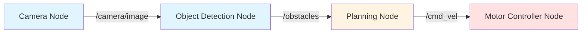
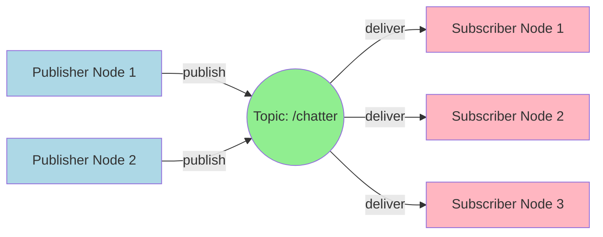
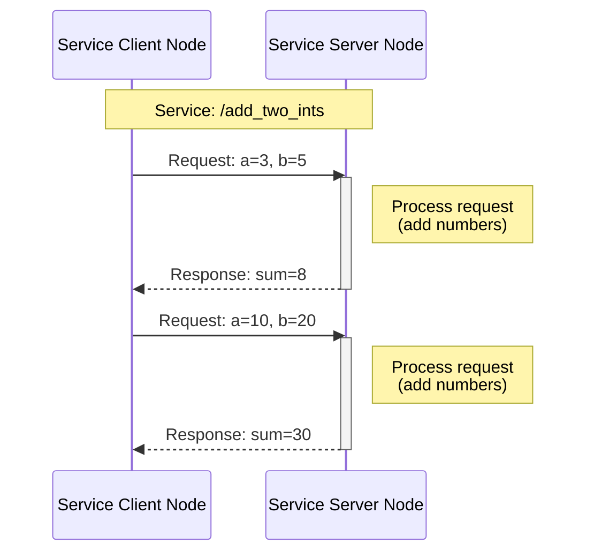
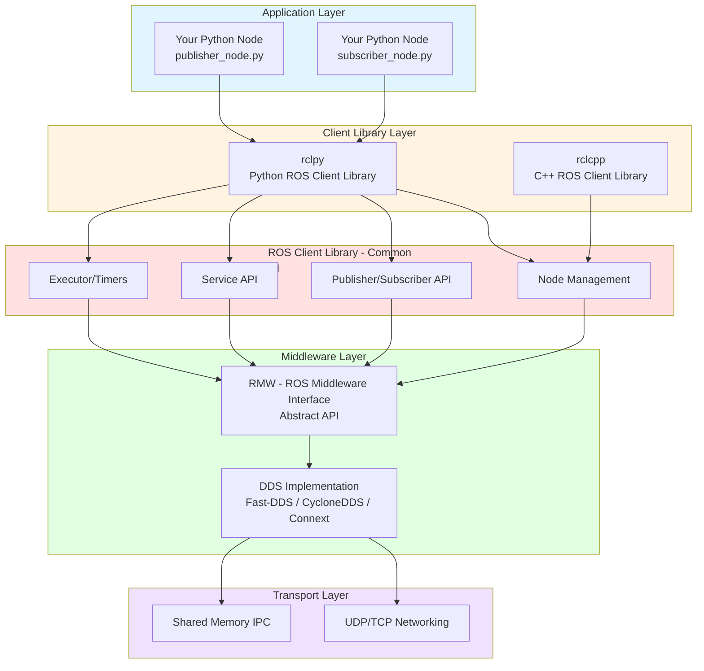

# Chapter 1: ROS 2 Fundamentals

Welcome to Chapter 1 of Module 1: The Robotic Nervous System. In this chapter, you'll learn the foundational concepts of ROS 2 (Robot Operating System 2), the industry-standard middleware for building modular, distributed robotic applications.

## Learning Outcomes

By the end of this chapter, you will be able to:

1. **Understand ROS 2 Architecture** - Explain how ROS 2 enables communication between distributed processes through the Data Distribution Service (DDS) middleware
2. **Create ROS 2 Nodes** - Write Python nodes that perform specific tasks in a robotic system
3. **Use Topics for Asynchronous Communication** - Implement publisher-subscriber patterns for continuous data streaming
4. **Use Services for Synchronous Communication** - Implement client-server patterns for request-response operations
5. **Build and Run ROS 2 Packages** - Use colcon to build workspaces and execute ROS 2 nodes
6. **Debug ROS 2 Applications** - Use command-line tools (`ros2 node list`, `ros2 topic echo`, `ros2 service call`) to inspect running systems

## Prerequisites

Before starting this chapter, ensure you have:

- **ROS 2 Humble installed** - Follow the [Setup Guide](../setup-guide.md) if you haven't already
- **Python 3.10+ knowledge** - Basic understanding of Python syntax, classes, and functions
- **Terminal/command-line familiarity** - Comfort running commands in bash/terminal
- **Text editor or IDE** - VS Code, PyCharm, or any editor for writing Python code

## Chapter Overview

This chapter is divided into five main sections:

1. **ROS 2 Nodes** - The fundamental building blocks of ROS 2 applications
2. **Topics and Asynchronous Communication** - Publisher-subscriber pattern for continuous data flow
3. **Services and Synchronous Communication** - Client-server pattern for request-response operations
4. **ROS 2 Architecture Overview** - Understanding the layers: DDS, rclpy, and executors
5. **Practical Examples** - Three runnable Python examples you can execute in your workspace

By the end, you'll have three working ROS 2 packages:
- `minimal_publisher` - Publishes messages to a topic
- `minimal_subscriber` - Subscribes to messages from a topic
- `service_example` - Implements a service server and client for adding two integers

---

Let's begin by understanding the most fundamental concept in ROS 2: **nodes**.

## ROS 2 Nodes

### What is a Node?

A **node** is the fundamental building block of any ROS 2 application. Think of a node as a single, modular process that performs a specific task in your robotic system.

**Key characteristics of nodes:**

- **Single Responsibility** - Each node should have one clear purpose (e.g., reading sensor data, controlling motors, making decisions)
- **Independent Processes** - Nodes run as separate operating system processes, providing isolation and fault tolerance
- **Communicates via ROS 2 Graph** - Nodes don't call each other directly; they communicate through topics, services, and actions
- **Discoverable** - ROS 2 automatically discovers nodes on the network without manual configuration

### Real-World Analogy

Imagine a robotic car:
- **Camera Node** - Captures images from a front-facing camera
- **Object Detection Node** - Analyzes images to detect obstacles
- **Planning Node** - Decides how to navigate around obstacles
- **Motor Controller Node** - Commands wheels to turn left, right, or stop

Each node is independent but works together through ROS 2's communication infrastructure.

### Node Communication Graph

In ROS 2, nodes form a **computational graph** where nodes are vertices and communication channels (topics/services) are edges.



**Explanation:**
- **Blue nodes** (Camera, Object Detection) - Sensor and perception pipeline
- **Yellow node** (Planning) - Decision-making logic
- **Red node** (Motor Controller) - Hardware interface for actuators

The arrows represent **topics** (we'll cover these in the next section), which carry data between nodes.

### Creating a Node in Python

Every ROS 2 Python node follows this basic structure:

```python
import rclpy
from rclpy.node import Node

class MyNode(Node):
    def __init__(self):
        super().__init__('my_node_name')  # Node name must be unique
        self.get_logger().info('Node has started!')

def main(args=None):
    rclpy.init(args=args)           # Initialize ROS 2 communication
    node = MyNode()                 # Create node instance
    rclpy.spin(node)                # Keep node running until Ctrl+C
    rclpy.shutdown()                # Cleanup

if __name__ == '__main__':
    main()
```

**Key components:**
1. **`rclpy.init()`** - Initializes the ROS 2 Python client library
2. **`Node` class** - Base class for all ROS 2 nodes
3. **`super().__init__('my_node_name')`** - Registers the node with a unique name
4. **`rclpy.spin()`** - Keeps the node alive and processing callbacks (subscriptions, timers, etc.)
5. **`rclpy.shutdown()`** - Cleans up resources when the node exits

### Inspecting Nodes

ROS 2 provides command-line tools to introspect running nodes:

```bash
# List all running nodes
ros2 node list

# Get information about a specific node
ros2 node info /my_node_name
```

**Example output of `ros2 node list`:**
```
/camera_node
/object_detection_node
/planning_node
/motor_controller_node
```

---

Now that you understand nodes, let's explore how they communicate using **topics**.

## Topics and Asynchronous Communication

### What is a Topic?

A **topic** is a named bus over which nodes exchange messages. Topics implement a **publish-subscribe pattern**, enabling asynchronous, many-to-many communication.

**Key characteristics of topics:**

- **Asynchronous** - Publishers don't wait for subscribers; messages are sent and forgotten
- **Decoupled** - Publishers and subscribers don't know about each other's existence
- **Many-to-Many** - Multiple nodes can publish to the same topic, and multiple nodes can subscribe
- **Typed** - Each topic has a specific message type (e.g., `std_msgs/String`, `geometry_msgs/Twist`)
- **Continuous Data Flow** - Ideal for streaming sensor data, robot state, or telemetry

### Publisher-Subscriber Pattern



**Flow explanation:**
1. **Publishers** (blue) send messages to the topic `/chatter`
2. The **Topic** (green) acts as a message bus
3. **Subscribers** (pink) receive all messages published to `/chatter`

### Real-World Use Cases

| Use Case | Topic Name | Message Type | Description |
|----------|------------|--------------|-------------|
| Robot Velocity Commands | `/cmd_vel` | `geometry_msgs/Twist` | Send linear and angular velocity commands to robot wheels |
| Laser Scan Data | `/scan` | `sensor_msgs/LaserScan` | LiDAR sensor publishes distance measurements 10-30 Hz |
| Camera Images | `/camera/image_raw` | `sensor_msgs/Image` | Camera publishes raw image frames 30 FPS |
| Battery Status | `/battery_state` | `sensor_msgs/BatteryState` | Battery monitor publishes voltage, current, percentage |

### Creating a Publisher (Python)

```python
from rclpy.node import Node
from std_msgs.msg import String

class MinimalPublisher(Node):
    def __init__(self):
        super().__init__('minimal_publisher')

        # Create publisher: topic name, message type, queue size
        self.publisher_ = self.create_publisher(String, 'chatter', 10)

        # Create timer: publish every 0.5 seconds
        self.timer = self.create_timer(0.5, self.timer_callback)
        self.count = 0

    def timer_callback(self):
        msg = String()
        msg.data = f'Hello World: {self.count}'
        self.publisher_.publish(msg)
        self.get_logger().info(f'Publishing: "{msg.data}"')
        self.count += 1
```

**Key API calls:**
- **`create_publisher(msg_type, topic_name, queue_size)`** - Creates a publisher
  - `queue_size`: Number of messages to buffer if subscribers are slow
- **`publish(msg)`** - Sends a message to all subscribers
- **`create_timer(period_sec, callback)`** - Periodically calls a function

### Creating a Subscriber (Python)

```python
from rclpy.node import Node
from std_msgs.msg import String

class MinimalSubscriber(Node):
    def __init__(self):
        super().__init__('minimal_subscriber')

        # Create subscription: topic name, message type, callback, queue size
        self.subscription = self.create_subscription(
            String,
            'chatter',
            self.listener_callback,
            10
        )

    def listener_callback(self, msg):
        self.get_logger().info(f'I heard: "{msg.data}"')
```

**Key API calls:**
- **`create_subscription(msg_type, topic_name, callback, queue_size)`** - Creates a subscriber
  - `callback`: Function called every time a message arrives
- **`listener_callback(msg)`** - Processes incoming messages

### Quality of Service (QoS)

Topics use **QoS policies** to control message delivery behavior:

| QoS Setting | Options | Use Case |
|-------------|---------|----------|
| **Reliability** | Reliable (TCP-like) / Best Effort (UDP-like) | Reliable for critical commands, Best Effort for high-frequency sensor data |
| **Durability** | Transient Local (store last message) / Volatile (no storage) | Transient Local for configuration data that late-joiners need |
| **History** | Keep Last N / Keep All | Keep Last 10 for sensor data, Keep All for logging |

**Example: Setting QoS**
```python
from rclpy.qos import QoSProfile, ReliabilityPolicy

qos_profile = QoSProfile(depth=10, reliability=ReliabilityPolicy.BEST_EFFORT)
self.publisher_ = self.create_publisher(String, 'chatter', qos_profile)
```

### Inspecting Topics

```bash
# List all active topics
ros2 topic list

# Show information about a topic (publishers, subscribers, message type)
ros2 topic info /chatter

# Display messages being published to a topic (live monitoring)
ros2 topic echo /chatter

# Publish a message from command line (useful for testing)
ros2 topic pub /chatter std_msgs/msg/String "{data: 'Hello from CLI'}"

# Measure publishing frequency (Hz)
ros2 topic hz /chatter
```

**Example output of `ros2 topic info /chatter`:**
```
Type: std_msgs/msg/String
Publisher count: 2
Subscription count: 3
```

---

Next, we'll explore **services** for request-response communication.

## Services and Synchronous Communication

### What is a Service?

A **service** is a synchronous, request-response communication pattern in ROS 2. Unlike topics (which are asynchronous and continuous), services implement a **client-server** model where the client blocks and waits for a response.

**Key characteristics of services:**

- **Synchronous** - Client sends a request and waits (blocks) for the server's response
- **One-to-One** - Each request is handled by exactly one server
- **Request-Response Pair** - Every service has a defined request type and response type
- **Non-Continuous** - Used for occasional operations, not continuous data streams
- **Ideal for Actions** - Configuration updates, triggering behaviors, querying state, mathematical operations

### Client-Server Pattern



**Flow explanation:**
1. **Client** sends a request with input parameters (`a=3, b=5`)
2. **Server** processes the request (performs computation)
3. **Server** returns a response with result (`sum=8`)
4. **Client** receives response and continues execution

### Topics vs. Services: When to Use Which?

| Feature | Topics | Services |
|---------|--------|----------|
| **Pattern** | Publish-Subscribe | Client-Server |
| **Direction** | One-way (publisher → subscriber) | Two-way (client ↔ server) |
| **Timing** | Asynchronous (fire-and-forget) | Synchronous (blocking) |
| **Frequency** | Continuous, high-rate | Occasional, on-demand |
| **Cardinality** | Many-to-many | One-to-one |
| **Use Case** | Sensor data, telemetry, commands | Configuration, queries, triggers |

**Example decision tree:**
- **"Does the caller need a response?"** → Yes: Service, No: Topic
- **"Is this a continuous data stream?"** → Yes: Topic, No: Service
- **"Can multiple nodes handle this request?"** → No: Service (one server), Yes: Topic (many subscribers)

### Creating a Service Server (Python)

```python
from rclpy.node import Node
from example_interfaces.srv import AddTwoInts

class MinimalService(Node):
    def __init__(self):
        super().__init__('minimal_service')

        # Create service: service name, service type, callback
        self.srv = self.create_service(
            AddTwoInts,
            'add_two_ints',
            self.add_two_ints_callback
        )

    def add_two_ints_callback(self, request, response):
        # Access request fields
        response.sum = request.a + request.b
        self.get_logger().info(f'Request: {request.a} + {request.b} = {response.sum}')
        return response  # Return response object
```

**Key API calls:**
- **`create_service(srv_type, service_name, callback)`** - Creates a service server
- **`callback(request, response)`** - Processes the request and populates the response
  - `request`: Contains input fields (e.g., `request.a`, `request.b`)
  - `response`: Object to populate with results (e.g., `response.sum`)

### Creating a Service Client (Python)

```python
from rclpy.node import Node
from example_interfaces.srv import AddTwoInts
import sys

class MinimalClientAsync(Node):
    def __init__(self):
        super().__init__('minimal_client_async')

        # Create client: service type, service name
        self.client = self.create_client(AddTwoInts, 'add_two_ints')

        # Wait until server is available
        while not self.client.wait_for_service(timeout_sec=1.0):
            self.get_logger().info('Service not available, waiting...')

    def send_request(self, a, b):
        request = AddTwoInts.Request()
        request.a = a
        request.b = b

        # Send request asynchronously (non-blocking)
        future = self.client.call_async(request)
        return future  # Return Future object for later retrieval
```

**Key API calls:**
- **`create_client(srv_type, service_name)`** - Creates a service client
- **`wait_for_service(timeout_sec)`** - Blocks until the server is discovered (returns `True` if found)
- **`call_async(request)`** - Sends request asynchronously, returns a `Future` object
  - Use `rclpy.spin_until_future_complete(node, future)` to wait for response

**Synchronous call (blocking):**
```python
future = client.call_async(request)
rclpy.spin_until_future_complete(node, future)
result = future.result()
print(f'Result: {result.sum}')
```

### Inspecting Services

```bash
# List all active services
ros2 service list

# Show service type
ros2 service type /add_two_ints

# Call a service from command line
ros2 service call /add_two_ints example_interfaces/srv/AddTwoInts "{a: 2, b: 3}"
```

**Example output of `ros2 service call`:**
```
requester: making request: example_interfaces.srv.AddTwoInts_Request(a=2, b=3)

response:
example_interfaces.srv.AddTwoInts_Response(sum=5)
```

### Real-World Use Cases

| Use Case | Service Name | Service Type | Description |
|----------|--------------|--------------|-------------|
| Trigger Emergency Stop | `/emergency_stop` | `std_srvs/Trigger` | Client calls service to immediately halt all robot motion |
| Get Robot Configuration | `/get_config` | `custom_srvs/GetConfig` | Query current PID gains, max velocity, sensor offsets |
| Save Map | `/slam/save_map` | `nav2_msgs/srv/SaveMap` | SLAM node saves current map to disk when requested |
| Set LED Color | `/set_led` | `custom_srvs/SetLED` | Change robot status LED color (r, g, b values) |

---

Now let's understand the underlying architecture that makes nodes, topics, and services work.

## ROS 2 Architecture Overview

### Layered Architecture

ROS 2 is built on a layered architecture where each layer provides abstractions for the layer above it.



### Layer Breakdown

#### 1. Application Layer (Your Code)

This is where you write your robotic applications using Python or C++. You interact with ROS 2 through the client library (`rclpy` for Python, `rclcpp` for C++).

**Example: Creating a publisher**
```python
import rclpy
from rclpy.node import Node
from std_msgs.msg import String

node = Node('my_publisher')
publisher = node.create_publisher(String, 'chatter', 10)
```

#### 2. Client Library Layer (rclpy / rclcpp)

The **client library** provides language-specific bindings to the ROS 2 core functionality. It handles:
- Object-oriented API for nodes, publishers, subscribers, services
- Python/C++ specific memory management and threading
- Callback execution and event loops

**Why separate client libraries?**
- **rclpy** (Python): Easier to learn, slower execution, ideal for high-level logic
- **rclcpp** (C++): Harder to learn, faster execution, ideal for performance-critical nodes (e.g., motor controllers, sensor drivers)

#### 3. ROS Client Library Common (rcl)

The **rcl** layer is a language-agnostic C library that implements core ROS 2 functionality:
- Node lifecycle management
- Publisher/subscriber mechanisms
- Service client/server logic
- Executors (event loops that process callbacks)
- Timers and rate limiters

Both `rclpy` and `rclcpp` call into `rcl` under the hood, ensuring consistent behavior across languages.

#### 4. Middleware Layer (RMW + DDS)

The **ROS Middleware (RMW)** layer is an abstract interface that allows ROS 2 to work with different **Data Distribution Service (DDS)** implementations.

**DDS** is a real-time, peer-to-peer networking standard that provides:
- **Discovery** - Automatic detection of nodes and topics (no central broker)
- **Publish-Subscribe** - Efficient message routing
- **Quality of Service (QoS)** - Reliability, durability, and deadline policies
- **Interoperability** - Different DDS vendors can communicate (within the same version)

**Common DDS implementations:**
| Implementation | Vendor | License | Default in ROS 2? |
|----------------|--------|---------|-------------------|
| **Fast-DDS** | eProsima | Apache 2.0 | Yes (Humble default) |
| **CycloneDDS** | Eclipse | EPL 2.0 | Alternative option |
| **Connext DDS** | RTI | Commercial | Production systems |

You can switch DDS implementations without changing your application code:
```bash
export RMW_IMPLEMENTATION=rmw_cyclonedds_cpp
ros2 run my_package my_node
```

#### 5. Transport Layer

DDS uses the underlying network stack:
- **UDP** - Fast, best-effort delivery for high-frequency sensor data
- **TCP** - Reliable delivery for critical commands
- **Shared Memory** - Zero-copy communication between processes on the same machine (fastest option)

### Executors: The ROS 2 Event Loop

An **executor** is responsible for executing callbacks (subscriptions, timers, service requests). It's similar to an event loop in GUI programming or async frameworks.

**Single-threaded executor (default):**
```python
import rclpy
node = MyNode()
rclpy.spin(node)  # Blocks and processes callbacks one at a time
```

**Multi-threaded executor (advanced):**
```python
from rclpy.executors import MultiThreadedExecutor
executor = MultiThreadedExecutor()
executor.add_node(node1)
executor.add_node(node2)
executor.spin()  # Processes callbacks in parallel threads
```

**When to use multi-threaded executors:**
- Node has long-running callbacks that would block other callbacks
- Need to process multiple callbacks concurrently (e.g., sensor fusion from 3+ sensors)

### Discovery: How Nodes Find Each Other

ROS 2 uses **DDS Discovery** to automatically find nodes, topics, and services on the network without a central server (unlike ROS 1's `roscore`).

**Discovery process:**
1. **Announcement** - When a node starts, it multicasts its presence (node name, topics, services)
2. **Listening** - All other nodes receive the announcement
3. **Matching** - Nodes with matching topics/services establish direct peer-to-peer connections
4. **Communication** - Data flows directly between publisher and subscriber (no broker)

**Discovery is automatic and decentralized:**
- No single point of failure
- Nodes can join/leave at any time
- Works across multiple machines (same network)

### ROS 2 vs. ROS 1: Key Differences

| Feature | ROS 1 | ROS 2 |
|---------|-------|-------|
| **Middleware** | Custom TCPROS | DDS (industry standard) |
| **Discovery** | Centralized (`roscore`) | Decentralized (DDS discovery) |
| **Real-Time** | No guarantees | DDS supports real-time QoS |
| **Security** | None | DDS Security (encryption, authentication) |
| **Languages** | Python 2, C++ | Python 3, C++, others via client libraries |
| **Platform** | Linux-first | Linux, Windows, macOS |

---

Now that you understand the theory, let's build three working ROS 2 examples!

## Practical Examples

In this section, you'll run three real ROS 2 packages that demonstrate nodes, topics, and services. All code is located in the `ros2-examples/src/` directory of this repository.

### Example 1: Minimal Publisher

The **minimal_publisher** package demonstrates how to publish messages to a topic at a fixed rate.

**File:** `ros2-examples/src/minimal_publisher/minimal_publisher/publisher_node.py`

```python title="publisher_node.py"
#!/usr/bin/env python3
import rclpy
from rclpy.node import Node
from std_msgs.msg import String


class MinimalPublisher(Node):
    def __init__(self):
        super().__init__('minimal_publisher')
        self.publisher_ = self.create_publisher(String, 'chatter', 10)
        timer_period = 0.5  # seconds (2 Hz)
        self.timer = self.create_timer(timer_period, self.timer_callback)
        self.count = 0
        self.get_logger().info('Minimal publisher node started, publishing at 2 Hz')

    def timer_callback(self):
        msg = String()
        msg.data = f'Hello World: {self.count}'
        self.publisher_.publish(msg)
        self.get_logger().info(f'Publishing: "{msg.data}"')
        self.count += 1


def main(args=None):
    rclpy.init(args=args)
    minimal_publisher = MinimalPublisher()
    try:
        rclpy.spin(minimal_publisher)
    except KeyboardInterrupt:
        minimal_publisher.get_logger().info('Keyboard interrupt, shutting down')
    minimal_publisher.destroy_node()
    rclpy.shutdown()


if __name__ == '__main__':
    main()
```

**Running the publisher:**

```bash
# Terminal 1: Source ROS 2 and your workspace
cd ~/ros2_textbook_ws
source /opt/ros/humble/setup.bash
source install/setup.bash

# Run the publisher node
ros2 run minimal_publisher publisher_node
```

**Expected output:**
```
[INFO] [minimal_publisher]: Minimal publisher node started, publishing at 2 Hz
[INFO] [minimal_publisher]: Publishing: "Hello World: 0"
[INFO] [minimal_publisher]: Publishing: "Hello World: 1"
[INFO] [minimal_publisher]: Publishing: "Hello World: 2"
...
```

**Verify the topic:**
```bash
# Terminal 2: Check that the topic exists
ros2 topic list

# Expected output includes:
# /chatter

# Echo messages being published
ros2 topic echo /chatter

# Expected output:
# data: Hello World: 5
# ---
# data: Hello World: 6
# ---
```

---

### Example 2: Minimal Subscriber

The **minimal_subscriber** package demonstrates how to subscribe to messages from a topic.

**File:** `ros2-examples/src/minimal_subscriber/minimal_subscriber/subscriber_node.py`

```python title="subscriber_node.py"
#!/usr/bin/env python3
import rclpy
from rclpy.node import Node
from std_msgs.msg import String


class MinimalSubscriber(Node):
    def __init__(self):
        super().__init__('minimal_subscriber')
        self.subscription = self.create_subscription(
            String,
            'chatter',
            self.listener_callback,
            10
        )
        self.subscription  # prevent unused variable warning
        self.get_logger().info('Minimal subscriber node started, waiting for messages...')

    def listener_callback(self, msg):
        self.get_logger().info(f'I heard: "{msg.data}"')


def main(args=None):
    rclpy.init(args=args)
    minimal_subscriber = MinimalSubscriber()
    try:
        rclpy.spin(minimal_subscriber)
    except KeyboardInterrupt:
        minimal_subscriber.get_logger().info('Keyboard interrupt, shutting down')
    minimal_subscriber.destroy_node()
    rclpy.shutdown()


if __name__ == '__main__':
    main()
```

**Running publisher and subscriber together:**

```bash
# Terminal 1: Run the publisher (if not already running)
ros2 run minimal_publisher publisher_node

# Terminal 2: Run the subscriber
ros2 run minimal_subscriber subscriber_node
```

**Expected output (Terminal 2 - Subscriber):**
```
[INFO] [minimal_subscriber]: Minimal subscriber node started, waiting for messages...
[INFO] [minimal_subscriber]: I heard: "Hello World: 12"
[INFO] [minimal_subscriber]: I heard: "Hello World: 13"
[INFO] [minimal_subscriber]: I heard: "Hello World: 14"
...
```

**What's happening:**
1. Publisher publishes `String` messages to `/chatter` at 2 Hz
2. Subscriber receives messages from `/chatter` and logs them
3. Both nodes discover each other automatically via DDS
4. No central broker (`roscore`) is needed!

---

### Example 3: Service Client and Server

The **service_example** package demonstrates request-response communication using services.

**File:** `ros2-examples/src/service_example/service_example/service_server.py`

```python title="service_server.py"
#!/usr/bin/env python3
import rclpy
from rclpy.node import Node
from example_interfaces.srv import AddTwoInts


class MinimalService(Node):
    def __init__(self):
        super().__init__('minimal_service')
        self.srv = self.create_service(
            AddTwoInts,
            'add_two_ints',
            self.add_two_ints_callback
        )
        self.get_logger().info('Service server ready: /add_two_ints')

    def add_two_ints_callback(self, request, response):
        response.sum = request.a + request.b
        self.get_logger().info(f'Request: {request.a} + {request.b} = {response.sum}')
        return response


def main(args=None):
    rclpy.init(args=args)
    minimal_service = MinimalService()
    try:
        rclpy.spin(minimal_service)
    except KeyboardInterrupt:
        minimal_service.get_logger().info('Keyboard interrupt, shutting down')
    minimal_service.destroy_node()
    rclpy.shutdown()


if __name__ == '__main__':
    main()
```

**File:** `ros2-examples/src/service_example/service_example/service_client.py`

```python title="service_client.py"
#!/usr/bin/env python3
import sys
import rclpy
from rclpy.node import Node
from example_interfaces.srv import AddTwoInts


class MinimalClientAsync(Node):
    def __init__(self):
        super().__init__('minimal_client_async')
        self.client = self.create_client(AddTwoInts, 'add_two_ints')
        while not self.client.wait_for_service(timeout_sec=1.0):
            self.get_logger().info('Service not available, waiting...')
        self.get_logger().info('Service /add_two_ints is available')

    def send_request(self, a, b):
        request = AddTwoInts.Request()
        request.a = a
        request.b = b
        self.get_logger().info(f'Sending request: {a} + {b}')
        return self.client.call_async(request)


def main(args=None):
    rclpy.init(args=args)

    if len(sys.argv) != 3:
        print('Usage: ros2 run service_example service_client <a> <b>')
        rclpy.shutdown()
        return

    a = int(sys.argv[1])
    b = int(sys.argv[2])

    minimal_client = MinimalClientAsync()
    future = minimal_client.send_request(a, b)
    rclpy.spin_until_future_complete(minimal_client, future)

    response = future.result()
    minimal_client.get_logger().info(f'Result: {a} + {b} = {response.sum}')

    minimal_client.destroy_node()
    rclpy.shutdown()


if __name__ == '__main__':
    main()
```

**Running the service server and client:**

```bash
# Terminal 1: Run the service server
ros2 run service_example service_server
```

**Expected output (Terminal 1):**
```
[INFO] [minimal_service]: Service server ready: /add_two_ints
```

```bash
# Terminal 2: Call the service with two integers
ros2 run service_example service_client 10 20
```

**Expected output (Terminal 2 - Client):**
```
[INFO] [minimal_client_async]: Service /add_two_ints is available
[INFO] [minimal_client_async]: Sending request: 10 + 20
[INFO] [minimal_client_async]: Result: 10 + 20 = 30
```

**Expected output (Terminal 1 - Server log):**
```
[INFO] [minimal_service]: Request: 10 + 20 = 30
```

**Calling the service from the command line:**

You can also call services directly using `ros2 service call`:

```bash
# Check if the service exists
ros2 service list

# Call the service with YAML-formatted request
ros2 service call /add_two_ints example_interfaces/srv/AddTwoInts "{a: 5, b: 7}"
```

**Expected output:**
```
requester: making request: example_interfaces.srv.AddTwoInts_Request(a=5, b=7)

response:
example_interfaces.srv.AddTwoInts_Response(sum=12)
```

---

### Building the Examples

To build and run these examples, navigate to your ROS 2 workspace:

```bash
# Navigate to the ros2-examples directory
cd path/to/ros2-examples

# Build all packages with colcon
colcon build --symlink-install

# Source the workspace overlay
source install/setup.bash

# Now you can run any of the nodes:
ros2 run minimal_publisher publisher_node
ros2 run minimal_subscriber subscriber_node
ros2 run service_example service_server
ros2 run service_example service_client 3 5
```

**Note:** The `--symlink-install` flag creates symbolic links to Python files, so you can edit code without rebuilding.

---

## Edge Cases

### Edge Case: Node Crash Handling

**What happens when a node crashes?**

ROS 2 nodes run as independent operating system processes. If one node crashes, other nodes continue running unaffected. This is called **process isolation** and is a key advantage over monolithic architectures.

**Example scenario:**
- You have 3 nodes running: `camera_node`, `planning_node`, and `motor_controller`
- The `planning_node` crashes due to a division-by-zero error
- **Result**: `camera_node` and `motor_controller` continue running normally

**Monitoring node health:**

```bash
# List all running nodes
ros2 node list

# Output:
# /camera_node
# /motor_controller
# (Note: /planning_node is missing because it crashed)

# Get detailed information about a specific node
ros2 node info /camera_node
```

**Best practices:**
1. **Use ROS 2 lifecycle nodes** for critical systems - lifecycle nodes support managed startup/shutdown states
2. **Implement watchdog timers** - detect when nodes stop publishing expected data
3. **Log errors appropriately** - use `self.get_logger().error()` for critical failures
4. **Use process managers** - tools like `systemd` or `supervisor` can auto-restart crashed nodes

**Graceful shutdown:**

Always handle `Ctrl+C` (KeyboardInterrupt) to cleanup resources:

```python
try:
    rclpy.spin(node)
except KeyboardInterrupt:
    node.get_logger().info('Shutting down gracefully')
finally:
    node.destroy_node()
    rclpy.shutdown()
```

---

### Edge Case: ROS 2 Version Compatibility

**Not all ROS 2 versions are compatible!**

ROS 2 releases follow a naming convention: Humble, Iron, Jazzy, etc. Each release has a different support lifecycle.

**Recommended for learning and production: ROS 2 Humble Hawksbill**
- **Release date**: May 2022
- **End of support**: May 2027 (5 years LTS)
- **Ubuntu version**: 22.04 Jammy Jellyfish
- **Python version**: 3.10+

**Why choose Humble?**
1. **Long-Term Support (LTS)** - 5 years of updates and bug fixes
2. **Mature ecosystem** - Most packages and tutorials target Humble
3. **Stable API** - API changes are minimized during the LTS period
4. **Industry adoption** - Many production robots use Humble

**Version compatibility issues:**

| Issue | Symptom | Solution |
|-------|---------|----------|
| **Message interface mismatch** | `AttributeError: 'Twist' object has no attribute 'linear_x'` | Rebuild packages with `colcon build` |
| **Python version mismatch** | `SyntaxError: invalid syntax` (when using Python 3.10 features on 3.8) | Use Python 3.10+ with Humble |
| **DDS version incompatibility** | Nodes can't discover each other | Ensure all nodes use the same RMW implementation (`RMW_IMPLEMENTATION` env var) |

**Checking your ROS 2 version:**

```bash
printenv ROS_DISTRO
# Output: humble

ros2 --version
# Output: ros2 cli version 0.18.x
```

---

## Troubleshooting

This section addresses the 5 most common errors beginners encounter when learning ROS 2.

### 1. Error: `ModuleNotFoundError: No module named 'rclpy'`

**Cause:** ROS 2 environment is not sourced in your current terminal session.

**Solution:**
```bash
source /opt/ros/humble/setup.bash

# Verify ROS 2 is sourced
printenv | grep ROS_DISTRO
# Should output: ROS_DISTRO=humble
```

**Permanent fix:** Add the source command to your `.bashrc`:
```bash
echo "source /opt/ros/humble/setup.bash" >> ~/.bashrc
source ~/.bashrc
```

---

### 2. Error: QoS Mismatch - Publisher and Subscriber Can't Communicate

**Symptom:** Publisher is running, subscriber is running, but no messages are received.

**Cause:** Publisher and subscriber have incompatible Quality of Service (QoS) settings.

**Example:**
- Publisher uses `ReliabilityPolicy.BEST_EFFORT` (UDP-like)
- Subscriber uses `ReliabilityPolicy.RELIABLE` (TCP-like)
- **Result:** Subscriber rejects messages from publisher

**Solution:** Ensure both use the same QoS profile or use compatible profiles.

```python
# Option 1: Both use default QoS (depth=10, reliable)
publisher = node.create_publisher(String, 'chatter', 10)
subscription = node.create_subscription(String, 'chatter', callback, 10)

# Option 2: Explicitly set matching QoS
from rclpy.qos import QoSProfile, ReliabilityPolicy

qos_profile = QoSProfile(depth=10, reliability=ReliabilityPolicy.BEST_EFFORT)
publisher = node.create_publisher(String, 'chatter', qos_profile)
subscription = node.create_subscription(String, 'chatter', callback, qos_profile)
```

**Debugging:**
```bash
# Check QoS settings for a topic
ros2 topic info /chatter --verbose
```

---

### 3. Error: Topic Not Publishing (No Data on `ros2 topic echo`)

**Symptom:** `ros2 topic echo /chatter` outputs nothing, even though the publisher node is running.

**Possible causes:**

**A) Topic name mismatch:**
```python
# Publisher publishes to '/chatter'
publisher = node.create_publisher(String, '/chatter', 10)

# Subscriber listens to 'chatter' (no leading slash)
subscription = node.create_subscription(String, 'chatter', callback, 10)

# Solution: Use consistent names (ROS 2 resolves both to '/chatter', but be explicit)
```

**B) Node is not spinning:**
```python
# BAD: Forgot to call rclpy.spin()
minimal_publisher = MinimalPublisher()
# Node is created but callbacks never execute!

# GOOD: Call rclpy.spin()
rclpy.spin(minimal_publisher)
```

**C) Timer not firing:**
```python
# BAD: Forgot to store timer as instance variable
def __init__(self):
    self.create_timer(0.5, self.callback)  # Timer gets garbage collected!

# GOOD: Store timer reference
def __init__(self):
    self.timer = self.create_timer(0.5, self.callback)
```

---

### 4. Error: `Permission denied` when running `colcon build`

**Symptom:**
```
PermissionError: [Errno 13] Permission denied: '/opt/ros/humble/...'
```

**Cause:** Trying to write to system directories (usually when sourcing workspace incorrectly).

**Solution:** Never build in `/opt/ros/` - always build in your own workspace:

```bash
# WRONG: Building in system directory
cd /opt/ros/humble
colcon build  # ❌ Permission denied

# RIGHT: Build in your workspace
cd ~/ros2_textbook_ws
colcon build  # ✅ Works
```

---

### 5. Error: `colcon build` Fails with `SetuptoolsDeprecationWarning`

**Symptom:**
```
SetuptoolsDeprecationWarning: setup.py install is deprecated.
```

**Cause:** Using outdated `setup.py` format or setuptools version mismatch.

**Solution:**

**A) Use `--symlink-install` to avoid install phase:**
```bash
colcon build --symlink-install
```

**B) Update setuptools:**
```bash
pip install --upgrade setuptools
```

**C) Ensure `setup.py` uses modern format:**
```python
from setuptools import find_packages, setup

setup(
    name='my_package',
    version='0.0.1',
    packages=find_packages(exclude=['test']),
    install_requires=['setuptools'],
    zip_safe=True,
    # ...
)
```

---

## Key Takeaways

Congratulations! You've completed Chapter 1: ROS 2 Fundamentals. Here are the essential concepts to remember:

### 1. Nodes are the Building Blocks

- **Nodes** are independent processes that perform specific tasks
- Each node has a unique name and runs in its own process
- Nodes communicate through topics, services, and actions (not direct function calls)
- **Command:** `ros2 node list` to see running nodes

### 2. Topics Enable Asynchronous Communication

- **Topics** implement the publish-subscribe pattern for continuous data streaming
- **Publishers** send messages without waiting for subscribers (fire-and-forget)
- **Subscribers** receive messages via callbacks
- **Many-to-many** communication: multiple publishers and subscribers per topic
- **Use case:** Sensor data, telemetry, continuous commands
- **Command:** `ros2 topic echo /topic_name` to monitor messages

### 3. Services Enable Synchronous Communication

- **Services** implement the client-server pattern for request-response operations
- **Clients** send requests and block until the server responds
- **Servers** process requests and return responses
- **One-to-one** communication: each request handled by exactly one server
- **Use case:** Configuration, queries, triggered actions
- **Command:** `ros2 service call /service_name service_type "{request_data}"`

### 4. DDS Powers ROS 2

- ROS 2 uses **DDS (Data Distribution Service)** as its middleware
- **Decentralized discovery** - no central broker needed (unlike ROS 1's `roscore`)
- **Quality of Service (QoS)** - control reliability, durability, and history
- **Real-time capable** - suitable for safety-critical systems
- **Language-agnostic** - Python (`rclpy`) and C++ (`rclcpp`) share the same underlying infrastructure

### 5. Three Communication Patterns

| Pattern | Topic (Pub-Sub) | Service (Client-Server) | Action (Goal-Feedback) |
|---------|-----------------|-------------------------|------------------------|
| **Timing** | Asynchronous | Synchronous | Asynchronous + Feedback |
| **Direction** | One-way | Two-way | Two-way + Progress |
| **Frequency** | Continuous | Occasional | Long-running tasks |
| **Example** | Camera images | Get config | Navigate to goal |

**Note:** Actions are covered in Chapter 2.

---

## What's Next?

You now understand the core communication patterns in ROS 2. In the next chapters, you'll learn:

- **[Chapter 2: Python Agents & Controllers](./chapter-2-python-agents-controllers.md)** - Build intelligent control loops that integrate AI decision-making with ROS 2
- **[Chapter 3: Humanoid Robot Modeling with URDF](./chapter-3-humanoid-modeling-urdf.md)** - Model robots using URDF for simulation and real-world deployment

**Practice exercises:**
1. Modify the publisher to publish at 10 Hz instead of 2 Hz
2. Create a new topic `/robot_status` that publishes battery percentage
3. Implement a service that multiplies two numbers instead of adding them
4. Add error handling to the service client for invalid inputs

**Additional resources:**
- [ROS 2 Documentation](https://docs.ros.org/en/humble/)
- [ROS 2 Tutorials](https://docs.ros.org/en/humble/Tutorials.html)
- [rclpy API Reference](https://docs.ros.org/en/humble/p/rclpy/)

---

**Congratulations on completing Chapter 1!**
