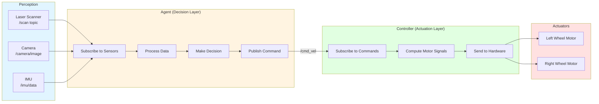
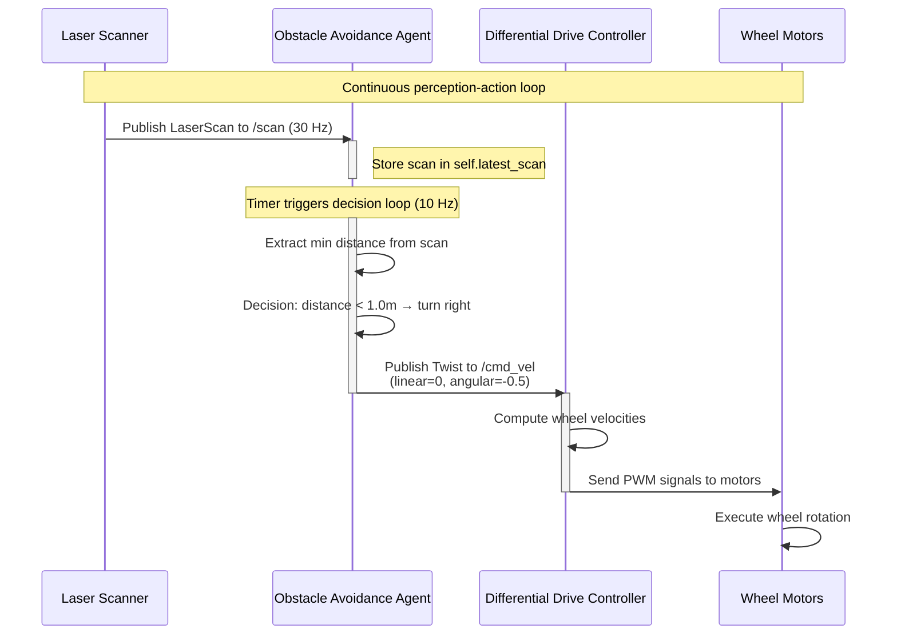
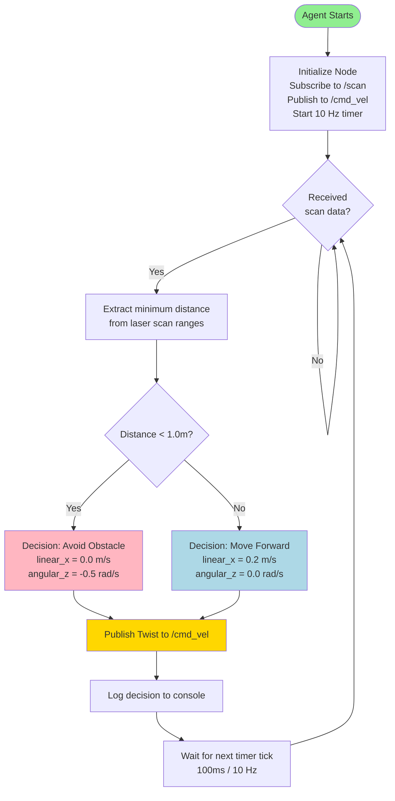

# Chapter 2: Python Agents & ROS 2 Controllers

Welcome to Chapter 2 of Module 1: The Robotic Nervous System. In this chapter, you'll learn how to build **intelligent agents** that bridge high-level decision-making with low-level robot control using ROS 2 and Python.

## Learning Outcomes

By the end of this chapter, you will be able to:

1. **Understand the Agent-Controller Architecture** - Distinguish between agents (decision-making) and controllers (motor commands)
2. **Implement Sensor-Agent-Actuator Workflows** - Build complete perception-decision-action loops
3. **Apply ROS 2 Best Practices** - Use timers, QoS profiles, error handling, and modular design patterns
4. **Design Obstacle Avoidance Agents** - Implement reactive behaviors using sensor data
5. **Debug Agent Systems** - Troubleshoot common issues like callback failures, rate mismatches, and QoS incompatibilities

## Prerequisites

Before starting this chapter, you should have completed:

- **[Chapter 1: ROS 2 Fundamentals](./chapter-1-ros2-fundamentals.md)** - Nodes, topics, services, publishers, subscribers
- **Python knowledge** - Classes, methods, conditional logic
- **Basic robotics concepts** - Sensors (LiDAR, cameras), actuators (motors, wheels)

## Chapter Overview

This chapter builds on Chapter 1 by introducing a higher-level abstraction: **agents**. While Chapter 1 focused on communication primitives (topics, services), Chapter 2 focuses on **intelligent behavior**.

**What you'll build:**
- An **obstacle avoidance agent** that reads laser scan data, makes decisions, and commands robot velocity
- A **mock sensor publisher** to test your agent without a real robot or simulator

**Key topics:**
1. Python Agents in ROS 2 - What makes a node an "agent"?
2. Bridging Agents to Controllers - The sensor → agent → actuator pipeline
3. Agent Workflow Example - Obstacle avoidance implementation
4. Best Practices - Timers, QoS, error handling, modularity
5. Troubleshooting - Common agent development issues

---

Let's start by defining what we mean by "agents" in the context of ROS 2.

## Python Agents in ROS 2

### What is an Agent?

In robotics, an **agent** is a software component that makes autonomous decisions based on sensor inputs and goals. Agents sit between perception (sensors) and actuation (motors), forming the "brain" of the robot.

**Agent vs. Controller:**

| Component | Agent | Controller |
|-----------|-------|------------|
| **Role** | Decision-making, planning, behavior | Execute motor commands, low-level control |
| **Input** | Sensor data (LiDAR, camera, IMU) | High-level commands (velocity, position) |
| **Output** | High-level commands (go forward, turn left) | Motor signals (PWM, torque, voltage) |
| **Frequency** | 1-10 Hz (decisions are slower) | 50-1000 Hz (control loops are fast) |
| **Example** | "Detect obstacle, decide to turn right" | "Set left wheel to 2.5 m/s, right wheel to 1.8 m/s" |

**Why separate agents from controllers?**
1. **Modularity** - Swap decision-making logic without changing motor drivers
2. **Testability** - Test agents with mock data, controllers with mock commands
3. **Safety** - Controllers enforce safety limits (max velocity, collision detection)
4. **Reusability** - Same controller works with different agents (obstacle avoidance, line following, waypoint navigation)

### Agent Architecture Pattern



**Workflow explanation:**
1. **Perception** (blue) - Sensors publish data to topics (`/scan`, `/camera/image`, `/imu/data`)
2. **Agent** (yellow) - Subscribes to sensors, processes data, makes decisions, publishes commands
3. **Controller** (green) - Subscribes to `/cmd_vel`, computes motor signals, sends to hardware
4. **Actuators** (red) - Physical motors execute commands

### ROS 2 Agent Node Structure

Every agent in ROS 2 is a **node** with the following components:

```python
class ObstacleAvoidanceAgent(Node):
    def __init__(self):
        super().__init__('obstacle_avoidance_agent')

        # 1. Subscriptions (Perception)
        self.scan_subscription = self.create_subscription(
            LaserScan, '/scan', self.scan_callback, 10
        )

        # 2. Publishers (Actuation)
        self.cmd_vel_publisher = self.create_publisher(
            Twist, '/cmd_vel', 10
        )

        # 3. Internal State (Agent Memory)
        self.min_distance = float('inf')
        self.obstacle_detected = False

        # 4. Timer (Decision Loop)
        self.timer = self.create_timer(0.1, self.decision_callback)  # 10 Hz

    def scan_callback(self, msg):
        """Process sensor data (perception)"""
        # Update internal state based on sensor readings
        pass

    def decision_callback(self):
        """Make decisions and publish commands (action)"""
        # Decide what to do based on internal state
        pass
```

**Key components:**
1. **Subscriptions** - Receive sensor data from topics
2. **Publishers** - Send commands to controllers/actuators
3. **Internal State** - Store sensor readings, goals, flags
4. **Timer** - Periodic decision loop (decoupled from sensor rate)

---

Now let's explore how to connect agents to controllers.

## Bridging Agents to Controllers with rclpy

### The Sensor-Agent-Actuator Pipeline

In ROS 2, agents act as a **bridge** between sensors and actuators. This section explains how to implement this pipeline using `rclpy`.

### Step 1: Subscribe to Sensor Topics

Agents need to read sensor data to make informed decisions. Common sensor topics:

| Sensor Type | Topic Name | Message Type | Typical Rate |
|-------------|------------|--------------|--------------|
| **Laser Scanner (LiDAR)** | `/scan` | `sensor_msgs/LaserScan` | 10-30 Hz |
| **Camera** | `/camera/image_raw` | `sensor_msgs/Image` | 30 Hz |
| **IMU (Orientation)** | `/imu/data` | `sensor_msgs/Imu` | 50-100 Hz |
| **Odometry (Position)** | `/odom` | `nav_msgs/Odometry` | 20-50 Hz |

**Example: Subscribing to laser scan data**

```python
from sensor_msgs.msg import LaserScan

class ObstacleAvoidanceAgent(Node):
    def __init__(self):
        super().__init__('obstacle_avoidance_agent')

        # Subscribe to laser scan topic
        self.scan_subscription = self.create_subscription(
            LaserScan,           # Message type
            '/scan',             # Topic name
            self.scan_callback,  # Callback function
            10                   # QoS depth
        )

        # Store latest sensor reading
        self.latest_scan = None

    def scan_callback(self, msg):
        """Called every time a LaserScan message arrives"""
        # Store the latest scan for processing
        self.latest_scan = msg

        # Optional: Process immediately (not recommended for complex logic)
        # self.process_scan(msg)
```

**Best practice:** Store sensor data in callbacks, process in a separate timer-based loop.

### Step 2: Process Data and Make Decisions

After receiving sensor data, the agent must:
1. **Extract relevant information** (e.g., minimum distance to obstacle)
2. **Apply decision logic** (e.g., if distance < 1.0m, turn)
3. **Generate commands** (e.g., set linear velocity to 0, angular velocity to 0.5)

**Example: Decision logic**

```python
def decision_callback(self):
    """Called periodically by timer (e.g., 10 Hz)"""
    if self.latest_scan is None:
        self.get_logger().warn('No scan data received yet')
        return

    # Extract minimum distance from laser scan
    min_distance = min(self.latest_scan.ranges)

    # Decision logic
    if min_distance < 1.0:  # Obstacle within 1 meter
        # Turn right to avoid
        linear_velocity = 0.0
        angular_velocity = -0.5  # rad/s (negative = turn right)
        self.get_logger().info(f'Obstacle detected at {min_distance:.2f}m, turning right')
    else:
        # Move forward
        linear_velocity = 0.2  # m/s
        angular_velocity = 0.0
        self.get_logger().info(f'Clear path ({min_distance:.2f}m), moving forward')

    # Publish command
    self.publish_velocity(linear_velocity, angular_velocity)
```

### Step 3: Publish to Actuator Topics

Once the agent has made a decision, it publishes commands to topics that controllers subscribe to.

**Common actuator topics:**

| Actuator Type | Topic Name | Message Type | Description |
|---------------|------------|--------------|-------------|
| **Velocity Commands** | `/cmd_vel` | `geometry_msgs/Twist` | Linear and angular velocity for mobile robots |
| **Joint Commands** | `/joint_commands` | `trajectory_msgs/JointTrajectory` | Position/velocity for robot arms |
| **Gripper Commands** | `/gripper/command` | `control_msgs/GripperCommand` | Open/close gripper |

**Example: Publishing velocity commands**

```python
from geometry_msgs.msg import Twist

class ObstacleAvoidanceAgent(Node):
    def __init__(self):
        super().__init__('obstacle_avoidance_agent')

        # Publisher for velocity commands
        self.cmd_vel_publisher = self.create_publisher(
            Twist,      # Message type
            '/cmd_vel', # Topic name
            10          # QoS depth
        )

    def publish_velocity(self, linear_x, angular_z):
        """Publish velocity command to /cmd_vel"""
        msg = Twist()

        # Set linear velocity (forward/backward)
        msg.linear.x = linear_x  # m/s
        msg.linear.y = 0.0        # No sideways motion (differential drive)
        msg.linear.z = 0.0        # No vertical motion (ground robot)

        # Set angular velocity (turning)
        msg.angular.x = 0.0       # No roll
        msg.angular.y = 0.0       # No pitch
        msg.angular.z = angular_z # rad/s (positive = turn left)

        # Publish the command
        self.cmd_vel_publisher.publish(msg)
```

### Complete Sensor-Agent-Actuator Flow



**Key observations:**
1. **Sensor rate (30 Hz)** ≠ **Agent decision rate (10 Hz)** - Agent uses latest sensor data when making decisions
2. **Agent doesn't block** - Sensor callbacks store data, timer callbacks process and decide
3. **Asynchronous communication** - Agent doesn't wait for controller acknowledgment

---

Let's implement a complete obstacle avoidance agent.

## Agent Workflow Example: Obstacle Avoidance

### Problem Statement

**Goal:** Build an agent that navigates a robot forward while avoiding obstacles.

**Behavior:**
- If no obstacle is detected (distance > 1.0m): Move forward at 0.2 m/s
- If obstacle is detected (distance < 1.0m): Stop and turn right at 0.5 rad/s
- Continuously monitor laser scan data from `/scan` topic
- Publish velocity commands to `/cmd_vel` topic at 10 Hz

### Workflow Diagram



### Implementation

Let's implement the complete obstacle avoidance agent with a mock sensor for testing.

**File:** `ros2-examples/src/obstacle_avoidance_agent/obstacle_avoidance_agent/obstacle_avoidance_agent.py`

```python title="obstacle_avoidance_agent.py"
#!/usr/bin/env python3
import rclpy
from rclpy.node import Node
from sensor_msgs.msg import LaserScan
from geometry_msgs.msg import Twist


class ObstacleAvoidanceAgent(Node):
    def __init__(self):
        super().__init__('obstacle_avoidance_agent')

        # Subscribe to laser scan
        self.scan_subscription = self.create_subscription(
            LaserScan, '/scan', self.scan_callback, 10
        )

        # Publish velocity commands
        self.cmd_vel_publisher = self.create_publisher(Twist, '/cmd_vel', 10)

        # Internal state
        self.latest_scan = None
        self.min_distance = float('inf')
        self.OBSTACLE_THRESHOLD = 1.0
        self.FORWARD_SPEED = 0.2
        self.TURN_SPEED = 0.5

        # Decision loop timer (10 Hz)
        self.timer = self.create_timer(0.1, self.decision_callback)

        self.get_logger().info('Obstacle avoidance agent started')

    def scan_callback(self, msg):
        """Store latest scan and extract minimum distance"""
        self.latest_scan = msg
        valid_ranges = [r for r in msg.ranges if r > 0.0 and r < float('inf')]
        if valid_ranges:
            self.min_distance = min(valid_ranges)
        else:
            self.min_distance = float('inf')

    def decision_callback(self):
        """Make decisions and publish commands"""
        if self.latest_scan is None:
            self.get_logger().warn('No scan data received yet')
            self.publish_velocity(0.0, 0.0)
            return

        if self.min_distance < self.OBSTACLE_THRESHOLD:
            # Avoid: Turn right
            self.publish_velocity(0.0, -self.TURN_SPEED)
            self.get_logger().info(f'[AVOID] Obstacle at {self.min_distance:.2f}m')
        else:
            # Forward: Move ahead
            self.publish_velocity(self.FORWARD_SPEED, 0.0)
            self.get_logger().info(f'[FORWARD] Clear path ({self.min_distance:.2f}m)')

    def publish_velocity(self, linear_x, angular_z):
        """Publish velocity command"""
        msg = Twist()
        msg.linear.x = linear_x
        msg.angular.z = angular_z
        self.cmd_vel_publisher.publish(msg)


def main(args=None):
    rclpy.init(args=args)
    agent = ObstacleAvoidanceAgent()
    try:
        rclpy.spin(agent)
    except KeyboardInterrupt:
        agent.get_logger().info('Shutting down')
    agent.destroy_node()
    rclpy.shutdown()


if __name__ == '__main__':
    main()
```

**Running the Agent with Mock Sensor:**

```bash
# Terminal 1: Build the package
cd ~/ros2_textbook_ws
colcon build --packages-select obstacle_avoidance_agent --symlink-install
source install/setup.bash

# Terminal 2: Run the mock sensor publisher
ros2 run obstacle_avoidance_agent mock_sensor_publisher
```

**Expected output (Terminal 2):**
```
[INFO] [mock_sensor_publisher]: Mock sensor publisher started
[INFO] [mock_sensor_publisher]: [CLEAR] All distances: 5.0m
[INFO] [mock_sensor_publisher]: [CLEAR] All distances: 5.0m
...
[INFO] [mock_sensor_publisher]: [OBSTACLE] Minimum distance: 0.50m
[INFO] [mock_sensor_publisher]: [OBSTACLE] Minimum distance: 0.50m
```

```bash
# Terminal 3: Run the obstacle avoidance agent
ros2 run obstacle_avoidance_agent obstacle_avoidance_agent
```

**Expected output (Terminal 3):**
```
[INFO] [obstacle_avoidance_agent]: Obstacle avoidance agent started
[INFO] [obstacle_avoidance_agent]: [FORWARD] Clear path (5.00m)
[INFO] [obstacle_avoidance_agent]: [FORWARD] Clear path (5.00m)
...
[INFO] [obstacle_avoidance_agent]: [AVOID] Obstacle at 0.50m
[INFO] [obstacle_avoidance_agent]: [AVOID] Obstacle at 0.50m
```

**Monitoring Commands:**

```bash
# Check active topics
ros2 topic list

# Monitor laser scans
ros2 topic echo /scan

# Monitor velocity commands
ros2 topic echo /cmd_vel
```

---

Now let's dive into best practices for building robust agents.

## Best Practices

### Best Practice 1: Callback Design

**Principle:** Callbacks should be fast and non-blocking.

**Why?** ROS 2 uses a single-threaded executor by default. If a callback blocks, all other callbacks are delayed, causing sensor data loss and sluggish behavior.

**Bad example:**
```python
def scan_callback(self, msg):
    # BAD: Heavy processing in callback blocks other callbacks
    time.sleep(0.5)  # Simulating slow processing
    min_distance = min(msg.ranges)
    self.make_decision(min_distance)  # Complex logic
    self.publish_velocity(0.2, 0.0)
```

**Good example:**
```python
def scan_callback(self, msg):
    # GOOD: Just store the data, process later
    self.latest_scan = msg
    self.min_distance = min([r for r in msg.ranges if r > 0])

def decision_callback(self):
    # Process and decide in a separate timer callback
    if self.min_distance < 1.0:
        self.publish_velocity(0.0, -0.5)
    else:
        self.publish_velocity(0.2, 0.0)
```

**Guidelines:**
- **Store data in callbacks** - Update internal state variables
- **Process in timers** - Use `create_timer()` for periodic processing
- **Avoid blocking** - No `time.sleep()`, `input()`, or long computations
- **Keep callbacks under 10ms** - Aim for sub-millisecond execution

---

### Best Practice 2: Timer-Based Periodic Execution

**Principle:** Decouple decision rate from sensor rate using timers.

**Why?** Sensors publish at varying rates (LiDAR at 30 Hz, cameras at 60 Hz). Decisions don't need to match sensor rates. Timers provide consistent, predictable execution.

**Example: 10 Hz Decision Loop**

```python
class MyAgent(Node):
    def __init__(self):
        super().__init__('my_agent')

        # Sensor callback stores data (runs at sensor rate)
        self.create_subscription(LaserScan, '/scan', self.scan_callback, 10)

        # Decision timer runs at fixed 10 Hz (independent of sensor rate)
        self.timer = self.create_timer(0.1, self.decision_callback)  # 0.1s = 10 Hz

    def scan_callback(self, msg):
        self.latest_scan = msg  # Fast - just store

    def decision_callback(self):
        # This runs exactly every 100ms, regardless of sensor rate
        if self.latest_scan is not None:
            self.process_and_decide()
```

**Timer frequency guidelines:**

| Task | Frequency | Timer Period |
|------|-----------|--------------|
| High-level planning | 1-5 Hz | 0.2-1.0s |
| Obstacle avoidance | 10-20 Hz | 0.05-0.1s |
| Motor control | 50-100 Hz | 0.01-0.02s |
| Safety checks | 100+ Hz | <0.01s |

---

### Best Practice 3: QoS Profile Selection

**Principle:** Choose QoS profiles based on data characteristics and requirements.

**RELIABLE vs. BEST_EFFORT:**

| QoS Setting | Use Case | Example Topics |
|-------------|----------|----------------|
| **RELIABLE** (TCP-like) | Critical data that must arrive | `/cmd_vel`, `/joint_commands`, service calls |
| **BEST_EFFORT** (UDP-like) | High-frequency sensor data where freshness > completeness | `/scan`, `/camera/image`, `/imu` |

**Example: Configuring QoS**

```python
from rclpy.qos import QoSProfile, ReliabilityPolicy, DurabilityPolicy

# BEST_EFFORT for high-frequency sensor data
sensor_qos = QoSProfile(
    depth=10,
    reliability=ReliabilityPolicy.BEST_EFFORT,  # Drop old messages
    durability=DurabilityPolicy.VOLATILE        # Don't store for late joiners
)

self.scan_subscription = self.create_subscription(
    LaserScan, '/scan', self.scan_callback, sensor_qos
)

# RELIABLE for critical commands
command_qos = QoSProfile(
    depth=10,
    reliability=ReliabilityPolicy.RELIABLE  # Ensure delivery
)

self.cmd_vel_publisher = self.create_publisher(
    Twist, '/cmd_vel', command_qos
)
```

**Rule of thumb:**
- **Sensors** → BEST_EFFORT (we want latest data, not all data)
- **Commands** → RELIABLE (every command must arrive)
- **Services** → Always RELIABLE (built-in)

---

### Best Practice 4: Error Handling for Service Calls

**Principle:** Always handle service call failures with timeouts and try-except blocks.

**Why?** Service servers can crash, timeout, or be unavailable. Agents must handle these gracefully.

**Example: Robust Service Call**

```python
from example_interfaces.srv import AddTwoInts

class MyAgent(Node):
    def __init__(self):
        super().__init__('my_agent')
        self.client = self.create_client(AddTwoInts, 'add_two_ints')

    def call_service_safely(self, a, b):
        # 1. Wait for service with timeout
        if not self.client.wait_for_service(timeout_sec=5.0):
            self.get_logger().error('Service not available after 5 seconds')
            return None

        # 2. Create request
        request = AddTwoInts.Request()
        request.a = a
        request.b = b

        # 3. Call asynchronously
        future = self.client.call_async(request)

        # 4. Wait for response with timeout
        rclpy.spin_until_future_complete(self, future, timeout_sec=2.0)

        # 5. Handle result or failure
        try:
            if future.done():
                response = future.result()
                self.get_logger().info(f'Result: {response.sum}')
                return response.sum
            else:
                self.get_logger().error('Service call timed out')
                return None
        except Exception as e:
            self.get_logger().error(f'Service call failed: {e}')
            return None
```

---

### Best Practice 5: Separation of Concerns

**Principle:** Separate sensing, decision-making, and actuation into distinct methods.

**Why?** Modular code is easier to test, debug, and reuse.

**Example: Modular Agent Structure**

```python
class ObstacleAvoidanceAgent(Node):
    def __init__(self):
        super().__init__('obstacle_avoidance_agent')
        self.setup_subscriptions()
        self.setup_publishers()
        self.setup_timers()

    # === SETUP METHODS ===
    def setup_subscriptions(self):
        self.create_subscription(LaserScan, '/scan', self.scan_callback, 10)

    def setup_publishers(self):
        self.cmd_vel_publisher = self.create_publisher(Twist, '/cmd_vel', 10)

    def setup_timers(self):
        self.timer = self.create_timer(0.1, self.decision_loop)

    # === PERCEPTION ===
    def scan_callback(self, msg):
        self.process_scan(msg)

    def process_scan(self, msg):
        valid_ranges = [r for r in msg.ranges if 0 < r < float('inf')]
        self.min_distance = min(valid_ranges) if valid_ranges else float('inf')

    # === DECISION ===
    def decision_loop(self):
        action = self.decide_action()
        self.execute_action(action)

    def decide_action(self):
        if self.min_distance < 1.0:
            return 'avoid'
        else:
            return 'forward'

    # === ACTUATION ===
    def execute_action(self, action):
        if action == 'avoid':
            self.publish_velocity(0.0, -0.5)
        elif action == 'forward':
            self.publish_velocity(0.2, 0.0)

    def publish_velocity(self, linear_x, angular_z):
        msg = Twist()
        msg.linear.x = linear_x
        msg.angular.z = angular_z
        self.cmd_vel_publisher.publish(msg)
```

**Benefits:**
- **Testable** - Test `decide_action()` independently
- **Readable** - Clear separation of responsibilities
- **Reusable** - Swap `decide_action()` for different behaviors

---

## Edge Cases

### Edge Case: Agent-Controller Rate Mismatch

**Problem:** Agent publishes commands at 10 Hz, but controller expects 50 Hz.

**Symptom:** Robot moves jerkily or stops unexpectedly between commands.

**Cause:** Controller interprets lack of new commands as "stop" signal.

**Solution 1: Increase agent decision rate**
```python
# Publish commands at 50 Hz to match controller expectations
self.timer = self.create_timer(0.02, self.decision_callback)  # 50 Hz
```

**Solution 2: Controller holds last command**
Most modern controllers (e.g., `diff_drive_controller`) hold the last received command until a new one arrives or a timeout occurs.

**Solution 3: Command timeout configuration**
```python
# Some controllers support timeout parameters
# Check controller documentation for specific parameters
```

**Best practice:** Match your agent's command rate to the controller's expected input rate, or ensure the controller is configured to hold commands.

---

## Troubleshooting

### 1. Callback Not Triggered

**Symptom:** Agent doesn't respond to sensor data, no log messages from callbacks.

**Possible causes:**

**A) QoS mismatch**
```bash
# Check QoS profiles
ros2 topic info /scan --verbose
```

**Solution:** Use compatible QoS or match sensor's QoS profile.

**B) Topic name mismatch**
```bash
# List active topics
ros2 topic list

# Check if /scan exists
ros2 topic echo /scan
```

**Solution:** Verify topic names match exactly.

---

### 2. Service Call Timeout

**Symptom:** `wait_for_service()` times out, service never becomes available.

**Debugging:**
```bash
# Check if service exists
ros2 service list

# Try calling from command line
ros2 service call /service_name service_type "{}"
```

**Solutions:**
- Start the service server first
- Increase timeout: `wait_for_service(timeout_sec=10.0)`
- Check network connectivity (if on different machines)

---

### 3. High CPU Usage from Tight Loops

**Symptom:** Agent consumes 100% CPU, system becomes slow.

**Cause:** Tight loop without sleep or waiting.

**Bad example:**
```python
while True:
    if self.latest_scan is not None:
        self.process_scan()  # No sleep - CPU at 100%
```

**Solution:** Use timers instead of while loops
```python
self.timer = self.create_timer(0.1, self.process_scan)  # 10 Hz
```

---

## Key Takeaways

### 1. Agents Bridge Perception and Action

- **Agents** = Decision-making layer between sensors and actuators
- Agents subscribe to sensors, process data, publish commands
- Separate from low-level controllers for modularity

### 2. Timer-Based Decision Loops

- Use `create_timer()` for periodic decisions
- Decouple decision rate from sensor rate
- Typical agent rates: 1-20 Hz

### 3. Callbacks Should Be Fast

- Store data in callbacks, process in timers
- Avoid blocking operations (sleep, input, long computations)
- Keep callbacks under 10ms

### 4. QoS Matters

- **BEST_EFFORT** for sensors (freshness > completeness)
- **RELIABLE** for commands (must arrive)
- QoS mismatch prevents communication

### 5. Modular Design

- Separate sensing, decision, and actuation methods
- Makes code testable, readable, reusable
- Follow single responsibility principle

---

## What's Next?

You now understand how to build intelligent agents in ROS 2. In Chapter 3, you'll learn how to model physical robots using URDF:

- **[Chapter 3: Humanoid Robot Modeling with URDF](./chapter-3-humanoid-modeling-urdf.md)** - Model robots with kinematic chains, joints, and visual representations

**Practice exercises:**
1. Modify the obstacle threshold to 0.5m and observe behavior changes
2. Add a second subscriber for IMU data and log orientation
3. Implement a "wall following" behavior (keep constant distance from right wall)
4. Add error handling if no scan data arrives for 5 seconds

**Additional resources:**
- [ROS 2 Navigation Stack](https://navigation.ros.org/)
- [Behavior Trees for Robotics](https://www.behaviortree.dev/)
- [QoS Policies Documentation](https://docs.ros.org/en/humble/Concepts/About-Quality-of-Service-Settings.html)

---

**Congratulations on completing Chapter 2!**