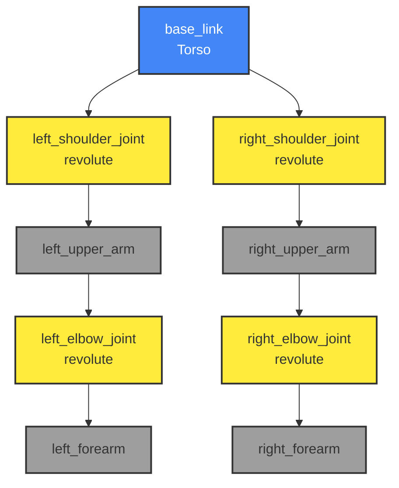

# Chapter 3: Humanoid Robot Modeling with URDF

Welcome to Chapter 3 of Module 1: The Robotic Nervous System. In this chapter, you'll learn how to model physical robots using **URDF (Unified Robot Description Format)**, the standard XML-based format for describing robot kinematics, dynamics, and visual appearance in ROS 2.

## Learning Outcomes

By the end of this chapter, you will be able to:

1. **Understand URDF Structure** - Explain the purpose of links, joints, and their relationships
2. **Write URDF Files** - Create robot descriptions with visual geometry, collision boundaries, and inertial properties
3. **Define Kinematic Chains** - Model multi-joint robots with parent-child link relationships
4. **Validate URDF** - Use `check_urdf` to verify XML syntax and kinematic tree structure
5. **Visualize Robots in RViz** - Launch robot_state_publisher and view 3D models
6. **Control Joints Interactively** - Use joint_state_publisher_gui to manipulate joint angles

## Prerequisites

Before starting this chapter, you should have completed:

- **[Chapter 1: ROS 2 Fundamentals](./chapter-1-ros2-fundamentals.md)** - Nodes, topics, publishers, subscribers
- **[Chapter 2: Python Agents & Controllers](./chapter-2-python-agents-controllers.md)** - Agent architectures
- **Basic XML knowledge** - Tags, attributes, nesting structure
- **3D geometry concepts** - Cartesian coordinates, rotations (roll, pitch, yaw)

## Chapter Overview

This chapter introduces URDF, the language robots speak to describe themselves. You'll build a simple humanoid robot model from scratch, visualize it in RViz, and control its joints interactively.

**What you'll build:**
- A **simple humanoid robot** with a torso, two arms, and four revolute joints
- A **launch file** to visualize the robot in RViz
- An **RViz configuration** for optimal viewing

**Key topics:**
1. Understanding URDF - Purpose, structure, and use cases
2. URDF Syntax - `<robot>`, `<link>`, `<joint>`, `<visual>`, `<collision>` elements
3. Building a Simple Humanoid - Torso and arms with revolute joints
4. Validation and Visualization - check_urdf and RViz workflow
5. Interactive Control - joint_state_publisher_gui

---

Let's start by understanding what URDF is and why we need it.

## Understanding URDF

### What is URDF?

**URDF (Unified Robot Description Format)** is an XML-based file format for describing the physical structure of robots in ROS. It defines:

- **Links** - Rigid bodies (e.g., torso, arm, wheel)
- **Joints** - Connections between links (e.g., revolute, prismatic, fixed)
- **Visual geometry** - 3D shapes for rendering (boxes, cylinders, meshes)
- **Collision geometry** - Simplified shapes for physics simulation
- **Inertial properties** - Mass, center of mass, inertia tensors

### Why Use URDF?

URDF enables multiple ROS 2 tools to work with your robot:

| Tool | Purpose | Uses URDF For |
|------|---------|---------------|
| **RViz** | 3D visualization | Displaying robot model with current joint states |
| **Gazebo** | Physics simulation | Simulating robot dynamics, collisions, sensors |
| **MoveIt** | Motion planning | Computing collision-free trajectories |
| **robot_state_publisher** | TF broadcasting | Publishing transforms between coordinate frames |
| **Control frameworks** | Joint control | Loading joint limits, controller parameters |

### URDF vs. Other Formats

| Format | Description | When to Use |
|--------|-------------|-------------|
| **URDF** | XML-based robot description | Standard for ROS 1 & 2, simple robots |
| **XACRO** | URDF with macros (variables, loops) | Complex robots with repeated structures |
| **SDF** | Gazebo's Simulation Description Format | Advanced physics features (contact models, sensors) |
| **MJCF** | MuJoCo XML format | MuJoCo physics engine integration |

**This chapter focuses on URDF.** XACRO will be introduced later for complex models.

### URDF Structure Overview

A URDF file is an XML document with a single `<robot>` root element containing multiple `<link>` and `<joint>` elements:

```xml
<robot name="simple_humanoid">
  <!-- Links: Rigid bodies -->
  <link name="base_link">
    <visual>...</visual>
    <collision>...</collision>
    <inertial>...</inertial>
  </link>

  <link name="left_arm">...</link>

  <!-- Joints: Connections between links -->
  <joint name="left_shoulder" type="revolute">
    <parent link="base_link"/>
    <child link="left_arm"/>
    <axis xyz="0 1 0"/>
    <limit lower="-1.57" upper="1.57"/>
  </joint>
</robot>
```

**Key relationships:**
- **Links** are connected by **joints**
- Each joint has a **parent link** and a **child link**
- Links form a **kinematic tree** (no loops allowed)

---

Now let's dive into URDF syntax, starting with the building blocks: `<robot>` and `<link>` elements.

## URDF Syntax: `<robot>` and `<link>` Elements

### The `<robot>` Element

Every URDF file starts with a `<robot>` root element:

```xml
<robot name="simple_humanoid">
  <!-- All links and joints go here -->
</robot>
```

**Attributes:**
- `name` (required): Unique identifier for the robot

### The `<link>` Element

A **link** represents a rigid body in the robot. Links have three main sub-elements:

1. **`<visual>`** - How the link looks (rendering)
2. **`<collision>`** - Shape for collision detection
3. **`<inertial>`** - Mass and inertia properties

#### Basic Link Structure

```xml
<link name="torso">
  <visual>
    <geometry>
      <box size="0.3 0.2 0.4"/>
    </geometry>
    <material name="blue">
      <color rgba="0 0 1 1"/>
    </material>
  </visual>

  <collision>
    <geometry>
      <box size="0.3 0.2 0.4"/>
    </geometry>
  </collision>

  <inertial>
    <mass value="5.0"/>
    <inertia ixx="0.1" ixy="0.0" ixz="0.0"
             iyy="0.1" iyz="0.0" izz="0.1"/>
  </inertial>
</link>
```

#### Link Sub-Elements Explained

**1. `<visual>` - Visual Representation**

Defines how the link appears in visualization tools like RViz.

```xml
<visual>
  <!-- Optional: Origin (position & orientation) -->
  <origin xyz="0 0 0" rpy="0 0 0"/>

  <!-- Required: Geometry -->
  <geometry>
    <box size="length width height"/>  <!-- Box primitive -->
    <!-- OR -->
    <cylinder radius="r" length="l"/>   <!-- Cylinder primitive -->
    <!-- OR -->
    <sphere radius="r"/>                 <!-- Sphere primitive -->
    <!-- OR -->
    <mesh filename="package://my_robot/meshes/arm.stl"/> <!-- 3D mesh file -->
  </geometry>

  <!-- Optional: Material/Color -->
  <material name="blue">
    <color rgba="0 0 1 1"/>  <!-- Red Green Blue Alpha (0-1) -->
  </material>
</visual>
```

**2. `<collision>` - Collision Boundaries**

Defines simplified geometry for physics simulation and collision detection.

```xml
<collision>
  <origin xyz="0 0 0" rpy="0 0 0"/>
  <geometry>
    <!-- Usually simpler than visual geometry for performance -->
    <box size="0.3 0.2 0.4"/>
  </geometry>
</collision>
```

**Best practice:** Use simple primitives (boxes, cylinders) for collision geometry even if visual uses detailed meshes.

**3. `<inertial>` - Mass and Inertia**

Defines physical properties for dynamics simulation.

```xml
<inertial>
  <!-- Optional: Center of mass offset -->
  <origin xyz="0 0 0" rpy="0 0 0"/>

  <!-- Required: Mass (kg) -->
  <mass value="5.0"/>

  <!-- Required: Inertia tensor (kg·m²) -->
  <inertia ixx="0.1" ixy="0.0" ixz="0.0"
           iyy="0.1" iyz="0.0" izz="0.1"/>
</inertial>
```

**Inertia tensor:**
- `ixx`, `iyy`, `izz`: Moments of inertia around X, Y, Z axes
- `ixy`, `ixz`, `iyz`: Products of inertia (usually 0 for symmetric objects)

**Typical values:**
- **Torso (5 kg, 0.3×0.2×0.4 m box):** `ixx=0.09`, `iyy=0.10`, `izz=0.06`
- **Arm (1.5 kg, 0.1×0.1×0.3 m cylinder):** `ixx=0.01`, `iyy=0.01`, `izz=0.001`

---

### Coordinate Frames

Every link has its own **coordinate frame** defined by the link's origin. Child links are positioned relative to their parent's frame.

**Conventions:**
- **X-axis (red):** Forward
- **Y-axis (green):** Left
- **Z-axis (blue):** Up

**Origin parameters:**
- `xyz="x y z"`: Position offset (meters)
- `rpy="roll pitch yaw"`: Rotation offset (radians)
  - Roll: Rotation around X-axis
  - Pitch: Rotation around Y-axis
  - Yaw: Rotation around Z-axis

---

Next, let's explore how to connect links using joints.

## URDF Syntax: `<joint>` Elements

### What is a Joint?

A **joint** connects two links and defines how they can move relative to each other. Joints have:

- **Parent link** - The fixed reference link
- **Child link** - The moving link
- **Joint type** - Determines degrees of freedom
- **Axis** - Direction of motion (for revolute/prismatic joints)
- **Limits** - Constraints on position, velocity, and effort

### Joint Types

| Joint Type | DOF | Description | Example Use Case |
|------------|-----|-------------|------------------|
| **revolute** | 1 | Rotates around an axis with limits | Elbow, shoulder, hip |
| **continuous** | 1 | Rotates around an axis without limits | Wheel, propeller |
| **prismatic** | 1 | Slides along an axis | Elevator, telescope |
| **fixed** | 0 | No motion (rigid connection) | Camera mount, sensor bracket |
| **planar** | 2 | Moves in a plane (X, Y translation) | Air hockey puck |
| **floating** | 6 | Full 6-DOF motion | Free-falling object |

**Most common:** revolute (robot joints), fixed (sensors/cameras), continuous (wheels)

### Revolute Joint Example

```xml
<joint name="left_shoulder" type="revolute">
  <!-- Parent link (fixed reference) -->
  <parent link="base_link"/>

  <!-- Child link (moves) -->
  <child link="left_arm"/>

  <!-- Joint position relative to parent link -->
  <origin xyz="0 0.15 0.1" rpy="0 0 0"/>

  <!-- Axis of rotation (Y-axis for shoulder abduction) -->
  <axis xyz="0 1 0"/>

  <!-- Joint limits -->
  <limit lower="-1.57" upper="1.57" effort="10.0" velocity="1.0"/>
</joint>
```

**Explanation:**
- **Parent:** `base_link` (torso)
- **Child:** `left_arm` (upper arm link)
- **Origin:** Joint is located 0.15m to the left and 0.1m up from torso center
- **Axis:** Rotates around Y-axis (0 1 0)
- **Limits:**
  - `lower/upper`: -90° to +90° (in radians)
  - `effort`: Maximum torque (10 Nm)
  - `velocity`: Maximum angular velocity (1 rad/s ≈ 57°/s)

### Fixed Joint Example

Fixed joints rigidly connect two links (no motion):

```xml
<joint name="camera_mount" type="fixed">
  <parent link="head"/>
  <child link="camera"/>
  <origin xyz="0.05 0 0" rpy="0 0 0"/>
</joint>
```

**Use cases:**
- Mounting sensors (cameras, LiDARs)
- Attaching decorative elements
- Creating composite links

### Kinematic Tree Constraint

**IMPORTANT:** URDF requires a **tree structure** - no kinematic loops allowed.

**Valid (tree):**
```
     base_link
      /      \
   left_arm  right_arm
```

**Invalid (loop):**
```
   left_hand ← (error!)
      ↓          ↑
   left_arm → right_arm
```

**Why?** ROS 2's TF (transform) system requires a directed acyclic graph (DAG). Loops require **closed-loop kinematics** solvers, which URDF doesn't support natively.

**Solution for loops:** Use constraints in simulation (Gazebo SDF) or specialized packages (like KDL).

---

Now let's explore visual and collision geometry in detail.

## URDF Syntax: `<visual>` and `<collision>` Geometry

### Geometry Primitives

URDF supports four basic geometric primitives:

#### 1. Box

```xml
<geometry>
  <box size="length width height"/>
</geometry>
```

**Example:** Torso (0.3×0.2×0.4 m)
```xml
<box size="0.3 0.2 0.4"/>
```

#### 2. Cylinder

```xml
<geometry>
  <cylinder radius="r" length="l"/>
</geometry>
```

**Example:** Arm link (radius 0.05 m, length 0.3 m)
```xml
<cylinder radius="0.05" length="0.3"/>
```

**Note:** Cylinder's Z-axis is aligned with its length by default.

#### 3. Sphere

```xml
<geometry>
  <sphere radius="r"/>
</geometry>
```

**Example:** Head (radius 0.1 m)
```xml
<sphere radius="0.1"/>
```

#### 4. Mesh

```xml
<geometry>
  <mesh filename="package://robot_description/meshes/arm.stl" scale="1 1 1"/>
</geometry>
```

**Supported formats:**
- **STL** (STereoLithography) - Binary or ASCII, widely supported
- **DAE** (COLLADA) - Supports colors, textures, animations
- **OBJ** (Wavefront) - Simple mesh format

**Example:** Custom arm mesh
```xml
<mesh filename="package://my_robot/meshes/upper_arm.stl" scale="0.001 0.001 0.001"/>
```

**Scale factor:** STL files often use millimeters, so scale by 0.001 to convert to meters.

### Visual vs. Collision Geometry

**Best practice:** Use different geometry for visual and collision.

```xml
<link name="arm">
  <!-- Visual: Detailed mesh for aesthetics -->
  <visual>
    <geometry>
      <mesh filename="package://my_robot/meshes/arm_detailed.stl"/>
    </geometry>
    <material name="gray">
      <color rgba="0.5 0.5 0.5 1"/>
    </material>
  </visual>

  <!-- Collision: Simple primitive for performance -->
  <collision>
    <geometry>
      <cylinder radius="0.05" length="0.3"/>
    </geometry>
  </collision>
</link>
```

**Why separate?**
- **Visual:** High-poly meshes look good but are computationally expensive
- **Collision:** Simple primitives (box, cylinder, sphere) enable fast physics

**Performance impact:**
- Detailed mesh collision: 10-100× slower than primitives
- Use primitives for collision unless absolutely necessary

### Materials and Colors

Define materials for visual appearance:

```xml
<material name="blue">
  <color rgba="0 0 1 1"/>  <!-- Red Green Blue Alpha -->
</material>
```

**Common colors:**
```xml
<color rgba="1 0 0 1"/>  <!-- Red -->
<color rgba="0 1 0 1"/>  <!-- Green -->
<color rgba="0 0 1 1"/>  <!-- Blue -->
<color rgba="1 1 0 1"/>  <!-- Yellow -->
<color rgba="0.5 0.5 0.5 1"/>  <!-- Gray -->
<color rgba="1 1 1 1"/>  <!-- White -->
```

**Reusing materials:**
```xml
<!-- Define once -->
<material name="blue">
  <color rgba="0 0 1 1"/>
</material>

<!-- Reference multiple times -->
<link name="link1">
  <visual>
    <geometry>...</geometry>
    <material name="blue"/>  <!-- Reference by name -->
  </visual>
</link>
```

---

Now let's add sensors to our URDF model.

## URDF Syntax: `<sensor>` Elements

### Adding Sensors to URDF

Sensors are typically modeled as **fixed joints** connecting a sensor link to a parent link. The sensor link contains sensor-specific tags (for Gazebo simulation).

### Camera Sensor Example

```xml
<!-- Camera link -->
<link name="camera_link">
  <visual>
    <geometry>
      <box size="0.02 0.05 0.02"/>
    </geometry>
    <material name="black">
      <color rgba="0 0 0 1"/>
    </material>
  </visual>

  <collision>
    <geometry>
      <box size="0.02 0.05 0.02"/>
    </geometry>
  </collision>

  <inertial>
    <mass value="0.1"/>
    <inertia ixx="0.0001" ixy="0" ixz="0"
             iyy="0.0001" iyz="0" izz="0.0001"/>
  </inertial>
</link>

<!-- Fixed joint mounting camera to head -->
<joint name="camera_joint" type="fixed">
  <parent link="head"/>
  <child link="camera_link"/>
  <origin xyz="0.05 0 0" rpy="0 0 0"/>  <!-- 5cm in front of head -->
</joint>
```

### IMU Sensor Example

```xml
<!-- IMU link -->
<link name="imu_link">
  <visual>
    <geometry>
      <box size="0.01 0.01 0.005"/>
    </geometry>
    <material name="green">
      <color rgba="0 1 0 1"/>
    </material>
  </visual>

  <inertial>
    <mass value="0.01"/>
    <inertia ixx="0.00001" ixy="0" ixz="0"
             iyy="0.00001" iyz="0" izz="0.00001"/>
  </inertial>
</link>

<!-- Fixed joint mounting IMU to torso -->
<joint name="imu_joint" type="fixed">
  <parent link="base_link"/>
  <child link="imu_link"/>
  <origin xyz="0 0 0.15" rpy="0 0 0"/>  <!-- Top of torso -->
</joint>
```

**Note:** Sensor data simulation (camera images, IMU readings) requires Gazebo-specific plugins, which are covered in advanced tutorials.

---

Now let's build a complete simple humanoid robot URDF file.

## Building a Simple Humanoid Robot in URDF

In this section, we'll create a complete URDF file for a simplified humanoid robot with the following structure:

- **Torso** (`base_link`): The root of the kinematic tree
- **Left arm**: Upper arm + forearm (2 links, 2 joints)
- **Right arm**: Upper arm + forearm (2 links, 2 joints)
- **Total**: 5 links, 4 revolute joints

### Robot Structure Diagram



### Design Specifications

| Component | Dimensions | Mass | Color |
|-----------|-----------|------|-------|
| **Torso** | 0.3m × 0.2m × 0.4m (W×D×H) | 5.0 kg | Blue |
| **Upper Arms** | 0.1m × 0.1m × 0.3m | 1.5 kg each | Gray |
| **Forearms** | 0.08m × 0.08m × 0.25m | 1.0 kg each | Gray |

| Joint | Type | Axis | Limits | Purpose |
|-------|------|------|--------|---------|
| **Shoulder joints** | Revolute | Z-axis | -90° to +90° | Arm abduction/adduction |
| **Elbow joints** | Revolute | Y-axis | 0° to 135° | Arm flexion/extension |

### Complete URDF File: `simple_humanoid.urdf`

:::info File Location
This file is located at: `ros2-examples/module_1_urdf/simple_humanoid.urdf`
:::

```xml title="ros2-examples/module_1_urdf/simple_humanoid.urdf"
<?xml version="1.0"?>
<!--
Simple Humanoid Robot URDF - Educational Example
================================================

This URDF file defines a simplified humanoid robot with:
- 1 torso (base_link)
- 2 arms (left and right)
- 2 shoulder joints (revolute)
- 2 forearms (left and right)
- 2 elbow joints (revolute)

Total: 5 links, 4 revolute joints
-->

<robot name="simple_humanoid">

  <!-- ========================================
       BASE LINK: TORSO
       ======================================== -->

  <link name="base_link">

    <!-- VISUAL: What the robot looks like -->
    <visual>
      <origin xyz="0 0 0.2" rpy="0 0 0"/>
      <geometry>
        <!-- Box: width(x) depth(y) height(z) -->
        <box size="0.3 0.2 0.4"/>
      </geometry>
      <material name="blue">
        <color rgba="0.2 0.4 0.8 1.0"/>  <!-- Blue torso -->
      </material>
    </visual>

    <!-- COLLISION: Simplified geometry for collision detection -->
    <collision>
      <origin xyz="0 0 0.2" rpy="0 0 0"/>
      <geometry>
        <!-- Match visual geometry for simple shapes -->
        <box size="0.3 0.2 0.4"/>
      </geometry>
    </collision>

    <!-- INERTIAL: Mass and inertia properties for physics simulation -->
    <inertial>
      <origin xyz="0 0 0.2" rpy="0 0 0"/>
      <mass value="5.0"/>  <!-- 5 kg torso -->

      <!-- Inertia tensor for a box: I = (1/12) * m * (h^2 + d^2) for Ixx, etc. -->
      <!-- For box 0.3×0.2×0.4m, mass 5kg: -->
      <!-- Ixx = (1/12) * 5 * (0.2^2 + 0.4^2) = 0.0833 -->
      <!-- Iyy = (1/12) * 5 * (0.3^2 + 0.4^2) = 0.1042 -->
      <!-- Izz = (1/12) * 5 * (0.3^2 + 0.2^2) = 0.0542 -->
      <inertia
        ixx="0.0833" ixy="0.0" ixz="0.0"
        iyy="0.1042" iyz="0.0"
        izz="0.0542"/>
    </inertial>

  </link>


  <!-- ========================================
       LEFT ARM
       ======================================== -->

  <!-- LEFT SHOULDER JOINT: Connects torso to left upper arm -->
  <joint name="left_shoulder_joint" type="revolute">

    <!-- Parent link (torso) -->
    <parent link="base_link"/>

    <!-- Child link (left upper arm) -->
    <child link="left_upper_arm"/>

    <!-- Joint origin: Position where arm attaches to torso -->
    <!-- x=0.15m (half torso width), y=0, z=0.35m (near top of torso) -->
    <origin xyz="0.15 0 0.35" rpy="0 0 0"/>

    <!-- Rotation axis: Rotate around Z-axis (shoulder abduction/adduction) -->
    <axis xyz="0 0 1"/>

    <!-- Joint limits for revolute joint -->
    <limit
      lower="-1.57"    <!-- -90 degrees (arm down) -->
      upper="1.57"     <!-- +90 degrees (arm up) -->
      effort="10.0"    <!-- Maximum torque (N⋅m) -->
      velocity="1.0"/> <!-- Maximum angular velocity (rad/s) -->

    <!-- Joint dynamics (optional, for simulation) -->
    <dynamics damping="0.7" friction="0.0"/>

  </joint>

  <!-- LEFT UPPER ARM LINK -->
  <link name="left_upper_arm">

    <visual>
      <!-- Origin: Arm extends downward from shoulder -->
      <origin xyz="0 0 -0.15" rpy="0 0 0"/>
      <geometry>
        <!-- Upper arm: 0.1m × 0.1m × 0.3m box -->
        <box size="0.1 0.1 0.3"/>
      </geometry>
      <material name="gray">
        <color rgba="0.7 0.7 0.7 1.0"/>  <!-- Gray arms -->
      </material>
    </visual>

    <collision>
      <origin xyz="0 0 -0.15" rpy="0 0 0"/>
      <geometry>
        <box size="0.1 0.1 0.3"/>
      </geometry>
    </collision>

    <inertial>
      <origin xyz="0 0 -0.15" rpy="0 0 0"/>
      <mass value="1.5"/>  <!-- 1.5 kg upper arm -->

      <!-- Inertia for box 0.1×0.1×0.3m, mass 1.5kg -->
      <inertia
        ixx="0.0113" ixy="0.0" ixz="0.0"
        iyy="0.0113" iyz="0.0"
        izz="0.0025"/>
    </inertial>

  </link>


  <!-- LEFT ELBOW JOINT: Connects upper arm to forearm -->
  <joint name="left_elbow_joint" type="revolute">

    <parent link="left_upper_arm"/>
    <child link="left_forearm"/>

    <!-- Joint origin: At bottom of upper arm -->
    <origin xyz="0 0 -0.3" rpy="0 0 0"/>

    <!-- Rotation axis: Rotate around Y-axis (elbow flexion/extension) -->
    <axis xyz="0 1 0"/>

    <!-- Joint limits: Elbow can only bend one direction -->
    <limit
      lower="0.0"      <!-- 0 degrees (straight) -->
      upper="2.35"     <!-- 135 degrees (bent) -->
      effort="5.0"     <!-- Maximum torque (N⋅m) -->
      velocity="1.0"/> <!-- Maximum angular velocity (rad/s) -->

    <dynamics damping="0.5" friction="0.0"/>

  </joint>

  <!-- LEFT FOREARM LINK -->
  <link name="left_forearm">

    <visual>
      <!-- Forearm extends downward from elbow -->
      <origin xyz="0 0 -0.125" rpy="0 0 0"/>
      <geometry>
        <!-- Forearm: 0.08m × 0.08m × 0.25m box (slightly smaller than upper arm) -->
        <box size="0.08 0.08 0.25"/>
      </geometry>
      <material name="gray">
        <color rgba="0.7 0.7 0.7 1.0"/>
      </material>
    </visual>

    <collision>
      <origin xyz="0 0 -0.125" rpy="0 0 0"/>
      <geometry>
        <box size="0.08 0.08 0.25"/>
      </geometry>
    </collision>

    <inertial>
      <origin xyz="0 0 -0.125" rpy="0 0 0"/>
      <mass value="1.0"/>  <!-- 1.0 kg forearm -->

      <!-- Inertia for box 0.08×0.08×0.25m, mass 1.0kg -->
      <inertia
        ixx="0.0053" ixy="0.0" ixz="0.0"
        iyy="0.0053" iyz="0.0"
        izz="0.0011"/>
    </inertial>

  </link>


  <!-- ========================================
       RIGHT ARM (Mirror of left arm)
       ======================================== -->

  <!-- RIGHT SHOULDER JOINT -->
  <joint name="right_shoulder_joint" type="revolute">

    <parent link="base_link"/>
    <child link="right_upper_arm"/>

    <!-- Joint origin: Mirror of left shoulder (x=-0.15m) -->
    <origin xyz="-0.15 0 0.35" rpy="0 0 0"/>

    <axis xyz="0 0 1"/>

    <limit
      lower="-1.57"
      upper="1.57"
      effort="10.0"
      velocity="1.0"/>

    <dynamics damping="0.7" friction="0.0"/>

  </joint>

  <!-- RIGHT UPPER ARM LINK -->
  <link name="right_upper_arm">

    <visual>
      <origin xyz="0 0 -0.15" rpy="0 0 0"/>
      <geometry>
        <box size="0.1 0.1 0.3"/>
      </geometry>
      <material name="gray">
        <color rgba="0.7 0.7 0.7 1.0"/>
      </material>
    </visual>

    <collision>
      <origin xyz="0 0 -0.15" rpy="0 0 0"/>
      <geometry>
        <box size="0.1 0.1 0.3"/>
      </geometry>
    </collision>

    <inertial>
      <origin xyz="0 0 -0.15" rpy="0 0 0"/>
      <mass value="1.5"/>
      <inertia
        ixx="0.0113" ixy="0.0" ixz="0.0"
        iyy="0.0113" iyz="0.0"
        izz="0.0025"/>
    </inertial>

  </link>


  <!-- RIGHT ELBOW JOINT -->
  <joint name="right_elbow_joint" type="revolute">

    <parent link="right_upper_arm"/>
    <child link="right_forearm"/>

    <origin xyz="0 0 -0.3" rpy="0 0 0"/>

    <axis xyz="0 1 0"/>

    <limit
      lower="0.0"
      upper="2.35"
      effort="5.0"
      velocity="1.0"/>

    <dynamics damping="0.5" friction="0.0"/>

  </joint>

  <!-- RIGHT FOREARM LINK -->
  <link name="right_forearm">

    <visual>
      <origin xyz="0 0 -0.125" rpy="0 0 0"/>
      <geometry>
        <box size="0.08 0.08 0.25"/>
      </geometry>
      <material name="gray">
        <color rgba="0.7 0.7 0.7 1.0"/>
      </material>
    </visual>

    <collision>
      <origin xyz="0 0 -0.125" rpy="0 0 0"/>
      <geometry>
        <box size="0.08 0.08 0.25"/>
      </geometry>
    </collision>

    <inertial>
      <origin xyz="0 0 -0.125" rpy="0 0 0"/>
      <mass value="1.0"/>
      <inertia
        ixx="0.0053" ixy="0.0" ixz="0.0"
        iyy="0.0053" iyz="0.0"
        izz="0.0011"/>
    </inertial>

  </link>

</robot>
```

### Key Design Decisions Explained

1. **Base Link Choice**: The torso (`base_link`) is the root because it's the most stable part of the robot. All transformations are computed relative to this link.

2. **Joint Placement**:
   - Shoulder joints are positioned at `(±0.15, 0, 0.35)`, which is 15cm from the center (half the torso width) and 35cm up from the ground.
   - Elbow joints are positioned at the bottom of each upper arm.

3. **Coordinate Frame Convention**:
   - **X-axis**: Forward (right is positive, left is negative)
   - **Y-axis**: Left (left is positive, right is negative)
   - **Z-axis**: Up (up is positive, down is negative)
   - **RPY**: Roll (X), Pitch (Y), Yaw (Z) angles in radians

4. **Joint Axes**:
   - **Shoulder joints** rotate around the **Z-axis** (vertical), allowing arms to move up/down
   - **Elbow joints** rotate around the **Y-axis** (side-to-side), allowing forearms to bend forward

5. **Inertia Calculation**: For a box with dimensions $(w, d, h)$ and mass $m$:
   $$
   I_{xx} = \frac{1}{12}m(d^2 + h^2), \quad I_{yy} = \frac{1}{12}m(w^2 + h^2), \quad I_{zz} = \frac{1}{12}m(w^2 + d^2)
   $$

---

## Validating URDF with `check_urdf`

Before visualizing your URDF, you should validate it to catch syntax errors and structural issues.

### Installation (if not already installed)

```bash
sudo apt-get install liburdfdom-tools
```

### Validating the URDF

```bash
cd ~/ros2_ws/ros2-examples/module_1_urdf
check_urdf simple_humanoid.urdf
```

### Expected Output

If the URDF is valid:

```
robot name is: simple_humanoid
---------- Successfully Parsed XML ---------------
root Link: base_link has 2 child(ren)
    child(1):  left_upper_arm
        child(1):  left_forearm
    child(2):  right_upper_arm
        child(1):  right_forearm
```

### Common Validation Errors

| Error Message | Cause | Solution |
|--------------|-------|----------|
| `Error: XML parsing error` | Malformed XML (unclosed tags, missing quotes) | Check XML syntax with an XML validator |
| `Error: link '...' is not unique` | Duplicate link names | Ensure all link names are unique |
| `Error: joint '...' is not unique` | Duplicate joint names | Ensure all joint names are unique |
| `Error: link '...' is referenced but not defined` | Joint references non-existent link | Check parent/child link names in joints |
| `Error: joint '...' has a malformed parent` | Missing `<parent>` element | Add `<parent link="..."/>` to joint |
| `Error: link '...' has no inertia` | Missing `<inertial>` section | Add mass and inertia to link |

### Using `urdf_to_graphiz` for Visualization

You can also generate a visual graph of your robot structure:

```bash
urdf_to_graphiz simple_humanoid.urdf
```

This creates a PDF showing the kinematic tree structure.

---

## Visualizing URDF in RViz

RViz is ROS 2's 3D visualization tool. To visualize the humanoid robot, we need:

1. **`robot_state_publisher`**: Publishes TF transforms for all links based on joint states
2. **`joint_state_publisher_gui`**: GUI to manually control joint angles
3. **RViz**: Visualization tool to display the robot model

### Creating a Launch File

Create a launch file to start all necessary nodes:

```python title="ros2-examples/module_1_urdf/launch/visualize_humanoid.launch.py"
#!/usr/bin/env python3
"""
Launch file for visualizing simple_humanoid.urdf in RViz

This launch file starts three nodes:
1. robot_state_publisher - Publishes TF transforms based on URDF
2. joint_state_publisher_gui - GUI for controlling joint angles
3. rviz2 - 3D visualization tool

Usage:
    ros2 launch module_1_urdf visualize_humanoid.launch.py
"""

import os
from ament_index_python.packages import get_package_share_directory
from launch import LaunchDescription
from launch.actions import DeclareLaunchArgument
from launch.substitutions import LaunchConfiguration
from launch_ros.actions import Node

def generate_launch_description():

    # Path to URDF file
    urdf_file = os.path.join(
        os.path.dirname(__file__),
        '..',
        'simple_humanoid.urdf'
    )

    # Read URDF file
    with open(urdf_file, 'r') as f:
        robot_description = f.read()

    # Path to RViz config file (optional)
    rviz_config_file = os.path.join(
        os.path.dirname(__file__),
        '..',
        'humanoid.rviz'
    )

    # Check if RViz config exists
    use_rviz_config = os.path.exists(rviz_config_file)

    # Nodes to launch
    nodes = [

        # robot_state_publisher - Publishes TF transforms for all links
        Node(
            package='robot_state_publisher',
            executable='robot_state_publisher',
            name='robot_state_publisher',
            output='screen',
            parameters=[{
                'robot_description': robot_description,
                'use_sim_time': False
            }]
        ),

        # joint_state_publisher_gui - GUI for controlling joints
        Node(
            package='joint_state_publisher_gui',
            executable='joint_state_publisher_gui',
            name='joint_state_publisher_gui',
            output='screen'
        ),

        # rviz2 - 3D visualization
        Node(
            package='rviz2',
            executable='rviz2',
            name='rviz2',
            output='screen',
            arguments=['-d', rviz_config_file] if use_rviz_config else []
        ),
    ]

    return LaunchDescription(nodes)
```

### Running the Visualization

```bash
# Source ROS 2
source /opt/ros/humble/setup.bash

# Navigate to module directory
cd ~/ros2_ws/ros2-examples/module_1_urdf

# Run the launch file
ros2 launch module_1_urdf visualize_humanoid.launch.py
```

### What You'll See

1. **Joint State Publisher GUI**: A window with sliders for each revolute joint
   - `left_shoulder_joint`: -1.57 to 1.57 rad
   - `right_shoulder_joint`: -1.57 to 1.57 rad
   - `left_elbow_joint`: 0.0 to 2.35 rad
   - `right_elbow_joint`: 0.0 to 2.35 rad

2. **RViz Window**: 3D visualization of the robot
   - Blue torso
   - Gray arms
   - Moving the sliders will animate the joints in real-time

### RViz Configuration

Add these displays in RViz (if not using a saved config):

1. **RobotModel**:
   - Topic: `/robot_description`
   - Shows the visual geometry of all links

2. **TF**:
   - Shows coordinate frames for each link
   - Helps debug coordinate transformations

3. **Grid**:
   - Reference plane for orientation

**Fixed Frame**: Set to `base_link` (the root link)

---

## Controlling Joints Programmatically

While `joint_state_publisher_gui` is useful for manual testing, real robots need programmatic control. Here's how to publish joint states from a Python node.

### Publishing Joint States

```python title="ros2-examples/module_1_urdf/joint_controller_example.py"
#!/usr/bin/env python3
"""
Joint Controller Example - Programmatic Joint Control

This node demonstrates how to publish joint states to control
the simple humanoid robot. It animates the arm joints in a wave motion.
"""

import rclpy
from rclpy.node import Node
from sensor_msgs.msg import JointState
import math

class JointController(Node):
    def __init__(self):
        super().__init__('joint_controller')

        # Publisher for joint states
        self.publisher = self.create_publisher(JointState, '/joint_states', 10)

        # Timer for periodic updates (20 Hz)
        self.timer = self.create_timer(0.05, self.publish_joint_states)

        # Animation time
        self.time = 0.0

        self.get_logger().info('Joint controller started')

    def publish_joint_states(self):
        """Publish joint states with sine wave animation"""

        msg = JointState()

        # Set timestamp
        msg.header.stamp = self.get_clock().now().to_msg()

        # Define joint names (must match URDF)
        msg.name = [
            'left_shoulder_joint',
            'right_shoulder_joint',
            'left_elbow_joint',
            'right_elbow_joint'
        ]

        # Animate joints with sine waves
        # Shoulders move up and down
        shoulder_angle = 0.5 * math.sin(self.time)  # Oscillate ±0.5 rad

        # Elbows bend and extend (phase-shifted)
        elbow_angle = 0.5 * (1 + math.sin(self.time + math.pi))  # 0 to 1 rad

        # Set joint positions
        msg.position = [
            shoulder_angle,   # left_shoulder_joint
            shoulder_angle,   # right_shoulder_joint
            elbow_angle,      # left_elbow_joint
            elbow_angle       # right_elbow_joint
        ]

        # Publish
        self.publisher.publish(msg)

        # Increment time
        self.time += 0.05  # 20 Hz

def main(args=None):
    rclpy.init(args=args)
    node = JointController()

    try:
        rclpy.spin(node)
    except KeyboardInterrupt:
        pass

    node.destroy_node()
    rclpy.shutdown()

if __name__ == '__main__':
    main()
```

### Running with Programmatic Control

Instead of using `joint_state_publisher_gui`, run the controller:

```bash
# Terminal 1: Run robot_state_publisher and RViz
ros2 launch module_1_urdf visualize_humanoid.launch.py

# Terminal 2: Run custom joint controller
python3 ~/ros2_ws/ros2-examples/module_1_urdf/joint_controller_example.py
```

The robot arms will now wave automatically!

---

## Extending URDF: Adding Sensors

Let's add a camera sensor to the robot's torso.

### Modified URDF with Camera

Add this to `simple_humanoid.urdf` before the closing `</robot>` tag:

```xml
<!-- Camera link -->
<link name="camera_link">
  <visual>
    <geometry>
      <box size="0.02 0.05 0.02"/>
    </geometry>
    <material name="black">
      <color rgba="0 0 0 1"/>
    </material>
  </visual>

  <collision>
    <geometry>
      <box size="0.02 0.05 0.02"/>
    </geometry>
  </collision>

  <inertial>
    <mass value="0.1"/>
    <inertia ixx="0.0001" ixy="0" ixz="0"
             iyy="0.0001" iyz="0" izz="0.0001"/>
  </inertial>
</link>

<!-- Fixed joint mounting camera to torso -->
<joint name="camera_joint" type="fixed">
  <parent link="base_link"/>
  <child link="camera_link"/>
  <origin xyz="0.2 0 0.3" rpy="0 0 0"/>  <!-- Front of torso -->
</joint>
```

Now the robot has a camera! To simulate camera data in Gazebo, you'd add a Gazebo plugin (covered in advanced tutorials).

---

## Edge Cases and Common Pitfalls

### 1. Circular Dependencies in Kinematic Tree

**Problem**: URDF kinematic trees must be **acyclic** (no loops).

**Invalid Example**:
```xml
<!-- INVALID: Creates a loop -->
<joint name="joint_a" type="revolute">
  <parent link="link_1"/>
  <child link="link_2"/>
</joint>

<joint name="joint_b" type="revolute">
  <parent link="link_2"/>
  <child link="link_1"/>  <!-- Creates cycle! -->
</joint>
```

**Error**: `check_urdf` will report: "Error: link 'link_1' is both ancestor and descendant"

**Solution**: Redesign the kinematic chain to be a tree. Use **closed-loop mechanisms** (e.g., parallel linkages) only in simulation with constraints, not in URDF directly.

---

### 2. Missing Inertial Properties

**Problem**: Links without `<inertial>` sections will have zero mass, causing physics simulation failures in Gazebo.

**Symptom**: Robot collapses or behaves unrealistically in simulation.

**Solution**: Always define `<mass>` and `<inertia>` for every link.

**Quick approximation** for inertia (if you don't need precision):
```xml
<inertial>
  <mass value="1.0"/>
  <inertia ixx="0.01" ixy="0.0" ixz="0.0"
           iyy="0.01" iyz="0.0" izz="0.01"/>
</inertial>
```

---

### 3. Joint Limits Violations

**Problem**: Joint limits (`<limit>`) define physically realistic ranges. Commanding positions outside these limits will be clamped.

**Example**: Elbow joint with `lower="0.0"` and `upper="2.35"` cannot bend backward.

**Solution**: Design joint limits based on real-world constraints. For humanoid robots, study human anatomy for realistic joint ranges.

---

### 4. Coordinate Frame Misalignment

**Problem**: Incorrect `<origin>` offsets cause links to be positioned incorrectly.

**Debugging**:
1. Visualize TF frames in RViz (add `TF` display)
2. Check that child frames are positioned relative to parent frames correctly
3. Use `ros2 run tf2_tools view_frames` to generate a PDF of the TF tree

---

## Troubleshooting

### Issue 1: RViz shows "No transform from [link] to [base_link]"

**Cause**: `robot_state_publisher` is not running or URDF is malformed.

**Solution**:
```bash
# Check if robot_state_publisher is running
ros2 node list

# Check if /robot_description is being published
ros2 param get /robot_state_publisher robot_description

# Validate URDF
check_urdf simple_humanoid.urdf
```

---

### Issue 2: Joints don't move in RViz

**Cause**: No joint state publisher is running.

**Solution**:
```bash
# Check if joint states are being published
ros2 topic echo /joint_states

# If no output, start joint_state_publisher_gui
ros2 run joint_state_publisher_gui joint_state_publisher_gui
```

---

### Issue 3: Robot appears at origin with wrong orientation

**Cause**: Fixed Frame in RViz is not set to `base_link`.

**Solution**: In RViz, set **Global Options → Fixed Frame** to `base_link`.

---

### Issue 4: `check_urdf` fails with "command not found"

**Cause**: `liburdfdom-tools` package not installed.

**Solution**:
```bash
sudo apt-get update
sudo apt-get install liburdfdom-tools
```

---

## Key Takeaways

1. **URDF is the standard format** for describing robot geometry and kinematics in ROS 2.

2. **Kinematic trees must be acyclic** – no loops allowed. The tree starts from a single root link (`base_link`).

3. **Every link needs three properties**:
   - **Visual**: What it looks like
   - **Collision**: Simplified geometry for collision detection
   - **Inertial**: Mass and inertia for physics simulation

4. **Joints connect links** and define how they move relative to each other. Revolute joints require limits.

5. **Validation is critical** – always run `check_urdf` before visualization to catch errors early.

6. **Visualization workflow**:
   ```
   URDF → robot_state_publisher → TF → RViz
   ```

7. **Joint control** requires publishing to `/joint_states` topic with `sensor_msgs/JointState` messages.

8. **Coordinate conventions matter** – ROS 2 uses right-handed coordinates (X-forward, Y-left, Z-up) and RPY angles (roll-pitch-yaw).

---

## Practice Exercises

1. **Add legs to the humanoid**: Extend `simple_humanoid.urdf` to include:
   - 2 thigh links connected to torso via hip joints (revolute)
   - 2 shin links connected to thighs via knee joints (revolute)
   - Visualize in RViz

2. **Add a head**: Create a head link connected to the torso via a neck joint (revolute, Z-axis rotation for looking left/right).

3. **Mesh geometry**: Replace box primitives with mesh files (`.stl` or `.dae`) for more realistic visuals.

4. **Inertia calculator**: Write a Python script that calculates inertia tensors for boxes, cylinders, and spheres given dimensions and mass.

5. **Export to SDF**: Convert your URDF to Gazebo's SDF format using `gz sdf -p simple_humanoid.urdf > simple_humanoid.sdf`.

---

## Validation Instructions

To verify your implementation of this chapter:

```bash
# 1. Validate URDF syntax
cd ~/ros2_ws/ros2-examples/module_1_urdf
check_urdf simple_humanoid.urdf

# Expected output: "Successfully Parsed XML" with 5 links

# 2. Visualize in RViz
ros2 launch module_1_urdf visualize_humanoid.launch.py

# Expected: RViz window opens showing blue torso with gray arms

# 3. Test joint control
# Move sliders in joint_state_publisher_gui
# Expected: Arms move smoothly in RViz

# 4. Generate TF tree diagram
ros2 run tf2_tools view_frames

# Expected: frames.pdf created showing kinematic tree

# 5. Check joint state topics
ros2 topic echo /joint_states --once

# Expected: JointState message with 4 joint positions
```

**Success criteria**:
- ✅ URDF passes `check_urdf` validation
- ✅ Robot displays correctly in RViz
- ✅ All 4 joints are controllable via GUI
- ✅ TF tree shows proper parent-child relationships
- ✅ Joint states are published to `/joint_states` topic

---