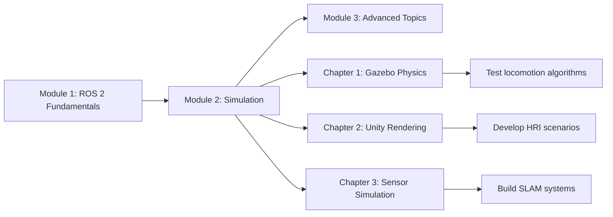

# Module 2: The Digital Twin (Gazebo & Unity)

## Learning Objectives

By the end of this module, you will:

- Simulate humanoid robots in realistic physics environments using Gazebo Classic 11
- Understand gravity, collision detection, and joint dynamics in physics simulation
- Render photorealistic robot environments with Unity for human-robot interaction (HRI)
- Configure and validate simulated sensors (LiDAR, depth cameras, IMUs) in Gazebo
- Integrate Unity with ROS 2 using the ROS-TCP-Connector bridge
- Test robot behaviors in simulation before deploying to real hardware

## Prerequisites

Before starting this module, you should have:

1. **Completed Module 1**: ROS 2 fundamentals, Python agents, URDF modeling
2. **simple_humanoid.urdf**: The humanoid robot model from Module 1 Chapter 3
3. **ROS 2 Humble** installed on Ubuntu 22.04 (or WSL2 for Windows users)
4. **Gazebo Classic 11** installed (see installation guide in Chapter 1)
5. **Basic 3D graphics understanding**: Coordinate systems, transformations (covered in Module 1)
6. **Minimum Hardware**: 8GB RAM for Gazebo; 16GB RAM + dedicated GPU recommended for Unity

## Module Structure

This module consists of three chapters, each building on robotics simulation concepts:

### Chapter 1: Gazebo Simulation – Physics, Gravity, Collisions ⚙️

Learn to simulate humanoid robots in Gazebo with realistic physics. Topics include:

- Installing and configuring Gazebo Classic 11 for ROS 2 Humble
- Creating Gazebo world files with ground planes, lighting, and physics settings
- Adding physics properties to URDF models (friction, inertia, damping)
- Testing collision detection and gravity simulation
- Launching Gazebo with ROS 2 integration using Python launch files
- Troubleshooting common Gazebo errors and performance issues

**Time**: 2-3 hours | **Difficulty**: Intermediate | **Priority**: P1 (MVP)

**Download**: [gazebo_humanoid_world.zip](/examples/gazebo_humanoid_world.zip)

---

### Chapter 2: Unity Rendering – High-Fidelity Visualization 🎨

Learn to create photorealistic robot visualizations in Unity. Topics include:

- Installing Unity 2021 LTS and ROS-TCP-Connector package
- Importing URDF models into Unity scenes with ArticulationBody physics
- Configuring materials, lighting, and shadows for realistic rendering
- Setting up Unity-ROS 2 bidirectional communication bridge
- Publishing camera feeds from Unity to ROS 2 topics
- Testing ROS-Unity integration with joint commands and sensor data

**Time**: 3-4 hours | **Difficulty**: Advanced | **Priority**: P2 (Optional)

**Note**: This chapter is optional. Students with hardware limitations can skip Unity and focus on Gazebo (Chapter 1) and sensors (Chapter 3). Unity excels at photorealistic rendering for demos, HRI studies, and computer vision research, but Gazebo is sufficient for physics simulation and robot testing.

**Download**: [unity_humanoid_scene.zip](/examples/unity_humanoid_scene.zip)

---

### Chapter 3: Sensor Simulation – LiDAR, Depth Cameras, IMUs 📡

Learn to simulate robot sensors with realistic noise models. Topics include:

- Configuring LiDAR sensor plugins in Gazebo URDFs (ray-based simulation)
- Setting up depth cameras with configurable resolution and noise parameters
- Adding IMU sensors for orientation, angular velocity, and linear acceleration data
- Visualizing sensor data in RViz (laser scans, depth images, IMU orientation)
- Validating sensor accuracy with known test environments
- Understanding sensor fusion concepts for autonomous navigation

**Time**: 2-3 hours | **Difficulty**: Intermediate | **Priority**: P3

**Download**: [gazebo_sensors.zip](/examples/gazebo_sensors.zip)

---

## Installation Quick Links

### Required for Chapter 1 (Gazebo)

- **Gazebo Classic 11**: [Installation Guide](http://classic.gazebosim.org/tutorials?tut=install_ubuntu)
- **gazebo_ros_pkgs**: Install with `sudo apt install ros-humble-gazebo-ros-pkgs`
- **ROS 2 Humble**: Already installed from Module 1

### Optional for Chapter 2 (Unity)

- **Unity 2021 LTS**: [Download Unity Hub](https://unity.com/download)
- **ROS-TCP-Connector**: [GitHub Repository](https://github.com/Unity-Technologies/ROS-TCP-Connector)
- **Unity Personal License**: Free for revenue under $100k/year

### Hardware Recommendations

**For Gazebo (Chapter 1 & 3)**:
- Minimum: 8GB RAM, integrated GPU, Ubuntu 22.04
- Recommended: 16GB RAM, dedicated GPU for complex worlds
- Expected Performance: 20+ FPS with simple_humanoid + 10 environment objects

**For Unity (Chapter 2)**:
- Minimum: 16GB RAM, dedicated GPU (GTX 1050 or better)
- Recommended: 32GB RAM, modern GPU (RTX series)
- Expected Performance: 30+ FPS with high-quality lighting and shadows

**Fallback Options**:
- **Low-end hardware for Gazebo**: Use headless mode (`gzserver` only, no GUI), visualize in RViz
- **No GPU for Unity**: Reduce resolution to 1280x720, disable post-processing, or skip Unity chapter entirely

---

## How This Module Fits into the Textbook



**Module 1** taught you how to define robots with URDF, communicate via ROS 2, and write Python agents.
**Module 2** builds on this by simulating robots in realistic environments before deploying to hardware.
**Module 3** (future) will cover advanced topics like reinforcement learning, path planning, and real-world deployment.

---

## Why Simulation Matters

Simulation is critical for robotics development because:

1. **Safety**: Test dangerous behaviors (falling, collisions) without hardware damage
2. **Cost**: Iterate quickly without expensive prototype builds
3. **Speed**: Run physics faster than real-time for rapid experimentation
4. **Reproducibility**: Exact same conditions for every test run
5. **Scale**: Test thousands of scenarios impossible in the real world

Real-world robotics projects follow this workflow:

```
Design (URDF) → Simulate (Gazebo/Unity) → Validate → Deploy to Hardware → Iterate
```

By mastering simulation in Module 2, you'll save months of development time and avoid costly hardware failures.

---

## Next Steps

Start with [Chapter 1: Gazebo Simulation](./chapter-1-gazebo-physics.md) to learn physics-based robot simulation. This is the foundation for all subsequent chapters.

If you have questions or encounter issues, refer to the troubleshooting sections in each chapter or consult the [ROS 2 Humble documentation](https://docs.ros.org/en/humble/) and [Gazebo Classic tutorials](http://classic.gazebosim.org/tutorials).

**Good luck, and happy simulating! 🤖**
