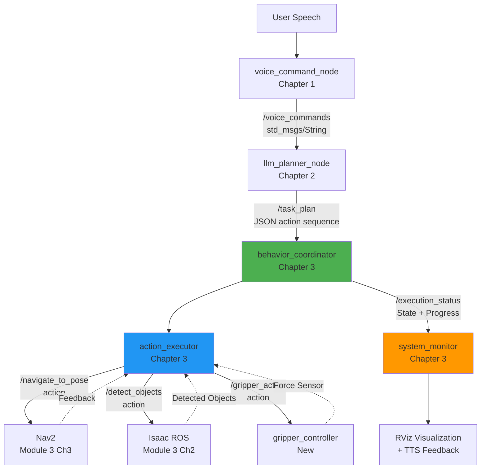

# Chapter 3: Capstone - Autonomous Humanoid VLA

## Introduction

You've built the individual components—voice recognition with Whisper (Chapter 1), cognitive planning with LLMs (Chapter 2), navigation with Nav2 (Module 3), and vision with Isaac ROS (Module 3). Now it's time to integrate these systems into a **complete autonomous humanoid** capable of understanding natural language commands and executing complex multi-step tasks without human intervention.

This capstone chapter demonstrates **Vision-Language-Action (VLA)** in practice: a humanoid robot that can hear "bring me the bottle from the shelf," decompose this command into a 6-step action plan, navigate to the shelf, detect the bottle using computer vision, grasp it with force-controlled manipulation, return to the user, and confirm task completion—all autonomously in under 2 minutes.

**The Integration Challenge**: Building individual components is one thing; orchestrating them into a reliable autonomous system is another. You must handle:
- **Temporal coordination**: Voice command arrives → wait for LLM plan → execute actions sequentially → handle timeouts
- **State management**: Track which action is executing, detect failures, decide when to replan
- **Failure recovery**: Object detection fails → retry with different viewpoint, grasp fails → adjust gripper force
- **System monitoring**: Provide real-time feedback to user via RViz visualization and text-to-speech

**Real-World VLA Systems**: This architecture mirrors deployments at Google (Everyday Robots), DeepMind (RT-2), and Tesla (Optimus). Industrial humanoids like Boston Dynamics' Atlas and Figure AI's Figure 01 use similar VLA pipelines: language understanding → task planning → vision-guided manipulation. Your capstone is a simplified but functionally complete version of these systems, suitable for warehouse automation, eldercare assistance, and domestic robotics.

**What You'll Build**: A `vla_coordinator` ROS 2 package that:
1. **Listens** to `/voice_commands` from Whisper node (Chapter 1)
2. **Receives** action plans from `/task_plan` LLM planner (Chapter 2)
3. **Executes** actions via behavior coordinator state machine
4. **Dispatches** primitives to Nav2 (navigation), Isaac ROS (perception), gripper controller (manipulation)
5. **Monitors** execution progress, handles failures, publishes status to `/execution_status`
6. **Visualizes** system state in RViz (voice commands text, task plan viewer, progress bar)

**Portfolio Demonstration**: This capstone serves as a compelling portfolio piece for robotics roles. You'll record a video showing end-to-end autonomous task execution—a humanoid responding to your voice command and completing a multi-step manipulation task in simulation. This demonstrates full-stack robotics competency: perception, planning, control, and system integration.

**Learning Objectives**:
- Implement state machine-based behavior coordination for multi-step task execution
- Integrate 4 major subsystems (voice, planning, navigation, manipulation) via ROS 2 topics and action servers
- Handle asynchronous action execution with timeouts and preemption
- Implement failure detection and recovery strategies (retry, replan, user notification)
- Visualize system state for debugging and demonstration
- Deploy and test complete VLA pipeline in Isaac Sim warehouse environment

Let's build your autonomous humanoid.

## System Architecture

The VLA system consists of 7 ROS 2 nodes communicating via topics and action servers. Understanding the data flow is critical for debugging and extending the system.

### Architecture Diagram



### Node Responsibilities

**1. voice_command_node** (Chapter 1 - Whisper)
- **Input**: Microphone audio
- **Output**: `/voice_commands` (std_msgs/String)
- **Function**: Transcribe speech to text with >90% accuracy, `<2s` latency
- **Status**: ✅ Complete from Chapter 1

**2. llm_planner_node** (Chapter 2 - LLM)
- **Input**: `/voice_commands` (std_msgs/String)
- **Output**: `/task_plan` (JSON action sequence)
- **Function**: Translate natural language to executable action primitives
- **Status**: ✅ Complete from Chapter 2

**3. behavior_coordinator** (Chapter 3 - **New**)
- **Input**: `/task_plan` (JSON action sequence)
- **Output**: `/execution_status` (state machine state, progress)
- **Function**: State machine managing task execution lifecycle
- **States**: idle → planning → executing → completed / failed
- **Responsibilities**:
  - Parse action plan from LLM
  - Iterate through action sequence
  - Call action_executor for each primitive
  - Detect failures, trigger replanning or retry
  - Publish progress updates for monitoring

**4. action_executor** (Chapter 3 - **New**)
- **Input**: Individual action primitive (from behavior_coordinator)
- **Output**: Action server calls to Nav2 / Isaac ROS / Gripper
- **Function**: Dispatch action primitives to appropriate subsystem
- **Mapping**:
  - `navigate` → Nav2 `/navigate_to_pose` action
  - `detect_object` → Isaac ROS `/detect_objects` action
  - `grasp`, `release` → Gripper `/gripper_action` action
  - `say` → TTS (text-to-speech) service
- **Handles**: Timeouts, preemption, result parsing

**5. system_monitor** (Chapter 3 - **New**)
- **Input**: `/execution_status`, `/task_plan`, `/voice_commands`
- **Output**: RViz visualization markers, TTS feedback
- **Function**: User interface for debugging and demonstration
- **Visualizations**:
  - Voice command text overlay
  - Task plan JSON viewer (actions, progress)
  - Execution progress bar (X/N actions complete)
  - Robot state (idle, planning, navigating, grasping)
  - Error messages on failures

**6. Nav2** (Module 3 Ch3 - Existing)
- **Action Server**: `/navigate_to_pose` (nav2_msgs/NavigateToPose)
- **Function**: Path planning and obstacle avoidance
- **Dependencies**: Costmaps, localization (AMCL)

**7. Isaac ROS** (Module 3 Ch2 - Existing)
- **Action Server**: `/detect_objects` (custom DetectObjects action)
- **Function**: GPU-accelerated object detection
- **Dependencies**: Camera sensor, YOLO model

**8. Gripper Controller** (Chapter 3 - **New**)
- **Action Server**: `/gripper_action` (control_msgs/GripperCommand)
- **Function**: Force-controlled parallel jaw gripper
- **Sensors**: Position encoder, force/torque sensor

### Topic Flow

```
Voice → /voice_commands → LLM → /task_plan → Coordinator → /execution_status → Monitor → RViz
                                                    ↓
                                              action_executor
                                                ↙     ↓     ↘
                                              Nav2  Isaac  Gripper
```

### State Machine (behavior_coordinator)

The coordinator implements a finite state machine with 5 states:

1. **IDLE**: Waiting for task plan
   - Transition: Receive `/task_plan` → PLANNING

2. **PLANNING**: Validating received plan
   - Validates action sequence completeness
   - Checks preconditions (grasp requires detect_object)
   - Transition: Valid plan → EXECUTING, Invalid → IDLE (publish error)

3. **EXECUTING**: Running action sequence
   - Iterates through actions sequentially
   - Calls action_executor for each primitive
   - Monitors timeouts (expected_duration * 1.5 buffer)
   - Transition: All actions complete → COMPLETED, Failure → FAILED

4. **COMPLETED**: Task successful
   - Publishes completion status
   - Logs performance metrics (total time, action breakdown)
   - Transition: Timeout (5s) → IDLE (ready for next task)

5. **FAILED**: Task failed
   - Reasons: Action timeout, detection failure, grasp failure, navigation blocked
   - Recovery strategies:
     - Retry current action (max 2 retries)
     - Request replanning from LLM (publish clarification request)
     - Notify user via TTS ("I couldn't find the bottle")
   - Transition: Timeout (5s) → IDLE

### Asynchronous Execution

All subsystem interactions use **ROS 2 action servers** for non-blocking execution:

```python
# Example: Navigate action dispatch
navigate_goal = NavigateToPose.Goal()
navigate_goal.pose = target_pose

self.nav2_client.send_goal_async(navigate_goal)
# ... wait for result with timeout...
result = self.nav2_client.get_result(timeout=action['expected_duration'])
```

This allows:
- **Concurrent execution**: Coordinator can monitor progress while action executes
- **Preemption**: Cancel navigation if new command arrives
- **Feedback**: Display progress (distance to goal, objects detected)

## Behavior Coordination

The behavior coordinator is the brain of the VLA system, orchestrating action execution using a state machine pattern.

### State Machine Implementation

```python
from enum import Enum

class RobotState(Enum):
    IDLE = 0
    PLANNING = 1
    EXECUTING = 2
    COMPLETED = 3
    FAILED = 4

class BehaviorCoordinator(Node):
    def __init__(self):
        super().__init__('behavior_coordinator')
        self.state = RobotState.IDLE
        self.current_plan = []
        self.current_action_index = 0
        self.retry_count = 0
        self.max_retries = 2

        # Subscribe to task plans
        self.plan_sub = self.create_subscription(
            String, 'task_plan', self.plan_callback, 10
        )

        # Publish execution status
        self.status_pub = self.create_publisher(String, 'execution_status', 10)

        # Action executor
        self.executor = ActionExecutor(self)

    def plan_callback(self, msg):
        """Receive new task plan from LLM."""
        if self.state != RobotState.IDLE:
            self.get_logger().warn('Busy executing task, ignoring new plan')
            return

        plan_data = json.loads(msg.data)
        self.current_plan = plan_data.get('plan', [])

        self.state = RobotState.PLANNING
        self.validate_and_execute_plan()

    def validate_and_execute_plan(self):
        """Validate plan and start execution."""
        # Validate preconditions
        if not self.validate_plan(self.current_plan):
            self.state = RobotState.FAILED
            self.publish_status('Plan validation failed')
            self.transition_to_idle()
            return

        self.state = RobotState.EXECUTING
        self.current_action_index = 0
        self.execute_next_action()

    def execute_next_action(self):
        """Execute next action in sequence."""
        if self.current_action_index >= len(self.current_plan):
            # All actions complete
            self.state = RobotState.COMPLETED
            self.publish_status('Task completed successfully')
            self.transition_to_idle()
            return

        action = self.current_plan[self.current_action_index]
        self.get_logger().info(f'Executing action {self.current_action_index + 1}/{len(self.current_plan)}: {action["action"]}')

        # Dispatch to executor
        success = self.executor.execute_action(action)

        if success:
            self.retry_count = 0
            self.current_action_index += 1
            self.execute_next_action()  # Continue to next action
        else:
            self.handle_action_failure(action)

    def handle_action_failure(self, action):
        """Handle failed action with retry or replan."""
        if self.retry_count < self.max_retries:
            self.retry_count += 1
            self.get_logger().warn(f'Retrying action (attempt {self.retry_count}/{self.max_retries})')
            self.execute_next_action()  # Retry same action
        else:
            self.state = RobotState.FAILED
            self.publish_status(f'Action failed: {action["action"]}')
            self.transition_to_idle()
```

### Action Execution with Timeouts

Each action has an `expected_duration`. The executor monitors execution time and aborts if timeout is exceeded:

```python
import time

def execute_action_with_timeout(self, action):
    """Execute action with timeout monitoring."""
    timeout = action['expected_duration'] * 1.5  # 50% buffer
    start_time = time.time()

    # Dispatch action (non-blocking)
    goal_handle = self.dispatch_action(action)

    # Wait for completion or timeout
    while not goal_handle.done():
        elapsed = time.time() - start_time
        if elapsed > timeout:
            self.get_logger().error(f'Action timeout: {action["action"]} exceeded {timeout}s')
            goal_handle.cancel()  # Preempt action
            return False

        time.sleep(0.1)  # Poll every 100ms

    return goal_handle.result().success
```

### Failure Recovery Strategies

| Failure Type | Detection | Recovery Strategy |
|--------------|-----------|-------------------|
| **Navigation blocked** | Nav2 returns `UNKNOWN` status | Replan path with updated costmap, or request user assistance |
| **Object not detected** | Isaac ROS returns empty detections | Retry from different viewpoint, adjust camera angle, or notify user |
| **Grasp failed** | Gripper force sensor shows no contact | Adjust grasp pose, increase force, or retry with different approach |
| **Action timeout** | Execution time > expected_duration * 1.5 | Cancel action, retry (max 2), or mark task as failed |
| **Invalid plan** | LLM generates malformed JSON | Request replanning with error feedback, or use cached plan |

### Progress Tracking

The coordinator publishes execution status every 500ms:

```python
{
  "state": "EXECUTING",
  "current_action": "navigate",
  "progress": 3,  # Current action index
  "total_actions": 7,
  "elapsed_time": 12.5,
  "estimated_remaining": 18.3
}
```

This allows RViz to display real-time progress bars and state transitions.

## Module Integration

The capstone integrates 4 modules developed across the textbook. Understanding how they connect is essential for debugging multi-module issues.

### Module Dependencies

**Module 1 (ROS 2 Fundamentals)** → Provides:
- ROS 2 Humble framework (nodes, topics, actions, launch files)
- URDF humanoid model (`simple_humanoid.urdf`)
- Joint controllers for arm manipulation

**Module 2 (Simulation)** → Provides:
- Isaac Sim warehouse environment (shelves, objects, lighting)
- Physics simulation (gravity, collisions, friction)
- Sensor simulation (cameras, LIDAR, force sensors)

**Module 3 (AI-Robot Brain)** → Provides:
- **Ch2 Isaac ROS**: GPU-accelerated object detection (`/detect_objects` action)
- **Ch3 Nav2**: Path planning and obstacle avoidance (`/navigate_to_pose` action)
- Costmap generation from LIDAR scans

**Module 4 (VLA)** → Provides:
- **Ch1**: Whisper voice commands (`/voice_commands` topic)
- **Ch2**: LLM task planning (`/task_plan` topic)
- **Ch3**: Behavior coordination and system integration

### Launch File Composition

The capstone uses a **composite launch file** that starts all 7 nodes:

```python
# capstone_demo.launch.py
def generate_launch_description():
    return LaunchDescription([
        # Module 4 Ch1: Voice commands
        IncludeLaunchDescription(
            'whisper_ros2', 'voice_interface.launch.py'
        ),

        # Module 4 Ch2: LLM planner
        IncludeLaunchDescription(
            'llm_planner', 'llm_planner.launch.py',
            launch_arguments={'llm_backend': 'ollama'}
        ),

        # Module 3 Ch3: Nav2 navigation
        IncludeLaunchDescription(
            'nav2_bringup', 'navigation_launch.py'
        ),

        # Module 3 Ch2: Isaac ROS perception
        Node(package='isaac_ros_yolo', executable='yolo_node'),

        # Module 4 Ch3: Behavior coordinator
        Node(package='vla_coordinator', executable='behavior_coordinator'),

        # Module 4 Ch3: System monitor
        Node(package='vla_coordinator', executable='system_monitor'),

        # Module 4 Ch3: Gripper controller
        Node(package='vla_coordinator', executable='gripper_controller'),

        # RViz visualization
        Node(
            package='rviz2',
            executable='rviz2',
            arguments=['-d', rviz_config_path]
        ),
    ])
```

### Topic Remapping

Different modules may use different topic names. Use remapping to connect them:

```python
# Remap Isaac ROS detections to standard name
Node(
    package='isaac_ros_yolo',
    executable='yolo_node',
    remappings=[
        ('detections', '/detected_objects')
    ]
)
```

### TF Tree Integration

The system requires a complete TF tree from `map` → `odom` → `base_link` → `camera_link`, `gripper_link`:

```
map
 └─ odom (from AMCL localization)
     └─ base_link (robot root)
         ├─ camera_link (from URDF)
         ├─ gripper_link (from URDF)
         └─ lidar_link (from URDF)
```

If you see "No transform from map to camera_link" errors, check that all TF publishers are running.

## Runnable Example

Let's walk through a complete demonstration: **"Bring me the bottle from the shelf"**

### Setup (5 minutes)

**Step 1**: Launch Isaac Sim with warehouse scene

```bash
# Start Isaac Sim (GUI mode)
~/.local/share/ov/pkg/isaac_sim-*/isaac-sim.sh

# Load warehouse scene from Assets
# File → Open → isaac_sim/assets/Isaac/Environments/Simple_Warehouse/warehouse.usd
```

**Step 2**: Spawn humanoid robot

In Isaac Sim Python console:
```python
from omni.isaac.core import World
from omni.isaac.core.utils.stage import add_reference_to_stage

world = World()
add_reference_to_stage(
    usd_path="/path/to/simple_humanoid.urdf",
    prim_path="/World/humanoid"
)
world.reset()
```

**Step 3**: Launch VLA system

```bash
# Terminal 1: Launch all VLA nodes
cd ~/ros2_ws
source install/setup.bash
ros2 launch vla_coordinator capstone_demo.launch.py

# Wait for all nodes to initialize (~30s)
# You should see:
# [voice_command_node]: Started
# [llm_planner_node]: Started
# [behavior_coordinator]: Started
# [system_monitor]: Started
# [Nav2]: All servers active
```

### Execution (90 seconds)

**Step 4**: Issue voice command

Speak clearly into microphone:
```
"Go to the shelf and bring me the water bottle"
```

**Expected System Behavior**:

**T+0s**: Whisper transcribes command
```
[voice_command_node]: Published: "Go to the shelf and bring me the water bottle"
```

**T+3s**: LLM generates plan
```
[llm_planner_node]: Generated plan with 7 actions in 2.8s
[task_plan]: {
  "plan": [
    {"action": "navigate", "parameters": {"target": "shelf"}, "expected_duration": 12.0},
    {"action": "detect_object", "parameters": {"object_class": "bottle", "max_results": 1}, "expected_duration": 3.0},
    {"action": "navigate", "parameters": {"target": "detected_object_pose"}, "expected_duration": 5.0},
    {"action": "move_arm", "parameters": {"pose_name": "ready"}, "expected_duration": 2.0},
    {"action": "grasp", "parameters": {"object_id": "bottle_0", "force": 10.0}, "expected_duration": 4.0},
    {"action": "navigate", "parameters": {"target": "user"}, "expected_duration": 12.0},
    {"action": "say", "parameters": {"text": "Here is your water bottle"}, "expected_duration": 2.0}
  ]
}
```

**T+5s**: Coordinator starts execution
```
[behavior_coordinator]: State: EXECUTING
[behavior_coordinator]: Action 1/7: navigate to shelf
```

**T+17s**: Navigation complete, start detection
```
[Nav2]: Goal reached
[behavior_coordinator]: Action 2/7: detect_object
[isaac_ros_yolo]: Detected 1 object (bottle) at [2.3, 1.5, 0.8]
```

**T+22s**: Approach object
```
[behavior_coordinator]: Action 3/7: navigate to detected_object_pose
```

**T+27s**: Prepare arm for grasp
```
[behavior_coordinator]: Action 4/7: move_arm to ready pose
[joint_controller]: Moving arm to ready configuration
```

**T+31s**: Grasp bottle
```
[behavior_coordinator]: Action 5/7: grasp
[gripper_controller]: Closing gripper with 10.0N force
[gripper_controller]: Contact detected, grasp successful
```

**T+33s**: Return to user
```
[behavior_coordinator]: Action 6/7: navigate to user
```

**T+45s**: Deliver and confirm
```
[behavior_coordinator]: Action 7/7: say
[tts]: "Here is your water bottle"
[behavior_coordinator]: State: COMPLETED
[behavior_coordinator]: Task completed in 40.2s
```

### RViz Visualization

During execution, RViz displays:

1. **3D View**: Robot model, warehouse environment, detected objects (green boxes)
2. **Costmap**: Nav2 path planning visualization (obstacles in red, path in blue)
3. **Text Overlay**:
   - Voice command: "Go to the shelf and bring me the water bottle"
   - Current state: "EXECUTING (5/7 actions)"
   - Current action: "Grasping bottle_0"
4. **Progress Bar**: 71% complete (5 of 7 actions done)
5. **TF Tree**: All transforms published correctly

## Practice Exercises

1. **Add Force Feedback Logging** (Easy, 30min)
   - Modify gripper_controller to log force sensor readings during grasp
   - Save to CSV: timestamp, force_x, force_y, force_z, grasp_success
   - Analyze: What force range indicates successful grasps?

2. **Implement Multi-Object Task** (Medium, 1-2hrs)
   - Test command: "Bring me all bottles from the shelf"
   - Modify behavior coordinator to handle action sequences with loops
   - Detect multiple objects, grasp each, return to user
   - Track: How does total time scale with number of objects?

3. **Test Obstacle Avoidance Recovery** (Medium, 1hr)
   - Place obstacle between robot and shelf mid-execution
   - Verify Nav2 replans path automatically
   - Measure: How much does replanning delay total task time?

4. **Record Demonstration Video** (Easy, 30min)
   - Use OBS Studio or screen recording
   - Capture: Voice command → full task execution → completion
   - Duration: 60-90s showing end-to-end autonomy
   - Upload to portfolio (YouTube, LinkedIn)

5. **Test System Resilience** (Hard, 2hrs)
   - Disconnect microphone mid-task → verify graceful degradation
   - Stop LLM server → verify cached plan fallback
   - Simulate detection failure (hide bottle) → verify retry logic
   - Document failure modes and recovery strategies

6. **Tune State Machine Timeouts** (Medium, 1hr)
   - Measure actual action durations over 10 runs
   - Update `expected_duration` in prompt templates
   - Reduce timeout buffer from 1.5x to 1.2x
   - Verify: Does this improve responsiveness without causing false timeouts?

## Troubleshooting

### Issue 1: Action primitive execution timeout

**Symptoms**: `[behavior_coordinator]: Action timeout: navigate exceeded 18.0s`

**Causes**:
- Path blocked by obstacle
- Navigation goal unreachable
- expected_duration too short

**Solutions**:
```bash
# 1. Check Nav2 costmap for obstacles
ros2 topic echo /global_costmap/costmap

# 2. Increase timeout buffer in behavior_coordinator
# Edit: vla_coordinator/behavior_coordinator.py
timeout = action['expected_duration'] * 2.0  # Was 1.5

# 3. Update expected_duration in LLM prompt examples
# Edit: llm_planner/prompt_templates.py
{"action": "navigate", "expected_duration": 20.0}  # Was 15.0
```

### Issue 2: Gripper fails to grasp object

**Symptoms**: `[gripper_controller]: No contact detected after closing`

**Causes**:
- Object pose estimation inaccurate (detection error)
- Gripper approach angle wrong
- Force threshold too low

**Solutions**:
```bash
# 1. Visualize detected object pose in RViz
ros2 topic echo /detected_objects

# 2. Adjust grasp force in action primitive
{"action": "grasp", "parameters": {"force": 15.0}}  # Was 10.0

# 3. Add pre-grasp alignment step
# Move arm to align gripper parallel with object before closing
```

### Issue 3: System stuck in PLANNING state

**Symptoms**: Coordinator receives plan but never transitions to EXECUTING

**Causes**:
- Plan validation failing silently
- LLM generated invalid JSON
- Precondition check blocking execution

**Solutions**:
```bash
# 1. Enable debug logging
ros2 run vla_coordinator behavior_coordinator --ros-args --log-level debug

# 2. Check plan structure
ros2 topic echo /task_plan

# 3. Verify action executor clients are connected
ros2 action list  # Should show /navigate_to_pose, /detect_objects, /gripper_action
```

### Issue 4: RViz doesn't show task plan visualization

**Symptoms**: RViz displays robot but no task plan overlay

**Causes**:
- system_monitor node not running
- RViz config missing visualization markers
- Topic name mismatch

**Solutions**:
```bash
# 1. Check if system_monitor is publishing
ros2 topic list | grep visualization

# 2. Verify RViz subscribed to correct topics
# In RViz: Add → By topic → /visualization_marker

# 3. Restart system_monitor
ros2 run vla_coordinator system_monitor
```

## References

1. **Brohan, A., et al. (2023)**. "RT-2: Vision-Language-Action Models Transfer Web Knowledge to Robotic Control." *arXiv:2307.15818*. [Paper](https://arxiv.org/abs/2307.15818)
   - DeepMind's RT-2 model demonstrating end-to-end VLA learning from internet-scale data

2. **Driess, D., et al. (2023)**. "PaLM-E: An Embodied Multimodal Language Model." *arXiv:2303.03378*. [Paper](https://arxiv.org/abs/2303.03378)
   - Google's embodied LLM integrating vision, language, and robot control in a unified model

3. **Ahn, M., et al. (2022)**. "Do As I Can, Not As I Say: Grounding Language in Robotic Affordances." *Conference on Robot Learning (CoRL)*. [Paper](https://arxiv.org/abs/2204.01691)
   - SayCan demonstrating LLM-based task planning grounded in robot affordances

---

**Next Steps**: You now have a complete Vision-Language-Action system! Consider:
1. **Deploy to real hardware**: Adapt for physical humanoid (adjust sensor configs, tune controllers)
2. **Extend action primitives**: Add `wipe_surface`, `open_door`, `pour_liquid` for richer tasks
3. **Multi-robot coordination**: Orchestrate multiple humanoids for warehouse automation
4. **Learn from demonstration**: Record human teleoperation, use as training data for imitation learning
5. **Share your work**: Upload demo video to LinkedIn, GitHub, personal website as portfolio piece

**Congratulations** on completing Module 4! You've built a state-of-the-art autonomous humanoid capable of understanding voice commands, planning complex tasks, and executing multi-step manipulation—skills directly applicable to roles at robotics companies like Boston Dynamics, Figure AI, Agility Robotics, and Tesla.
