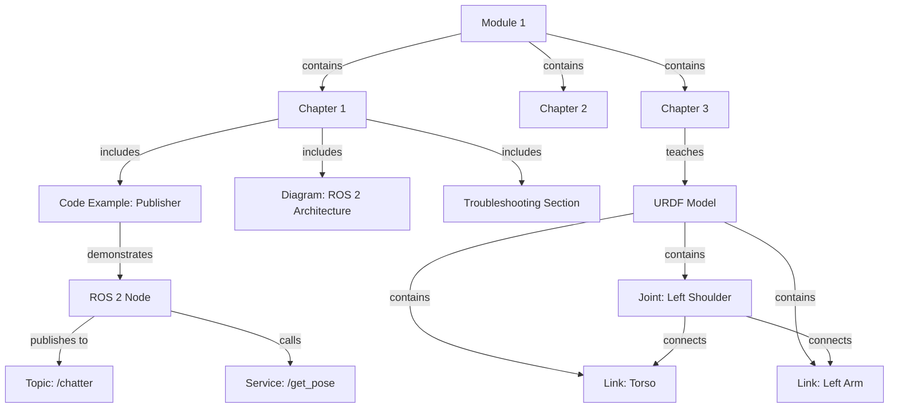

# Data Model: Module 1 - The Robotic Nervous System (ROS 2)

**Feature**: 001-ros2-robotic-nervous-system
**Date**: 2025-12-17
**Phase**: Phase 1 - Data Model and Entity Definitions

## Overview

This document defines the key entities, data structures, and relationships for Module 1 content. Since this is a static documentation module (not a backend service), the "data model" describes the conceptual entities taught to readers (ROS 2 primitives, URDF components) rather than database schemas.

---

## Content Entities (Documentation Structure)

### 1. Chapter

Represents a single instructional chapter in Module 1.

**Attributes**:
- `chapter_id` (string): Unique identifier (e.g., "chapter-1-ros2-fundamentals")
- `title` (string): Display title (e.g., "Chapter 1: ROS 2 Fundamentals")
- `file_path` (string): Markdown file location (e.g., "docs/module-1/chapter-1-ros2-fundamentals.md")
- `order` (integer): Display order in sidebar (1, 2, 3)
- `estimated_time` (integer): Reader completion time in minutes (e.g., 90 for Chapter 1)
- `prerequisites` (array of strings): Required prior knowledge (e.g., ["Python basics", "Linux command line"])
- `learning_outcomes` (array of strings): Key takeaways (e.g., ["Understand ROS 2 node concept", "Create publisher/subscriber"])

**Relationships**:
- A Chapter contains multiple Code Examples (1-to-many)
- A Chapter contains multiple Conceptual Diagrams (1-to-many)
- A Chapter has one Troubleshooting Section (1-to-1)

**Validation Rules**:
- `title` must be non-empty
- `order` must be unique within Module 1
- `estimated_time` should be between 30-120 minutes (per spec assumption)

---

### 2. Code Example

Represents a runnable Python or URDF code snippet embedded in a chapter.

**Attributes**:
- `example_id` (string): Unique identifier (e.g., "minimal-publisher")
- `title` (string): Descriptive title (e.g., "Minimal Publisher Node")
- `language` (enum): Programming language ("python", "xml", "bash")
- `file_path` (string): Source code location (e.g., "ros2-examples/module_1_fundamentals/minimal_publisher/publisher_node.py")
- `lines_of_code` (integer): Approximate LOC (e.g., 25 for minimal publisher)
- `dependencies` (array of strings): ROS 2 packages required (e.g., ["rclpy", "std_msgs"])
- `execution_command` (string): How to run (e.g., "ros2 run minimal_publisher publisher_node")
- `expected_output` (string): What readers should see (e.g., "Publishing: 'Hello World: 0'")
- `inline_comments` (boolean): Whether code includes line-by-line explanations (true for all examples per FR-003)

**Relationships**:
- Belongs to one Chapter (many-to-1)
- May reference other Code Examples (e.g., subscriber references publisher topic)

**Validation Rules**:
- `language` must be "python", "xml", or "bash"
- `file_path` must exist in `ros2-examples/` directory
- `inline_comments` must be true (constitution Principle III: Clear, Developer-Focused Writing)

---

### 3. Conceptual Diagram

Represents a visual aid (Mermaid diagram or static image) explaining ROS 2 concepts.

**Attributes**:
- `diagram_id` (string): Unique identifier (e.g., "ros2-architecture")
- `title` (string): Diagram caption (e.g., "ROS 2 Layered Architecture")
- `type` (enum): Diagram format ("mermaid", "image")
- `source` (string): Mermaid.js code or image file path (e.g., "static/img/ros2-architecture.png")
- `alt_text` (string): Accessibility description for screen readers
- `referenced_concepts` (array of strings): Concepts illustrated (e.g., ["DDS", "rclpy", "Executors"])

**Relationships**:
- Belongs to one Chapter (many-to-1)

**Validation Rules**:
- If `type` == "mermaid", `source` must be valid Mermaid.js syntax
- If `type` == "image", `source` file must exist in `static/img/`
- `alt_text` must be non-empty (accessibility requirement)

---

### 4. Troubleshooting Entry

Represents a common error scenario and its solution.

**Attributes**:
- `error_id` (string): Unique identifier (e.g., "rclpy-not-found")
- `error_message` (string): Exact error text (e.g., "ModuleNotFoundError: No module named 'rclpy'")
- `context` (string): When this error occurs (e.g., "When running ros2 run command")
- `solution` (string): Step-by-step fix (e.g., "Source ROS 2 setup: source /opt/ros/humble/setup.bash")
- `related_faq_link` (string, optional): Link to ROS 2 Discourse or ROS Answers (e.g., "https://answers.ros.org/question/12345/")

**Relationships**:
- Belongs to one Chapter (many-to-1)

**Validation Rules**:
- `error_message` must be non-empty
- `solution` must provide actionable steps (not just "Google it")

---

## ROS 2 Primitive Entities (Instructional Concepts)

These entities represent the ROS 2 concepts taught to readers. They are not stored in a database but define the structure of educational content.

### 5. ROS 2 Node (Conceptual)

**Definition**: Independent process in the ROS 2 computation graph that performs a specific task.

**Attributes** (as taught in Chapter 1):
- `node_name` (string): Unique identifier in the ROS 2 graph (e.g., "minimal_publisher")
- `namespace` (string, optional): Logical grouping (e.g., "/robot1/sensors")
- `subscribed_topics` (array of Topic): Topics this node listens to
- `published_topics` (array of Topic): Topics this node sends data to
- `provided_services` (array of Service): Services this node offers
- `called_services` (array of Service): Services this node requests
- `parameters` (key-value map): Runtime configuration (e.g., {"publish_rate": 10})

**State Transitions** (lifecycle nodes, advanced topic not covered in Module 1):
- Unconfigured → Inactive → Active → Finalized

**Example Instance**:
```python
Node(
    node_name="obstacle_avoidance_agent",
    namespace="/robot1",
    subscribed_topics=[Topic(name="/scan", type="LaserScan")],
    published_topics=[Topic(name="/cmd_vel", type="Twist")],
    parameters={"safety_distance": 1.0}
)
```

---

### 6. Topic (Conceptual)

**Definition**: Named channel for asynchronous many-to-many message passing in ROS 2.

**Attributes** (as taught in Chapter 1):
- `topic_name` (string): Unique name in the graph (e.g., "/chatter", "/cmd_vel")
- `message_type` (string): ROS 2 message definition (e.g., "std_msgs/String", "geometry_msgs/Twist")
- `qos_profile` (QoSProfile): Quality of Service settings (reliability, durability, history)
- `publishers` (array of Node): Nodes sending messages to this topic
- `subscribers` (array of Node): Nodes receiving messages from this topic

**QoS Profile Sub-Entity**:
- `reliability` (enum): "RELIABLE" (TCP-like) or "BEST_EFFORT" (UDP-like)
- `durability` (enum): "VOLATILE" (current messages only) or "TRANSIENT_LOCAL" (late-joining subscribers receive history)
- `history` (enum): "KEEP_LAST" (buffer last N messages) or "KEEP_ALL"
- `depth` (integer): History buffer size (e.g., 10 for KEEP_LAST 10)

**Example Instance**:
```python
Topic(
    topic_name="/scan",
    message_type="sensor_msgs/LaserScan",
    qos_profile=QoSProfile(
        reliability="BEST_EFFORT",  # Sensor data tolerates packet loss
        durability="VOLATILE",
        history="KEEP_LAST",
        depth=10
    ),
    publishers=[Node(name="lidar_driver")],
    subscribers=[Node(name="obstacle_avoidance_agent")]
)
```

---

### 7. Service (Conceptual)

**Definition**: Synchronous request-response communication pattern in ROS 2.

**Attributes** (as taught in Chapter 1):
- `service_name` (string): Unique name (e.g., "/add_two_ints")
- `service_type` (string): ROS 2 service definition (e.g., "example_interfaces/AddTwoInts")
- `request_structure` (schema): Fields in request message (e.g., {"a": int64, "b": int64})
- `response_structure` (schema): Fields in response message (e.g., {"sum": int64})
- `server_node` (Node): Node providing the service
- `client_nodes` (array of Node): Nodes calling the service
- `timeout` (float): Client call timeout in seconds (e.g., 5.0)

**Example Instance**:
```python
Service(
    service_name="/get_robot_pose",
    service_type="nav_msgs/GetPose",
    request_structure={},  # Empty request
    response_structure={"pose": "geometry_msgs/Pose"},
    server_node=Node(name="robot_state_server"),
    client_nodes=[Node(name="obstacle_avoidance_agent")],
    timeout=2.0
)
```

---

### 8. Python Agent (Conceptual, Chapter 2)

**Definition**: Application-level logic layer that processes sensor data and generates control commands.

**Attributes** (as taught in Chapter 2):
- `agent_name` (string): Descriptive identifier (e.g., "ObstacleAvoidanceAgent")
- `decision_algorithm` (string): High-level strategy (e.g., "If obstacle within 1m, turn left")
- `sensor_subscriptions` (array of Topic): Input data streams (e.g., [Topic(name="/scan")])
- `actuator_publications` (array of Topic): Output command streams (e.g., [Topic(name="/cmd_vel")])
- `internal_state` (key-value map): Agent memory (e.g., {"last_turn_direction": "left", "obstacle_count": 5})
- `update_frequency` (float): Decision loop rate in Hz (e.g., 10 Hz)

**Design Patterns** (best practices from Chapter 2):
- **Separation of Concerns**: Sensing → Decision → Actuation as distinct methods
- **Callback-Based**: Use rclpy timer callbacks for periodic execution
- **Stateless When Possible**: Minimize internal state to simplify testing

**Example Instance**:
```python
class ObstacleAvoidanceAgent(Node):
    def __init__(self):
        super().__init__('obstacle_avoidance_agent')
        self.sensor_sub = self.create_subscription(LaserScan, '/scan', self.sensor_callback, 10)
        self.actuator_pub = self.create_publisher(Twist, '/cmd_vel', 10)
        self.internal_state = {"last_turn_direction": None}
        self.timer = self.create_timer(0.1, self.decision_loop)  # 10 Hz

    def sensor_callback(self, msg):
        # Process sensor data
        pass

    def decision_loop(self):
        # Make decision and publish actuator command
        pass
```

---

### 9. URDF Model (Conceptual, Chapter 3)

**Definition**: Robot description file defining physical and kinematic structure in XML format.

**Attributes** (as taught in Chapter 3):
- `robot_name` (string): Top-level identifier (e.g., "simple_humanoid")
- `links` (array of Link): Rigid body components
- `joints` (array of Joint): Connections between links
- `sensors` (array of Sensor): Attached sensor elements (cameras, IMUs)
- `materials` (array of Material): Visual appearance definitions (colors, textures)

**Relationships**:
- URDF Model contains Links and Joints
- Each Joint connects exactly two Links (parent-child)
- Joints form a tree structure (no cycles allowed)

**Validation Rules** (enforced by check_urdf):
- Must have exactly one root link (no parent joint)
- No circular dependencies (parent cannot be descendant of child)
- All joint axes must be unit vectors
- Inertia tensors must be positive semi-definite

**Example Instance**:
```xml
<robot name="simple_humanoid">
  <link name="base_link">
    <visual>
      <geometry><box size="0.3 0.2 0.4"/></geometry>
      <material name="blue"><color rgba="0 0 1 1"/></material>
    </visual>
    <collision>
      <geometry><box size="0.3 0.2 0.4"/></geometry>
    </collision>
    <inertial>
      <mass value="5.0"/>
      <inertia ixx="0.1" iyy="0.1" izz="0.05" ixy="0" ixz="0" iyz="0"/>
    </inertial>
  </link>
</robot>
```

---

### 10. Link (URDF Sub-Entity, Chapter 3)

**Definition**: Rigid body component of a robot (torso, arm, leg segment).

**Attributes**:
- `link_name` (string): Unique identifier (e.g., "left_shoulder_link")
- `visual_geometry` (Geometry): Shape for rendering (box, cylinder, sphere, mesh)
- `collision_geometry` (Geometry): Simplified shape for physics simulation
- `inertial_properties` (Inertial): Mass, center of mass, inertia tensor

**Geometry Sub-Entity**:
- `type` (enum): "box", "cylinder", "sphere", "mesh"
- `dimensions` (varies by type): e.g., {"size": [0.1, 0.1, 0.2]} for box
- `mesh_file` (string, if type=mesh): Path to STL/DAE file (e.g., "meshes/arm.stl")

**Inertial Sub-Entity**:
- `mass` (float): Mass in kilograms (e.g., 1.5)
- `origin` (Pose): Center of mass offset from link origin
- `inertia_matrix` (3x3 matrix): Moment of inertia tensor

---

### 11. Joint (URDF Sub-Entity, Chapter 3)

**Definition**: Connection between two links with motion constraints.

**Attributes**:
- `joint_name` (string): Unique identifier (e.g., "left_shoulder_joint")
- `joint_type` (enum): "revolute", "prismatic", "fixed", "continuous", "planar", "floating"
- `parent_link` (Link): Fixed link in the relationship
- `child_link` (Link): Moving link in the relationship
- `axis` (vector3): Axis of rotation/translation (e.g., [0, 1, 0] for Y-axis)
- `origin` (Pose): Transform from parent link to joint frame
- `limits` (JointLimits): Position, velocity, effort bounds

**JointLimits Sub-Entity**:
- `lower` (float): Minimum position (radians for revolute, meters for prismatic)
- `upper` (float): Maximum position
- `velocity` (float): Maximum velocity (rad/s or m/s)
- `effort` (float): Maximum torque/force (Nm or N)

**Example Instance**:
```xml
<joint name="left_shoulder_joint" type="revolute">
  <parent link="base_link"/>
  <child link="left_shoulder_link"/>
  <origin xyz="0.15 0.0 0.2" rpy="0 0 0"/>
  <axis xyz="0 1 0"/> <!-- Pitch axis -->
  <limit lower="-1.57" upper="1.57" velocity="1.0" effort="10.0"/>
</joint>
```

---

## Entity Relationship Diagram



---

## Data Validation Strategy

Since this is static content (not a live database), validation occurs during:

1. **Docusaurus Build Time**:
   - Markdown syntax validation
   - Broken link detection (Docusaurus built-in)
   - Mermaid diagram syntax validation

2. **ROS 2 Example Execution**:
   - colcon build (checks package.xml, setup.py syntax)
   - ruff linter (Python style, per SC-008)
   - check_urdf (URDF syntax, per FR-008)

3. **Manual Review** (Constitution Principle III compliance):
   - All code examples have inline comments
   - Troubleshooting sections address real errors from research.md
   - Diagrams have alt-text for accessibility

---

## Next Steps

With data model defined, next deliverables:
1. **contracts/**: N/A (no API endpoints for this module)
2. **quickstart.md**: Step-by-step Docusaurus + ROS 2 workspace setup guide
