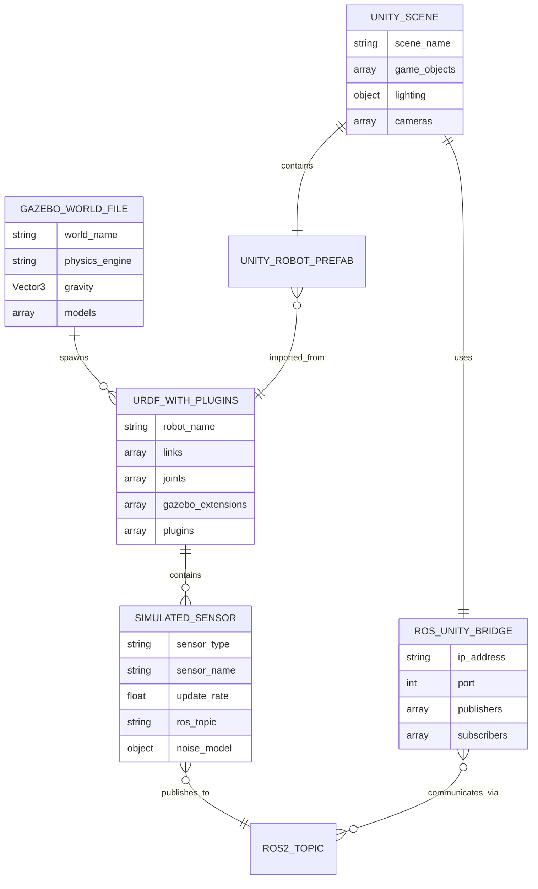
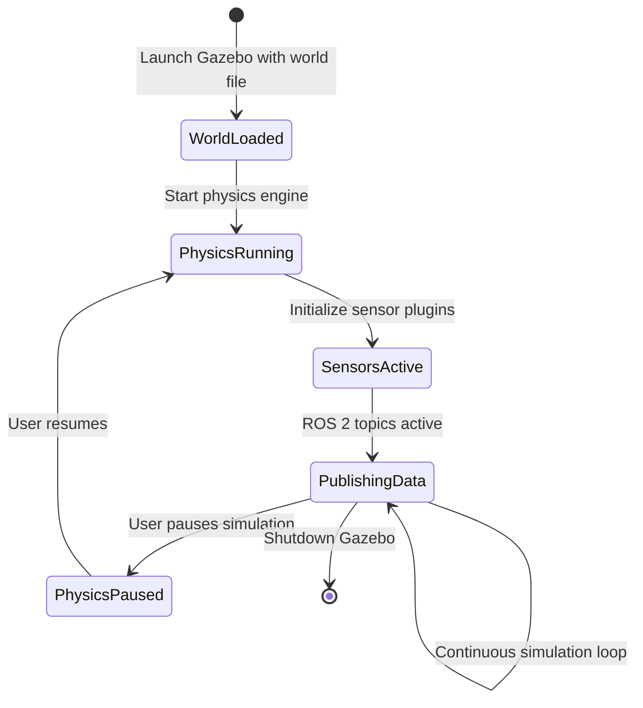
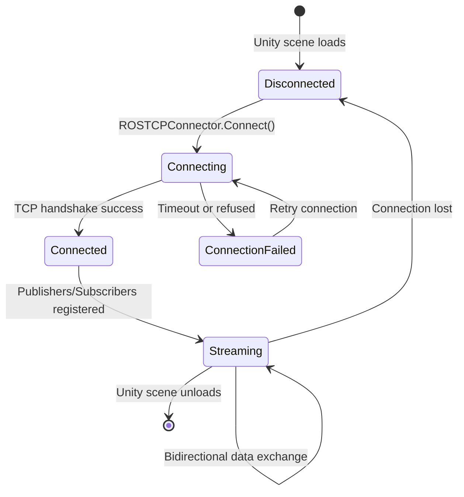

# Data Model: Module 2 - The Digital Twin (Gazebo & Unity)

**Feature**: 002-digital-twin-simulation
**Date**: 2025-12-19
**Phase**: Phase 1 - Design & Contracts

## Overview

This document defines the key entities for Module 2 educational content. Unlike software data models with databases and APIs, these entities represent **documentation artifacts** (files, configurations) that students create and use during the module.

## Core Entities

### 1. Gazebo World File

**Description**: XML-based environment definition for Gazebo physics simulation.

**Attributes**:
- `world_name` (string): Identifier for the world (e.g., "simple_humanoid_world")
- `physics_engine` (enum): Physics solver type (default: "ODE")
  - Values: "ODE", "Bullet", "Simbody", "DART"
- `gravity` (Vector3): Gravity acceleration (default: `<gravity>0 0 -9.81</gravity>`)
- `ground_plane` (boolean): Whether to include a flat ground surface
- `lighting` (object):
  - `ambient` (Color): Ambient light RGB values
  - `directional` (array): List of directional light sources with direction and color
- `models` (array): List of spawned models
  - Each model: `name`, `pose` (x, y, z, roll, pitch, yaw), `uri` (model file path)
- `plugins` (array): Gazebo plugins loaded at startup (e.g., `libgazebo_ros_factory.so`)

**Relationships**:
- **Contains** → `URDF Model` (spawned robots)
- **References** → `Gazebo Plugins` (physics, sensors)

**Example**:
```xml
<world name="simple_humanoid_world">
  <physics type="ode">
    <gravity>0 0 -9.81</gravity>
    <real_time_update_rate>1000</real_time_update_rate>
  </physics>

  <include>
    <uri>model://ground_plane</uri>
  </include>

  <include>
    <uri>model://sun</uri>
  </include>

  <model name="simple_humanoid">
    <pose>0 0 1 0 0 0</pose>
    <include><uri>file://simple_humanoid_gazebo.urdf</uri></include>
  </model>
</world>
```

**Validation Rules**:
- `gravity` magnitude should be realistic (e.g., Earth: 9.81 m/s², Moon: 1.62 m/s²)
- `real_time_update_rate` > 0 (typically 500-1000 Hz)
- All `uri` paths must resolve to valid models

**File Location**: `frontend_book/static/examples/gazebo_humanoid_world.zip/simple_humanoid.world`

---

### 2. URDF with Gazebo Plugins

**Description**: Extended URDF from Module 1 with `<gazebo>` tags for physics properties and sensor plugins.

**Attributes** (extending base URDF from Module 1):
- `robot_name` (string): Inherited from URDF `<robot name="...">`
- `links` (array): Rigid bodies (inherited from URDF)
- `joints` (array): Connections between links (inherited from URDF)
- `gazebo_extensions` (array): Gazebo-specific properties
  - Each extension:
    - `reference` (string): Link or joint name this applies to
    - `material` (string): Gazebo visual material (e.g., "Gazebo/Grey")
    - `mu1`, `mu2` (float): Friction coefficients (0.0-1.0)
    - `kp`, `kd` (float): Contact stiffness and damping
- `plugins` (array): Gazebo plugins attached to the robot
  - Each plugin:
    - `name` (string): Plugin instance name
    - `filename` (string): Shared library (e.g., "libgazebo_ros_ray.so")
    - `parameters` (object): Plugin-specific configuration (topic names, update rates, etc.)

**Relationships**:
- **Extends** → `URDF Model` (from Module 1)
- **Contains** → `Simulated Sensor` (as plugins)
- **Loaded by** → `Gazebo World File`

**Example** (LiDAR sensor plugin):
```xml
<robot name="simple_humanoid">
  <!-- Base URDF links and joints from Module 1 -->

  <!-- Gazebo-specific physics for torso link -->
  <gazebo reference="base_link">
    <material>Gazebo/Grey</material>
    <mu1>0.8</mu1>  <!-- Friction coefficient -->
    <mu2>0.8</mu2>
  </gazebo>

  <!-- LiDAR sensor attached to head -->
  <link name="head_lidar_link">
    <visual>
      <geometry><box size="0.05 0.05 0.05"/></geometry>
    </visual>
  </link>

  <joint name="head_lidar_joint" type="fixed">
    <parent link="head_link"/>
    <child link="head_lidar_link"/>
    <origin xyz="0.1 0 0" rpy="0 0 0"/>
  </joint>

  <!-- LiDAR Gazebo plugin -->
  <gazebo reference="head_lidar_link">
    <sensor type="ray" name="head_lidar">
      <pose>0 0 0 0 0 0</pose>
      <update_rate>10</update_rate>
      <ray>
        <scan>
          <horizontal>
            <samples>640</samples>
            <resolution>1</resolution>
            <min_angle>-2.094</min_angle>  <!-- -120 degrees -->
            <max_angle>2.094</max_angle>   <!-- +120 degrees -->
          </horizontal>
        </scan>
        <range>
          <min>0.1</min>
          <max>4.0</max>
          <resolution>0.01</resolution>
        </range>
        <noise>
          <type>gaussian</type>
          <mean>0.0</mean>
          <stddev>0.01</stddev>  <!-- 1cm standard deviation -->
        </noise>
      </ray>
      <plugin name="gazebo_ros_head_lidar_controller" filename="libgazebo_ros_ray.so">
        <ros>
          <namespace>/simple_humanoid</namespace>
          <remapping>~/out:=scan</remapping>
        </ros>
        <output_type>sensor_msgs/LaserScan</output_type>
        <frame_name>head_lidar_link</frame_name>
      </plugin>
    </sensor>
  </gazebo>
</robot>
```

**Validation Rules**:
- All `<gazebo reference="...">` must point to existing links or joints
- Friction coefficients (`mu1`, `mu2`) between 0.0 and 2.0 (typical range)
- Plugin `filename` must exist in Gazebo plugin path

**File Location**: `frontend_book/static/examples/gazebo_sensors.zip/humanoid_with_lidar.urdf`

---

### 3. Unity Scene

**Description**: Unity 3D environment file containing robot models, lighting, cameras, and ROS-Unity bridge components.

**Attributes**:
- `scene_name` (string): Unity scene name (e.g., "HumanoidDemo")
- `game_objects` (array): 3D objects in the scene
  - Each object:
    - `name` (string): GameObject name
    - `type` (enum): "Robot", "Camera", "Light", "Environment"
    - `transform` (object): Position (x, y, z), rotation (quaternion), scale (x, y, z)
    - `components` (array): Attached Unity components (MeshRenderer, RigidBody, Scripts)
- `lighting` (object):
  - `ambient_source` (enum): "Skybox", "Gradient", "Color"
  - `directional_light` (object): Main light source (direction, intensity, color, shadows)
  - `baked_lighting` (boolean): Whether lighting is pre-computed
- `cameras` (array):
  - Each camera: `name`, `field_of_view`, `clipping_planes`, `render_texture` (for ROS publishing)
- `ros_bridge` (object):
  - `tcp_connector` (object): ROS-TCP-Connector settings (server IP, port)
  - `publishers` (array): Unity → ROS 2 topics (camera images, sensor data)
  - `subscribers` (array): ROS 2 → Unity topics (joint commands, velocity commands)

**Relationships**:
- **Contains** → `Unity Robot Prefab` (imported from URDF)
- **Communicates with** → `ROS 2 Nodes` (via ROS-Unity Bridge)

**Example** (Unity scene structure):
```
HumanoidDemo.unity (scene file)
├── Directional Light (GameObject)
│   └── Light Component (intensity: 1.5, shadows: Soft)
├── Main Camera (GameObject)
│   ├── Camera Component (FOV: 60°, clipping: 0.3-1000)
│   └── ROSCameraPublisher Script (publishes to /camera/rgb)
├── Ground Plane (GameObject)
│   └── MeshRenderer (material: Concrete)
├── simple_humanoid (Prefab instance)
│   ├── Articulation Body (physics)
│   ├── ROSJointSubscriber Script (subscribes to /joint_states)
│   └── Child links (torso, arms, joints)
└── ROS TCP Connector (GameObject)
    └── ROSTCPConnector Script (IP: 127.0.0.1, Port: 10000)
```

**Validation Rules**:
- At least one camera must exist
- ROS TCP Connector must have valid IP/port (default: localhost:10000)
- Robot articulation body must match URDF joint structure

**File Location**: `frontend_book/static/examples/unity_humanoid_scene.zip/Assets/Scenes/HumanoidDemo.unity`

---

### 4. Simulated Sensor

**Description**: Software component emulating real sensor behavior (LiDAR, depth camera, IMU) in Gazebo or Unity.

**Attributes**:
- `sensor_type` (enum): "LiDAR", "DepthCamera", "IMU", "RGB Camera"
- `sensor_name` (string): Instance name (e.g., "head_lidar")
- `parent_link` (string): Robot link this sensor is attached to
- `update_rate` (float): Sensor data publishing frequency (Hz)
- `ros_topic` (string): ROS 2 topic name for sensor data
- `message_type` (string): ROS 2 message type (e.g., "sensor_msgs/LaserScan")
- `noise_model` (object):
  - `type` (enum): "gaussian", "uniform", "none"
  - `mean` (float): Mean noise value
  - `stddev` (float): Standard deviation (for gaussian)
- `sensor_specific_params` (object): Type-dependent parameters

**Sensor-Specific Parameters**:

**LiDAR**:
```yaml
horizontal_fov: 240.0  # degrees
vertical_fov: 30.0     # degrees (for 3D LiDAR)
samples: 640           # number of rays
range_min: 0.1         # meters
range_max: 4.0         # meters
resolution: 0.01       # meter precision
```

**Depth Camera**:
```yaml
image_width: 1280
image_height: 720
horizontal_fov: 87.0   # degrees
clipping_near: 0.3     # meters
clipping_far: 10.0     # meters
image_format: "R16"    # 16-bit grayscale depth
```

**IMU**:
```yaml
angular_velocity_range: 2000.0  # degrees/second
linear_acceleration_range: 16.0 # g (gravity units)
orientation_output: "quaternion" # or "euler"
gyro_bias_drift: 0.001  # degrees/second/second
accel_bias_drift: 0.01  # g/second
```

**Relationships**:
- **Part of** → `URDF with Gazebo Plugins` (defined in URDF)
- **Publishes to** → `ROS 2 Topic` (sensor data stream)

**Example** (Depth Camera configuration):
```xml
<sensor type="depth" name="head_depth_camera">
  <update_rate>30</update_rate>
  <camera>
    <horizontal_fov>1.518</horizontal_fov>  <!-- 87 degrees in radians -->
    <image>
      <width>1280</width>
      <height>720</height>
      <format>R16</format>
    </image>
    <clip>
      <near>0.3</near>
      <far>10.0</far>
    </clip>
    <noise>
      <type>gaussian</type>
      <mean>0.0</mean>
      <stddev>0.007</stddev>  <!-- 0.7cm depth noise -->
    </noise>
  </camera>
  <plugin name="depth_camera_controller" filename="libgazebo_ros_camera.so">
    <ros>
      <namespace>/simple_humanoid</namespace>
      <remapping>~/image_raw:=camera/depth/image_raw</remapping>
      <remapping>~/camera_info:=camera/depth/camera_info</remapping>
    </ros>
    <camera_name>head_depth_camera</camera_name>
    <frame_name>head_depth_camera_link</frame_name>
  </plugin>
</sensor>
```

**Validation Rules**:
- `update_rate` > 0 and < 1000 (typical: 10-100 Hz)
- `range_min` < `range_max` (for LiDAR/depth sensors)
- Noise `stddev` realistic for sensor type (e.g., LiDAR: 0.01-0.05m)

**File Location**: Defined inline in URDF files in `frontend_book/static/examples/gazebo_sensors.zip/`

---

### 5. ROS-Unity Bridge

**Description**: Bidirectional communication layer enabling ROS 2 ↔ Unity data exchange.

**Attributes**:
- `server_endpoint` (object):
  - `ip_address` (string): ROS 2 TCP endpoint IP (default: "127.0.0.1")
  - `port` (integer): TCP port (default: 10000)
  - `protocol` (string): "TCP" (ROS-TCP-Connector)
- `publishers` (array): Unity → ROS 2 topics
  - Each publisher:
    - `unity_component` (string): Unity script generating data (e.g., "ROSCameraPublisher")
    - `ros_topic` (string): Target ROS 2 topic (e.g., "/camera/rgb/image_raw")
    - `message_type` (string): ROS 2 message type (e.g., "sensor_msgs/Image")
    - `publish_rate` (float): Hz
- `subscribers` (array): ROS 2 → Unity topics
  - Each subscriber:
    - `unity_component` (string): Unity script consuming data (e.g., "ROSJointSubscriber")
    - `ros_topic` (string): Source ROS 2 topic (e.g., "/joint_states")
    - `message_type` (string): ROS 2 message type (e.g., "sensor_msgs/JointState")
    - `callback` (string): Unity method handling received messages

**Relationships**:
- **Connects** → `Unity Scene` (Unity side)
- **Connects** → `ROS 2 Nodes` (ROS side)
- **Requires** → `ROS TCP Endpoint` (ROS 2 package: ros_tcp_endpoint)

**Example** (Unity-side configuration):
```csharp
// Unity C# script: ROSTCPConnector component
public class ROSTCPConnector : MonoBehaviour {
    public string serverIP = "127.0.0.1";
    public int serverPort = 10000;

    void Start() {
        ROSConnection.GetOrCreateInstance().Connect(serverIP, serverPort);
    }
}

// Unity C# script: Camera publisher
public class ROSCameraPublisher : MonoBehaviour {
    private ROSConnection ros;
    public string topicName = "/camera/rgb/image_raw";
    public float publishRate = 30.0f; // Hz

    void Start() {
        ros = ROSConnection.GetOrCreateInstance();
        ros.RegisterPublisher<ImageMsg>(topicName);
        InvokeRepeating("PublishImage", 1.0f / publishRate, 1.0f / publishRate);
    }

    void PublishImage() {
        ImageMsg msg = CaptureImageFromCamera();
        ros.Publish(topicName, msg);
    }
}
```

**Example** (ROS 2 side - TCP endpoint):
```bash
# Start ROS 2 TCP endpoint to receive Unity data
ros2 run ros_tcp_endpoint default_server_endpoint --ros-args -p ROS_IP:=127.0.0.1 -p ROS_TCP_PORT:=10000
```

**Validation Rules**:
- `server_endpoint` IP must be reachable from Unity (localhost or LAN IP)
- Port must be open and not in use by other services
- All message types must be defined in ROS message packages (sensor_msgs, geometry_msgs, etc.)

**File Location**: Configuration in Unity project `Assets/Scripts/ROSIntegration/` and documented in `unity_humanoid_scene.zip/README.md`

---

## Entity Relationships Diagram



---

## State Transitions

### Gazebo Simulation Lifecycle



### Unity-ROS Bridge Connection



---

## Validation Checklist

For each entity type, documentation must include:

- [x] **Gazebo World File**: Example file, parameter explanations, validation commands
- [x] **URDF with Gazebo Plugins**: Annotated examples for LiDAR, depth camera, IMU
- [x] **Unity Scene**: Scene structure diagram, GameObject hierarchy, script references
- [x] **Simulated Sensor**: Configuration parameters, noise models, ROS 2 topic formats
- [x] **ROS-Unity Bridge**: Setup instructions, connection verification, troubleshooting

All entities defined with:
- Clear attribute descriptions
- Realistic example values
- Validation rules
- File storage locations

---

## File Naming Conventions

| Entity Type | File Extension | Naming Pattern | Example |
|-------------|---------------|----------------|---------|
| Gazebo World | `.world` | `{robot_name}_world.world` | `simple_humanoid_world.world` |
| URDF with Plugins | `.urdf` | `{robot_name}_gazebo.urdf` | `simple_humanoid_gazebo.urdf` |
| URDF with Sensor | `.urdf` | `{robot_name}_with_{sensor}.urdf` | `humanoid_with_lidar.urdf` |
| Unity Scene | `.unity` | `{purpose}Demo.unity` | `HumanoidDemo.unity` |
| Unity Prefab | `.prefab` | `{robot_name}.prefab` | `simple_humanoid.prefab` |
| Launch File | `.launch.py` | `{purpose}_demo.launch.py` | `gazebo_demo.launch.py` |

---

## References

- URDF Specification: http://wiki.ros.org/urdf/XML
- Gazebo SDF Format: http://sdformat.org/
- Unity GameObject Documentation: https://docs.unity3d.com/Manual/class-GameObject.html
- ROS-TCP-Connector API: https://github.com/Unity-Technologies/ROS-TCP-Connector
