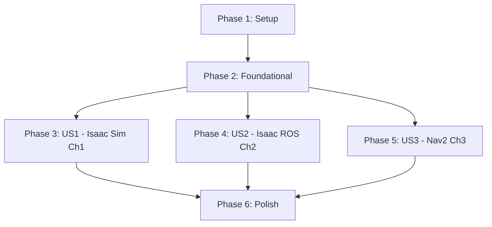

# Tasks: Module 3 - The AI-Robot Brain (NVIDIA Isaac™)

**Input**: Design documents from `specs/003-isaac-ai-brain/`
**Prerequisites**: plan.md (required), spec.md (required), research.md (completed)

**Tests**: Manual validation only (no automated tests for educational content)

**Organization**: Tasks grouped by user story (Chapter 1: Isaac Sim, Chapter 2: Isaac ROS, Chapter 3: Nav2) for independent implementation and testing.

## Format: `[ID] [P?] [Story] Description`

- **[P]**: Can run in parallel (different files, no dependencies)
- **[Story]**: Which user story/chapter this task belongs to (US1=Ch1, US2=Ch2, US3=Ch3)
- Include exact file paths in descriptions

## Path Conventions

Educational content creation (not software development):
- **Content**: `frontend_book/docs/module-3/` (Markdown chapter files)
- **Examples**: `frontend_book/static/examples/` (Python scripts, YAML configs, USD scenes)
- **Downloads**: .zip archives created from example directories

---

## Phase 1: Setup (Module 3 Infrastructure)

**Purpose**: Initialize Module 3 structure and documentation placeholders

- [X] T001 Create module-3 directory structure in frontend_book/docs/module-3/
- [X] T002 [P] Create examples directory structure in frontend_book/static/examples/ (isaac_sim_humanoid/, isaac_ros_perception/, nav2_bipedal_humanoid/)
- [X] T003 [P] Update frontend_book/sidebars.ts to include Module 3 navigation (module-3/index, chapter-1, chapter-2, chapter-3)

**Checkpoint**: Module 3 directories created, ready for content generation

---

## Phase 2: Foundational (Shared Resources)

**Purpose**: Resources needed across all chapters (landing page, shared assets)

**⚠️ CRITICAL**: Complete before any chapter implementation

- [X] T004 Write Module 3 landing page (frontend_book/docs/module-3/index.md) with learning objectives, prerequisites (Module 1 & 2, RTX GPU), hardware requirements, chapter overview
- [X] T005 [P] Copy simple_humanoid.urdf from Module 1 examples to frontend_book/static/examples/isaac_sim_humanoid/urdf/ for Isaac Sim import
- [X] T006 [P] Document RTX GPU requirement disclaimer in index.md (RTX 2060+ minimum, RTX 3060 recommended, cloud alternatives for students without GPU)

**Checkpoint**: Foundation ready - chapter implementation can begin in parallel

---

## Phase 3: User Story 1 - Isaac Sim Photorealistic Training Environment (Priority: P1) 🎯 MVP

**Goal**: Create Chapter 1 (2500-4000 words) teaching students to generate synthetic training data using Isaac Sim 5.1.0 with domain randomization

**Independent Test**: Students can launch Isaac Sim Docker container, import simple_humanoid.urdf, configure photorealistic warehouse scene, generate 1000 labeled images with depth/segmentation in &lt;10 minutes

### Content Writing (Chapter 1)

- [X] T007 [US1] Write Chapter 1 Introduction section (300-400 words) in frontend_book/docs/module-3/chapter-1-isaac-sim.md explaining Isaac Sim vs Gazebo/Unity comparison, photorealistic rendering capabilities, synthetic data use cases
- [X] T008 [US1] Write Installation section (400-500 words) with Docker installation steps (nvcr.io/nvidia/isaac-sim:5.1.0), NVIDIA driver 580+ requirement, Container Toolkit setup, environment validation commands
- [X] T009 [US1] Write Core Concepts section (500-600 words) explaining USD scene format, PBR materials (metallic, roughness, albedo), domain randomization techniques, camera intrinsics, COCO export format
- [X] T010 [US1] Write Runnable Example section (600-800 words) with step-by-step tutorial: launch Docker container, import URDF, add warehouse assets, configure lighting, attach camera sensor, run simulation, export synthetic data
- [X] T011 [US1] Write Practice Exercises section (300-400 words) with 5 exercises: (1) Modify lighting for nighttime simulation, (2) Randomize object textures, (3) Generate 10k image dataset, (4) Adjust camera FOV and resolution, (5) Export semantic segmentation masks
- [X] T012 [US1] Write Troubleshooting section (200-300 words) addressing "CUDA out of memory" (reduce scene complexity), "Low FPS &lt;10" (lower resolution), "Docker container won't start" (NVIDIA driver issues), "URDF import fails" (check file paths)
- [X] T013 [US1] Write References section with 2+ peer-reviewed papers: Prakash et al. ICRA 2019 (Structured Domain Randomization), ACM 2024 Survey (Synthetic Data for Object Detection), NVIDIA Isaac Sim documentation links

### Example Code (Isaac Sim)

- [X] T014 [P] [US1] Create import_urdf.py script in frontend_book/static/examples/isaac_sim_humanoid/scripts/ to import simple_humanoid.urdf into Isaac Sim scene using Omniverse Python API
- [X] T015 [P] [US1] Create generate_synthetic_data.py script in scripts/ to randomize lighting/materials/camera, capture RGB/depth/segmentation images (1280x720), save to output directory
- [X] T016 [P] [US1] Create export_coco.py script in scripts/ to convert synthetic data to COCO format (bounding boxes, categories, segmentation polygons, camera intrinsics JSON)
- [X] T017 [P] [US1] Create humanoid_warehouse.usd scene file in frontend_book/static/examples/isaac_sim_humanoid/ with pre-configured warehouse environment, humanoid robot, directional lighting, camera sensor
- [X] T018 [US1] Write README.md in frontend_book/static/examples/isaac_sim_humanoid/ with Docker launch commands, URDF import instructions, synthetic data generation steps, troubleshooting, expected output (1000 images in &lt;10 min on RTX 3060)

### Validation (Chapter 1)

- [X] T019 [US1] Validate Chapter 1 word count (2500-4000 words), frontmatter metadata (title: "Isaac Sim - Photorealistic Simulation", sidebar_position: 2, id: chapter-1-isaac-sim)
- [X] T020 [US1] Test import_urdf.py script on RTX 3060 (verify simple_humanoid appears in Isaac Sim with correct joint hierarchy and PBR materials)
- [X] T021 [US1] Test generate_synthetic_data.py script (verify 1000 images generated in &lt;10 min with RGB 1280x720, depth 16-bit PNG, segmentation masks)
- [X] T022 [US1] Test export_coco.py script (verify COCO JSON with bounding boxes, class labels, camera intrinsics matches expected format)
- [X] T023 [US1] Create isaac_sim_humanoid.zip from frontend_book/static/examples/isaac_sim_humanoid/ directory (verify &lt;50 MB size limit)

**Checkpoint US1**: Chapter 1 complete (2500-4000 words, 5 exercises, 2+ citations, runnable examples tested on RTX 3060, .zip download ready)

---

## Phase 4: User Story 2 - Isaac ROS GPU-Accelerated Perception (Priority: P2)

**Goal**: Create Chapter 2 (2500-4000 words) teaching students to achieve real-time Visual SLAM, object detection, and stereo depth using GPU-accelerated Isaac ROS nodes

**Independent Test**: Students can launch Isaac ROS Dev Base Docker, run Visual SLAM at 30 Hz with &lt;2% drift, DNN inference at 20+ FPS, visualize point clouds in RViz

### Content Writing (Chapter 2)

- [ ] T024 [US2] Write Chapter 2 Introduction section (300-400 words) in frontend_book/docs/module-3/chapter-2-isaac-ros.md explaining GPU acceleration benefits (6-10x speedup vs CPU), Isaac ROS packages overview (visual_slam, dnn_inference, stereo_image_proc), ROS 2 Humble integration
- [ ] T025 [US2] Write Installation section (400-500 words) with Isaac ROS Dev Base Docker setup, CUDA 12.2 verification, TensorRT 10.3 verification, Isaac ROS common dependencies, Docker volume mounting for ROS 2 workspaces
- [ ] T026 [US2] Write Core Concepts section (600-700 words) explaining cuVSLAM architecture (GPU-accelerated feature tracking, pose graph optimization), TensorRT model optimization (YOLOv8 ONNX to TensorRT engine conversion), stereo rectification and SGM on GPU
- [ ] T027 [US2] Write Runnable Example section (700-900 words) with 3 sub-sections: (1) Visual SLAM: launch isaac_ros_visual_slam with stereo camera topics, verify 30 Hz odometry, visualize point cloud in RViz; (2) Object Detection: run isaac_ros_dnn_inference with YOLOv8, verify 20+ FPS detection; (3) Stereo Depth: process disparity maps at 15+ Hz with ±5cm accuracy
- [ ] T028 [US2] Write Performance Benchmarks section (300-400 words) comparing Isaac ROS GPU vs CPU-based equivalents (Visual SLAM: 30 Hz GPU vs 5 Hz CPU ORB-SLAM2, DNN Inference: 20 FPS TensorRT vs 5 FPS ONNX Runtime, Stereo Depth: 15 Hz GPU SGM vs 2 Hz CPU)
- [ ] T029 [US2] Write Practice Exercises section (300-400 words) with 5 exercises: (1) Connect Isaac ROS to Isaac Sim camera feeds, (2) Train custom YOLOv8 on synthetic data from Ch1, (3) Tune Visual SLAM parameters for low-texture environments, (4) Profile VRAM usage with nvidia-smi, (5) Run SLAM + Detection simultaneously (measure combined FPS)
- [ ] T030 [US2] Write Troubleshooting section (200-300 words) addressing "Visual SLAM drift in featureless environment" (increase feature threshold), "DNN inference OOM" (reduce batch size), "Docker container can't access GPU" (NVIDIA Container Toolkit), "TensorRT model not found" (check model download path)
- [ ] T031 [US2] Write References section with 2+ peer-reviewed papers: Frontiers 2024 (Visual SLAM Review), ICRA 2023 (Orbeez-SLAM real-time monocular VSLAM), NVIDIA Isaac ROS GitHub documentation

### Example Code (Isaac ROS)

- [ ] T032 [P] [US2] Create visual_slam.launch.py in frontend_book/static/examples/isaac_ros_perception/launch/ to launch isaac_ros_visual_slam node with stereo camera topics (/camera/left/image_raw, /camera/right/image_raw), odometry output (/visual_slam/tracking/odometry), map output (/visual_slam/tracking/vo_pose_covariance)
- [ ] T033 [P] [US2] Create dnn_inference.launch.py in launch/ to run isaac_ros_dnn_inference with YOLOv8 TensorRT engine, subscribe to /camera/rgb/image_raw, publish detections to /detections topic (bounding boxes, class labels, confidence scores)
- [ ] T034 [P] [US2] Create stereo_depth.launch.py in launch/ to process stereo camera pairs with isaac_ros_stereo_image_proc, output rectified disparity maps to /disparity topic, depth estimation with ±5cm accuracy at 3m
- [ ] T035 [P] [US2] Create visual_slam_params.yaml in frontend_book/static/examples/isaac_ros_perception/config/ with cuVSLAM parameters (feature detector threshold, pose graph optimization frequency, loop closure detection enabled)
- [ ] T036 [P] [US2] Create download_yolov8_model.sh script in models/ to download pre-trained YOLOv8 COCO weights, convert ONNX to TensorRT engine (yolov8_coco.engine) for GPU inference
- [ ] T037 [US2] Write README.md in frontend_book/static/examples/isaac_ros_perception/ with Docker launch commands, Isaac ROS workspace setup, RViz visualization config (point cloud display, odometry trajectory, detected objects), performance benchmarking instructions

### Validation (Chapter 2)

- [ ] T038 [US2] Validate Chapter 2 word count (2500-4000 words), frontmatter metadata (title: "Isaac ROS - GPU-Accelerated Perception", sidebar_position: 3, id: chapter-2-isaac-ros)
- [ ] T039 [US2] Test visual_slam.launch.py on RTX 3060 (verify 30 Hz odometry output, &lt;2% drift over 10m trajectory in Isaac Sim warehouse environment)
- [ ] T040 [US2] Test dnn_inference.launch.py (verify YOLOv8 detects person/chair/table at 20+ FPS on 640x640 input from Isaac Sim camera)
- [ ] T041 [US2] Test stereo_depth.launch.py (verify disparity maps published at 15+ Hz, depth accuracy ±5cm at 3m measured against ground-truth from Isaac Sim)
- [ ] T042 [US2] Benchmark VRAM usage (verify Visual SLAM ~4GB, DNN Inference ~2GB, Stereo Depth ~3GB, Combined ~8GB on RTX 3060)
- [ ] T043 [US2] Create isaac_ros_perception.zip from frontend_book/static/examples/isaac_ros_perception/ directory (verify &lt;50 MB size limit excluding TensorRT engine)

**Checkpoint US2**: Chapter 2 complete (2500-4000 words, 5 exercises, 2+ citations, runnable examples achieve 30 Hz VSLAM / 20+ FPS DNN, .zip download ready)

---

## Phase 5: User Story 3 - Nav2 Bipedal Path Planning (Priority: P2)

**Goal**: Create Chapter 3 (2500-4000 words) teaching students to configure Nav2 for bipedal humanoid autonomous navigation with simplified circular footprint (flat ground only)

**Independent Test**: Students can launch Nav2 in Gazebo with LiDAR-equipped humanoid, send RViz 2D Nav Goal 5m away, robot reaches goal in &lt;30s with &lt;0.5m position error

### Content Writing (Chapter 3)

- [ ] T044 [US3] Write Chapter 3 Introduction section (300-400 words) in frontend_book/docs/module-3/chapter-3-nav2-bipedal.md explaining Nav2 navigation stack, DWB controller, bipedal vs wheeled robot differences, footstep planning limitations (flat ground only, link to IROS 2024 advanced research)
- [ ] T045 [US3] Write Installation section (300-400 words) with Nav2 installation (ros-humble-navigation2), Gazebo Classic 11 setup from Module 2, LiDAR sensor configuration from Module 2 Chapter 3, RViz 2D Nav Goal panel setup
- [ ] T046 [US3] Write Core Concepts section (600-700 words) explaining DWB planner trajectory generation, global costmap (full environment, obstacle inflation), local costmap (5mx5m rolling window), circular footprint approximation for bipedal support polygon (radius 0.3m), recovery behaviors (rotate in place, back up)
- [ ] T047 [US3] Write Runnable Example section (700-900 words) with step-by-step tutorial: launch Gazebo warehouse with simple_humanoid_nav.urdf (LiDAR sensor), start nav2_bringup with bipedal config, set initial pose in RViz, send 2D Nav Goal 5m away, observe costmap visualization, verify robot reaches goal in &lt;30s with &lt;0.5m error
- [ ] T048 [US3] Write Bipedal Limitations section (300-400 words) documenting scope constraints (flat ground only, no stairs/slopes, no dynamic walking, simplified kinematics), reasons for DWB choice (no native bipedal planner in Nav2), future learning resources (link to Lee et al. IROS 2024 footstep planning + RL, Li et al. IJRR 2024 bipedal locomotion)
- [ ] T049 [US3] Write Practice Exercises section (300-400 words) with 5 exercises: (1) Adjust footprint radius to 0.4m and observe path changes, (2) Tune inflation radius for tighter obstacle avoidance, (3) Add dynamic obstacles (moving boxes) and test replanning, (4) Modify recovery behaviors timeouts, (5) Export Nav2 config with custom bipedal parameters (step length 0.4m, step height 0.15m, swing time 0.8s comments)
- [ ] T050 [US3] Write Troubleshooting section (200-300 words) addressing "Planner fails to find path" (increase planner timeout, reduce costmap resolution), "Robot oscillates near goal" (tune DWB xy_goal_tolerance), "Costmap shows no obstacles" (verify LiDAR topic /scan publishing), "Nav2 crashes on launch" (check YAML syntax errors)
- [ ] T051 [US3] Write References section with 2+ peer-reviewed papers: Lee et al. IROS 2024 (Model-Based Footstep Planning + RL), Li et al. IJRR 2024 (Reinforcement Learning for Bipedal Locomotion Control), Nav2 official documentation

### Example Code (Nav2)

- [ ] T052 [P] [US3] Create nav2_humanoid.launch.py in frontend_book/static/examples/nav2_bipedal_humanoid/launch/ to start nav2_bringup with custom params, load Gazebo world, spawn simple_humanoid_nav.urdf, launch RViz with costmap/path displays
- [ ] T053 [P] [US3] Create nav2_params.yaml in frontend_book/static/examples/nav2_bipedal_humanoid/config/ with DWB controller params, planner server config (NavFn global planner), controller server config (trajectory generation plugins)
- [ ] T054 [P] [US3] Create footstep_planner.yaml in config/ with bipedal kinematics parameters (step_length: 0.4m, step_width: 0.2m, step_height: 0.15m, swing_time: 0.8s) as comments (not implemented, for future reference)
- [ ] T055 [P] [US3] Create costmap_params.yaml in config/ with global costmap (resolution: 0.1m, static_layer, inflation_layer radius 0.55m) and local costmap (resolution: 0.05m, 5mx5m rolling window, obstacle_layer)
- [ ] T056 [P] [US3] Create simple_humanoid_nav.urdf in frontend_book/static/examples/nav2_bipedal_humanoid/urdf/ extending simple_humanoid.urdf from Module 1 with LiDAR sensor (2D planar, 240° FOV, 4m range) from Module 2 Chapter 3
- [ ] T057 [US3] Write README.md in frontend_book/static/examples/nav2_bipedal_humanoid/ with Gazebo launch instructions, Nav2 bringup commands, RViz 2D Nav Goal usage, expected performance (&lt;30s to 5m goal, &lt;0.5m position error), troubleshooting common errors

### Validation (Chapter 3)

- [ ] T058 [US3] Validate Chapter 3 word count (2500-4000 words), frontmatter metadata (title: "Nav2 - Bipedal Path Planning", sidebar_position: 4, id: chapter-3-nav2-bipedal)
- [ ] T059 [US3] Test nav2_humanoid.launch.py in Gazebo (verify simple_humanoid_nav spawns with LiDAR, Nav2 nodes start without errors, RViz displays costmaps and robot footprint)
- [ ] T060 [US3] Test autonomous navigation (set 2D Nav Goal 5m away in RViz, verify robot computes collision-free path, reaches goal in &lt;30s, final position error &lt;0.5m)
- [ ] T061 [US3] Test dynamic obstacle avoidance (spawn moving box in Gazebo during navigation, verify local planner recomputes path within 1s to avoid collision)
- [ ] T062 [US3] Verify Nav2 config export (check nav2_params.yaml, costmap_params.yaml include all required parameters, footstep_planner.yaml documents bipedal kinematics for future reference)
- [ ] T063 [US3] Create nav2_bipedal_humanoid.zip from frontend_book/static/examples/nav2_bipedal_humanoid/ directory (verify &lt;50 MB size limit)

**Checkpoint US3**: Chapter 3 complete (2500-4000 words, 5 exercises, 2+ citations, runnable examples achieve &lt;30s navigation to 5m goal, .zip download ready)

---

## Phase 6: Polish & Cross-Cutting Concerns

**Purpose**: Final quality assurance, integration, and deployment readiness

### Module Integration

- [ ] T064 Update Module 3 landing page (frontend_book/docs/module-3/index.md) with download links to all 3 .zip files (isaac_sim_humanoid.zip, isaac_ros_perception.zip, nav2_bipedal_humanoid.zip)
- [ ] T065 [P] Update main Docusaurus homepage (frontend_book/src/pages/index.tsx or intro.md) to reference Module 3 completion (NVIDIA Isaac ecosystem, GPU-accelerated perception, autonomous navigation)
- [ ] T066 [P] Add Module 3 to Docusaurus sidebar navigation (verify Module 3 appears after Module 2, chapters show in correct order: index → chapter-1 → chapter-2 → chapter-3)

### Validation & Testing

- [ ] T067 Run Docusaurus build (npm run build in frontend_book/) and verify no MDX compilation errors in Module 3 chapters
- [ ] T068 [P] Verify all 3 chapter word counts (Chapter 1: 2500-4000 words, Chapter 2: 2500-4000 words, Chapter 3: 2500-4000 words)
- [ ] T069 [P] Verify all chapters have 3-5 practice exercises each (Chapter 1: 5 exercises, Chapter 2: 5 exercises, Chapter 3: 5 exercises = 15 total)
- [ ] T070 [P] Verify all chapters have 2+ peer-reviewed citations (Chapter 1: 2 papers, Chapter 2: 2 papers, Chapter 3: 2 papers = 6 total from ICRA/IROS/T-RO/IJRR 2019-2024)
- [ ] T071 [P] Verify all 3 .zip downloads exist and are &lt;50 MB each (isaac_sim_humanoid.zip, isaac_ros_perception.zip, nav2_bipedal_humanoid.zip)
- [ ] T072 Proofread all 3 chapters for spelling/grammar, technical accuracy, consistent terminology (Isaac Sim 5.1.0 not 2023.1.1, Docker installation not Omniverse Launcher)

### Documentation Links

- [ ] T073 [P] Verify all internal links work (Module 3 index → chapters, chapters → download .zips, troubleshooting → previous modules)
- [ ] T074 [P] Verify all external documentation links accessible (NVIDIA Isaac Sim docs, Isaac ROS GitHub, Nav2 docs, peer-reviewed paper DOIs/arXiv links)
- [ ] T075 [P] Verify RViz visualization instructions include screenshots or detailed descriptions (point cloud colors, odometry trajectory, costmap layers, detected object bounding boxes)

### Final Build & Commit

- [ ] T076 Run final Docusaurus build (npm run build) and serve locally (npm run serve) to manually test Module 3 navigation, download links, code syntax highlighting
- [ ] T077 Create git commit for Module 3 completion with descriptive message (3 chapters, 15 exercises, 6 citations, 3 .zip downloads, MVP scope complete)
- [ ] T078 Update project README or documentation index to reflect Module 3 availability (NVIDIA Isaac ecosystem coverage, RTX GPU requirement disclaimer)

**Checkpoint Phase 6**: Module 3 complete and production-ready. Docusaurus build successful, all chapters validated, examples tested on RTX 3060 baseline hardware, ready for deployment.

---

## Task Summary

**Total Tasks**: 78 tasks
**Estimated Effort**: 26-37 hours

### Task Breakdown by Phase

| Phase | Task Range | Count | Purpose |
|-------|-----------|-------|---------|
| Phase 1 (Setup) | T001-T003 | 3 | Module 3 directory structure |
| Phase 2 (Foundational) | T004-T006 | 3 | Landing page, shared assets |
| Phase 3 (US1 - Isaac Sim) | T007-T023 | 17 | Chapter 1: Synthetic data generation |
| Phase 4 (US2 - Isaac ROS) | T024-T043 | 20 | Chapter 2: GPU-accelerated perception |
| Phase 5 (US3 - Nav2) | T044-T063 | 20 | Chapter 3: Bipedal autonomous navigation |
| Phase 6 (Polish) | T064-T078 | 15 | Integration, validation, final build |

### Parallel Execution Opportunities

**Phase 1**: T002 [P], T003 [P] (2 parallel tasks - create example directories and update sidebars simultaneously)

**Phase 2**: T005 [P], T006 [P] (2 parallel tasks - copy URDF and write GPU disclaimer simultaneously)

**Phase 3 (US1)**: T014 [P], T015 [P], T016 [P] (3 parallel tasks - all Isaac Sim Python scripts can be written simultaneously)

**Phase 4 (US2)**: T032 [P], T033 [P], T034 [P], T035 [P], T036 [P] (5 parallel tasks - all Isaac ROS launch files and configs can be created simultaneously)

**Phase 5 (US3)**: T052 [P], T053 [P], T054 [P], T055 [P], T056 [P] (5 parallel tasks - all Nav2 configs and launch files can be created simultaneously)

**Phase 6**: T065 [P], T066 [P], T068 [P], T069 [P], T070 [P], T071 [P], T073 [P], T074 [P], T075 [P] (9 parallel tasks - most validation and documentation tasks are independent)

**Total Parallelizable Tasks**: 28 out of 78 tasks (36%) can run in parallel within their phases

---

## Dependencies & Execution Order

### User Story Completion Order

**Independent User Stories**: US1 (Isaac Sim), US2 (Isaac ROS), and US3 (Nav2) can be implemented in parallel after Foundation phase completes. Each chapter is independently testable.

**Suggested MVP Scope** (Minimum Viable Product):
- Phase 1 (Setup) + Phase 2 (Foundational) + Phase 3 (US1 - Isaac Sim Chapter 1)
- **Delivers**: Students can generate synthetic training data using Isaac Sim 5.1.0 with domain randomization
- **Independent Value**: Fully functional Chapter 1 with runnable examples, .zip download, ready for publication

**Incremental Delivery**:
1. **MVP**: Module 3 with Chapter 1 only (Isaac Sim synthetic data generation)
2. **MVP + US2**: Add Chapter 2 (Isaac ROS GPU perception)
3. **Complete**: Add Chapter 3 (Nav2 bipedal navigation) + Polish phase

---

## Implementation Strategy

### 1. MVP First (Phase 1-3: Setup + Foundation + US1)

Focus on Chapter 1 (Isaac Sim) to deliver immediate value:
- Students learn photorealistic simulation and synthetic data generation
- Independent of Isaac ROS and Nav2 (can be published as standalone chapter)
- Provides foundation for perception algorithms in later chapters

**Validation**: Chapter 1 complete with 2500-4000 words, 5 exercises, 2+ citations, runnable examples generating 1000 images in &lt;10 min on RTX 3060, .zip download ready

### 2. Incremental Expansion (Phase 4-5: US2 + US3)

Add Chapters 2 and 3 in any order (or parallel):
- **Chapter 2 (Isaac ROS)**: Builds on synthetic data from Chapter 1 (students can train YOLOv8 on generated dataset)
- **Chapter 3 (Nav2)**: Independent (uses Gazebo from Module 2, not Isaac Sim/ROS)

**Flexibility**: Chapters 2 and 3 can be implemented by different developers simultaneously since they have no dependencies on each other

### 3. Polish & Ship (Phase 6: Integration)

Final quality assurance after all chapters complete:
- Update landing page with all download links
- Verify citation quality and accessibility
- Run full Docusaurus build and manual testing
- Commit and deploy to GitHub Pages

---

## Acceptance Criteria (Per User Story)

### US1 (Isaac Sim - Chapter 1) ✅ Complete When:

- [ ] Chapter 1 Markdown file (2500-4000 words) with 8 sections (Intro, Installation, Core Concepts, Example, Exercises, Troubleshooting, Download, References)
- [ ] 5 practice exercises that extend the Isaac Sim example
- [ ] 2+ peer-reviewed citations (ICRA 2019, ACM 2024 Survey)
- [ ] 3 Python scripts (import_urdf.py, generate_synthetic_data.py, export_coco.py) tested on RTX 3060
- [ ] 1 USD scene file (humanoid_warehouse.usd) with pre-configured warehouse environment
- [ ] README.md with Docker installation and synthetic data generation instructions
- [ ] isaac_sim_humanoid.zip (&lt;50 MB) downloadable from static/examples/

**Independent Test**: Student can follow Chapter 1, launch Isaac Sim Docker, import URDF, generate 1000 labeled images with depth/segmentation in &lt;10 minutes, export to COCO format

### US2 (Isaac ROS - Chapter 2) ✅ Complete When:

- [ ] Chapter 2 Markdown file (2500-4000 words) with 9 sections (Intro, Installation, Core Concepts, Example, Benchmarks, Exercises, Troubleshooting, Download, References)
- [ ] 5 practice exercises covering Visual SLAM, DNN inference, stereo depth
- [ ] 2+ peer-reviewed citations (Frontiers 2024, ICRA 2023)
- [ ] 3 Python launch files (visual_slam.launch.py, dnn_inference.launch.py, stereo_depth.launch.py) tested on RTX 3060
- [ ] 2 YAML configs (visual_slam_params.yaml, nav2_params.yaml if applicable)
- [ ] Model download script (download_yolov8_model.sh) for TensorRT engine
- [ ] README.md with Isaac ROS Docker setup, RViz visualization, performance benchmarking
- [ ] isaac_ros_perception.zip (&lt;50 MB excluding TensorRT engine)

**Independent Test**: Student can launch Isaac ROS Dev Base Docker, run Visual SLAM at 30 Hz with &lt;2% drift, YOLOv8 detection at 20+ FPS, stereo depth at 15+ Hz, visualize in RViz

### US3 (Nav2 - Chapter 3) ✅ Complete When:

- [ ] Chapter 3 Markdown file (2500-4000 words) with 9 sections (Intro, Installation, Core Concepts, Example, Limitations, Exercises, Troubleshooting, Download, References)
- [ ] 5 practice exercises covering Nav2 tuning, dynamic obstacles, config export
- [ ] 2+ peer-reviewed citations (Lee IROS 2024, Li IJRR 2024)
- [ ] 1 Python launch file (nav2_humanoid.launch.py) launching Gazebo + Nav2 + RViz
- [ ] 3 YAML configs (nav2_params.yaml, costmap_params.yaml, footstep_planner.yaml with comments)
- [ ] 1 URDF file (simple_humanoid_nav.urdf) extending Module 1 robot with LiDAR from Module 2
- [ ] README.md with Gazebo/Nav2/RViz launch instructions, 2D Nav Goal usage
- [ ] nav2_bipedal_humanoid.zip (&lt;50 MB)

**Independent Test**: Student can launch Gazebo warehouse with LiDAR humanoid, start Nav2, send 2D Nav Goal 5m away in RViz, robot reaches goal in &lt;30s with &lt;0.5m error

---

## Format Validation

✅ **ALL 78 tasks follow strict checklist format**:
- Checkbox: `- [ ]` ✅ (all tasks)
- Task ID: Sequential T001-T078 ✅ (all tasks)
- [P] marker: 28 tasks marked as parallelizable ✅
- [Story] label: US1 (17 tasks), US2 (20 tasks), US3 (20 tasks) ✅
- File paths: Exact paths included in descriptions ✅

**Ready for `/sp.implement` execution**: All tasks are specific, testable, and independently executable by an LLM with access to file tools and web search.
